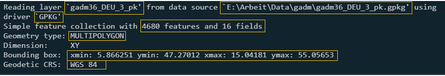
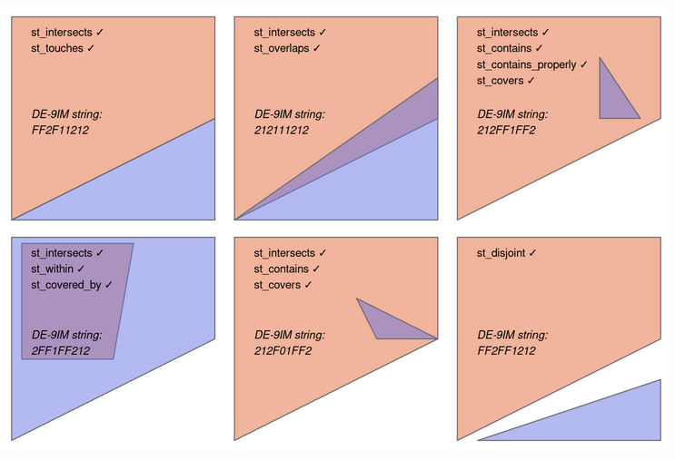

Das aktuell wichtigste R Packet um mit räumlichen Vektor Daten zu arbeiten ist `sf` ([Pebesma, 2018](https://journal.r-project.org/archive/2018/RJ-2018-009/index.html)). 
In diesem Tutorial lernt ihr die Grundlagen von `sf` - alles was ihr braucht um räumliche Daten in R zu laden, zu plotten und grundlegede räumliche Operationen mit ihnen durchzuführen. 
Eine großartige und kostenlose Quelle um `sf` und weitere GIS packages zu lernen ist das Buch [Geocomputation in R](https://geocompr.robinlovelace.net/). 

# Daten in mit sf laden

Wenn wir `sf` laden bekommen wir die folgende Meldung: 
        
```{r}
library(sf)
```

`sf` stellt also eine Verbindung zwischen der laufenden R Instanz und drei anderen Progemmen her: GEOS, GDAL und PROJ.
Alle drei Progamme sind uns in der Vorlesung schon begegenet: [GEOS](https://libgeos.org/) und [GDAL](https://gdal.org/) sind Sammlungen von Funktionen um Geodaten zu lesen, zu verändern und zu schreiben; [PROJ](https://proj.org/) transformiert Geodaten von einem Koordinatenbezugssystem in ein anderes.  

Mit dem Befehl `st_read()` lesen wir die Geopackage Datei `gadm36_DEU_3_pk.gpkg` (download [hier](https://cloud.uni-landau.de/index.php/s/99rjM6XDPkLxzxY)). 
Die Funktion beginnt, wie alle Funktionen in `sf`, mir `st_`, kurz für *spatiotemporal*.

```{r}
germany <- st_read("gadm36_DEU_3_pk.gpkg")
```

Nachdem die Datein geladen wurde erhalten wir automatische eine Reihe von Informationen. 



Diese sind von links nach recht und oben nach unten den gelben Boxen folgend: Der Layername der geladenen Datei. Dies ist nicht der Objektname in R, sondern der Name der in der Geopackage (gpkg) Datei hinterlegt ist; wo liegt die Datei auf der Festplatte; das Dateiformat (hier GPKG); die Anzahl von Reihen (*features*, 4680) und Spalten (*fields*, 16); die feature type (GeometryType); die Bounding Box, also minimale und maximale x und y Koorindaten bzw. Längen- und Breitengrade und als letztes das Koordinatenbezugssystem. 

Wenn wir das Objekt in R nun öffnet sehen wir das Folgende: 

```{r}
germany
```

Die Kopfzeile ist sehr ähnlich zu dem was wir bereits beim Einlesen der Datei gesehen haben. Darunter sind die ersten zehn Zeilen aller Spalten angezeigt. Das Objekt hat die Klassen:

```{r}
class(germany)
```

Also können wir damit auch wie mit einem normalen `data.frame` umgehen.
```{r}
germany[1,]
germany[,1]
```

Beim Subsetten von Spalten werdet ihr die `geom` oder `geometry` Spalte nicht los. 
In der Regel ist dies praktisch, da diese Spalte die räumlichen Koordinanten der Objekte beinhaltet. 
Falls ihr dennoch ganz explizit diese Spalte entfernen wollt, könnt ihr `st_drop_geometry()` verwenden. 
Die `geom` Spalte ist noch in einer anderen Hinsicht besonders, sie ist eine [list column](https://adv-r.hadley.nz/vectors-chap.html#list-columns). 
Also eine selber eine Liste. 
Die `geom` Spalte hat die Klasse `sfc`.

```{r}
class(germany$ge)
```

`sfc` ist kurz für *simple feature column*, also eine Spalte für simple features. 
Die einzelnen Elemente in der Spalte haben die Klasse `sfg`, *simple feature geometry*. 
`sfg` sind die einzelnen geometrischen Formen (Punkte, Linien, Polygone, ...) aus denen Vektordatensätze bestehen. 
Später werden wir selber `sfg` Objekte erstellen und daraus ein `sf` Objekt zusammensetzen. 

Ein Objekt der Klasse sf kann einfach mit `plot()` dargestellt werden. 
Hier subsette ich den Datensatz außerdem auf die ersten zehn Reihen, damit der Plot übersichtlich bleibt.

```{r}
plot(germany[1:10,])
```

Wir ihr seht wird dabei standartmäßig jede Variable einzeln dargestellt. 
Plots mit einzelnen Variablen werden erstellt wenn wir den Datensatz auf eine Variable subsetten. 

```{r}
plot(germany[,"GID_3"])
```

# Selber räumliche Daten erstellen. 


In `sf` können wir räumliche Objekte selber erstellen. Das ist zwar in der Praxis selten notwendig, da wir meistens Daten bereit liegen haben, aber spätere Abläufe sind leichter zu verstehen, wenn man den Prozess einmal von Vorne durchgegangen ist. Die Funktionen um geometrische Formen zu erstellen folgen einer einfachen Regel: `st_` + Name des *geometryTypes*. Um einen Punkt zu erstellen nutzen wir also: 
```{r}
point1 <- st_point(x = c(1,1))
```
`point1` ist ein Punkt mit den Koordinaten 1 1 und hat die Klasse `sfg`. 

```{r}
class(point1)
```

```{r}
plot(point1)
```

Linien bestehen aus mehreren Koordinaten die miteinander verbunden sind. Die einzelnen Koordinaten sind Vektoren (`c()`) genau wie bei `st_point()`. Theoretisch gibt es mehrere Möglichkeiten wie man der Funktion `st_linestring()` nun mehrere Punktkoordinaten geben könnte: Listen, Matrizen, data.frames. In der Praxis nutzt `sf` dafür Matrizen mit zwei Spalten und so vielen Reihen wie Koordinatenpaaren. Im Beispiel erstellen wir eine Linie mit den Koordinaten 1 1, 1 2, 2 2, 2 3. 

```{r}
line_coordinates <- matrix(data = c(1,1,1,2,2,2,2,3), ncol = 2, byrow = T)
line1 <- st_linestring(line_coordinates)
plot(line1)
```

Um das Objekt `line_coordinates` zu erstellen haben wir einen Vektor mit allen Koordinaten in eine Matrix mit 2 Spalten (`ncol`) überführt und angegeben, dass die Matrix reihenweise befüllt (`byrow = T`), also zuerst Reihe 1 Spalte 1, dann Reihe 1 Spalte 2 usw.. 
Standartmäßig werden Matrizen in R spaltenweise befüllt. 
Da diese Notation nicht besonders Intuitiv ist wird oft die Folgende genutzt: 

```{r}
line_coordinates <- 
        rbind(
                c(1,1), 
                c(1,2), 
                c(2,2),
                c(2,3)
        )
line1 <- st_linestring(line_coordinates)
plot(line1)
```

Wie ihr seht ist das Ergebnis gleich, aber die einzelnen Koordinaten sind nicht in einem langen Vektor sondern klar voneinander getrennt. Die Funktion `rbind()` (kurz für row bind) nimmt einzelne Vektoren und kombiniert sie als Reihen einer Matrix. Das Äquivalent für Spalten heißt `cbind()`. 

Mit `line_coordinates` können wir auch ein *multipoint* erstellen. 
```{r}
multipoint1 <- st_multipoint(line_coordinates)
plot(multipoint1)
```

Polygone werden mit Listen erstellt. Wenn wir nur ein Polygon haben sieht das im Prinzip genau aus wie bei einem *LineString* mit dem kleinen aber wichtigen Unterschied, dass die erste Koordinate und die letzte gleich sind. 

```{r}
polygon_coordinates <- 
        rbind(
                c(1,1), 
                c(1,2), 
                c(2,2),
                c(2,1),
                c(1,1)
        )

polygon1 <- st_polygon(list(polygon_coordinates))

plot(polygon1)
```

Auch *MultiLineStrings* und *Multipolygone* werden mit Listen erstellt. 

```{r}
multilinestring_coordinates <- 
list(rbind(c(1,1), c(1,2), c(1,3), c(1,4)),
rbind(c(2,0), c(3,0), c(4,0), c(4,1)))

multilinestring1 <- st_multilinestring(multilinestring_coordinates)
plot(multilinestring1)        
```

```{r}
multipolygon_coordinates <- 
list(
list(rbind(c(0,0), c(0,1), c(1,1), c(1,0), c(0,0))), 
list(rbind(c(2,1), c(2,2), c(1,2), c(1,1), c(2,1)))
)
multipolygon1 <- st_multipolygon(multipolygon_coordinates)
plot(multipolygon1)
```

*Geometry collections* sind einzelne geometrische Objekte, die verschiedene GeometryTypes kombinieren. 

```{r}
geometrycollection1 <- st_geometrycollection(x = list(st_multipolygon(multipolygon_coordinates), 
st_multilinestring(multilinestring_coordinates)
)
)
plot(geometrycollection1)
```


# Grundlege Operationen 

Bisher sind unsere Objekte zwar geometrische Formen, aber noch nicht wirklich *räumlich*. 
Sie sind noch nicht konkreten Orten auf der Erde zugewiese - sie haben kein Koordinatenbezugssytem (KBS).
Mit dem Befehl `st_crs()` weisen wir einem Objekt ein KBS zu. 
Alternativ können wir das auch mit `st_sfc()` machen, wenn wir aus einem `sfg` ein `sfc` machen. 
Wir können verschiedene Formate benutzen um das KBS zu beschreiben, aber in der Praxis ist der EPSG Code am einfachsten.
Wir weisen `geometrycollection1` mal das KBS WGS 84 zu. 

```{r}
geometrycollection_sfc <- st_sfc(geometrycollection1, crs = "EPSG:4326")
geometrycollection_sf  <- st_as_sf(geometrycollection_sfc)
```

Es gibt mehrere Alternative zu der normalen `plot()` Funktion um in R Karten zu erstellen. Die ich hier kurz zeige ist das `tmap` Package. 

Jede `tmap` Karte hat mindestens zwei Elemente:
        1. `tm_shape()` Die räumliche Datei die ihr für die Karte nutzen          wollt.  
        2. Die geometrische Form die ihr der Karte hinzufügen wollt. `tm_dots()` bei Punkten, `tm_lines()` bei Linien und `tm_polygons()` bei Polygonen. 
        
Diese Elemente werden mit einem `+` kombiniert. Dabei sind euch keine Grenzen gesetzt wieviel räumliche Daten oder geometrische Formen in einer Karte enthalten sein sollen. 
Wenn ihr verschiedene Datensätze in einer Karte nutzen wollt könnt ihr nach dem `+` einfach nochmal `tm_shape()` mit dem nächsten Datensatz nutzen. 

```{r}
library(tmap)
tm_shape(geometrycollection_sf) + 
        tm_dots(size = 1) + 
        tm_lines() + 
        tm_polygons()
```

Mit `tmap` könnt ihr neben statischen auch interaktive Karten erstellen.
Die sind super um seine Daten besser kennenzulernen, zu überprüfen ob man das richtige KBS angegeben hat oder für interaktive Dokumente im html Format wie dieses Tutorial. 
Um interaktive Karten zu erstellen, müsst ihr den tm_modus von "plot" zu "Wiew" ändern. 

```{r}
tmap_mode("view")
```

Danach erzeugt die gleiche Funktion wie vorher auch interaktive Karten. 

```{r}
tm_shape(geometrycollection_sf) + 
        tm_dots(size = 1) + 
        tm_lines() + 
        tm_polygons()
```

# Nützliche Funktionen

Da die Namen der Funktionen in `sf` meist selbsterklärend sind, kann man oft einfach `sf::` eingeben, die dann angezeigt Liste von Funktionen durchscrollen und mit etwas Hintergrundwissen und Fantasie findet man oft was man sucht. Besonders gut funktioniert das, wenn ihr diese Taktik mit der Hilfefunktion (?function_name oder markieren und F1 drücken) kombinert.  Nichtsdestotrotz wollen wir uns zum Abschluss hier noch einige Funktionen als Beispiel ansehen. 
Dazu benutzen wir wieder den `germany` Datensatz. 

## `st_area`

Mit `st_area` können wir die Fläche von Polygonen ermitteln.

```{r}
germany_area <- st_area(germany)
class(germany_area)
```
Das Erbgeniss ist ein Objekt der Klasse `units` die das gleichnamige [Package](https://r-quantities.github.io/units/articles/measurement_units_in_R.html) eingeführt hat.
Units sind sinnvoll damit wir nicht Meilen und Kilometer addieren sondern immer gleich mit gleich. 
Falls verschiedene Einheit kombiniert werden, gibt units eine Fehlermeldung. 
Das führt allerdings auch dazu, dass manche Funktionen mit units Objekten nicht oder nicht gut funktionieren. 
Daher kann es praktisch sein units Objekte in einfache Zahlen umzuwandeln. 
Das geht mit `units::drop_units()`. 

```{r}
germany_area <- units::drop_units(germany_area)
```

Diese können wir nun `germany` als Variable hinzufügen. 

```{r}
# Nutze die mutate Funkton aus dplyr und die assignment pipe aus magrittr um dem Datensatz germany die Fläche hinzuzufügen. 
library(magrittr)
germany %<>% dplyr::mutate(germany, area = germany_area)  
library(mapview)
mapview(germany, zcol = "area")
```

Um diese Karte zu erstellen habe wir das `mapview` Package verwandt. 
`mapview` ist die schnellere und einfachere Lösung um interaktive Karten zu erstellen. 
`tmap` bietet mehr Optionen und ist die bessere Lösung um Karten für Berichte oder Paper zu erstellen. 

## `st_nearest_feature()`

Mit `st_nearest_feature()` finden wir die Elemente in einem Datensatz die dem ausgewählten Element am nächsten sind. 

```{r}
# - Wähle den größten Bezirk
big1 <- germany |> 
        # ordne der Größe nach
        dplyr::arrange(area) |>
        # wähle den letzte also größten Bezirk 
        dplyr::slice_tail(n = 1)

# - Welches Element aus germany ist dem größten Bezirk am nächsten? 
nnid <- st_nearest_feature(big1, germany)
# - Das Ergebnis ist die Reihennummer dies nächsten Objektes. 
nnid
germany[nnid, ]
mapview(rbind(big1,germany[nnid, ]), zcol = "GID_3")
```

## `st_distance()`

Mit `st_distance()` können wir die Distanz zwischen Objekten berechnen. 
Wir könnten die Distanz zwischen den zehn größten Bezirken berechnen. 

```{r}
# finde die zehn größten Bezirke
big10 <- 
        germany |> 
        # ordne den Datensatz anhand der Variable area ansteigend 
        dplyr::arrange(area) |> 
        # schneide die 10 (n) letzten Reihen ab und verwerfe den Rest.
        dplyr::slice_tail(n = 10)

# was ist die Distanz zwischen den zehn größten Bezirken.
big10 <- st_distance(big10)
```

Hier haben wir der `st_distance()` Funktion nur ein einziges Argument gegeben: `big10`. 
Das Ergebnis ist eine Matrix mit units Objekten. 
In Spalte 3, Reihe 2 steht die Distanz vom dritten Polyongs zum zweiten. 
Dabei wird die kürzeste Distanz zwischen Außenkanten gemessen. 
Die Diagonale enthält die Distanz von Objekten zu sich selbst. 
Daher sind alle Elemente auf der Diagonalen 0. 

Wir können `st_distance()` auch mit zwei Datensätzen benutzen. 
Als Beispiel laden wir die einen Satz von Libellen ([hier](https://cloud.uni-landau.de/index.php/s/eKbTpdqAqHx9xGs)) und ein Gewässernetz von Rheinlandpflaz ([hier](https://cloud.uni-landau.de/index.php/s/gEP2cHbngRXm7Le)). 
Dann suchen wir für jeden Libellenpunkt den nächsten Fluss und messen die Distanz dahin. 

```{r}
dragonflies <- st_read("Libellen/artenfinder_libellen_rlp.shp")
rivers      <- st_read("rivers_rlp/Fließgewaesser.shp")

# Der Libellendatensatz ist groß (> 30.000 Reihen). 
# Wir nutzen nur einen Teil der Daten (100 zufällige Reihen) damit die Rechenzeit kurz bleibt. 

dragonflies <- dragonflies[sample(1:nrow(dragonflies), 100), ]

# Sind beide im gleichen KBS? - Ja 
st_crs(dragonflies) == st_crs(rivers)

near <- st_nearest_feature(dragonflies, rivers)

# erstellt einen neusortierten Flussdatensatz in dem die erste Reihe der Fluss ist, der dem Objekten aus der ersten Reihe des Libellendatensatzes am nächsten ist und so weiter.  
rivers_reorder <- rivers[near, ]
distance_to_river <- st_distance(dragonflies, rivers_reorder, by_element = TRUE)

# Füge Distanz als Variable hinzu
dragonflies %<>% dplyr::mutate(distance = units::drop_units(distance_to_river))

# Entferne Libellen, die mehr als 10 km vom nächsten Fluss entfernt sind 
dragonflies %<>% dplyr::filter(distance < 10000)

tm_shape(rivers) + 
        tm_lines(col = "blue") + 
        tm_shape(dragonflies) + 
        tm_dots(col = "distance", n = 7)

```

## `spatial subsetting`

In der Einführung in R haben wir bereits gesehen wie wir Tabellen in R subsetten, mit `[`, `$`,`select()` und `filter()`. 
Dabei habe wir die Position der gewünschten Objekte in der Tabelle (bei `[`), ihren Spaltennamen (bei `select()` und `$`) oder Werte der verschiedenen Variablen (bei `filter()`) genutzt. 
Bei räumlichen Daten bietet sich nun auch räumliche Beziehungen an, um Daten zu subsetten. 
Die Syntax folgt dabei dem folgendem Schema: Lasse `X` den Datensatz sein aus dem wir auswählen wollen und lasse `Y` den Datensatz sein anhand dessen wir auswählen. 
Ein Beispiel aus der Volresung wäre hier: `X` sind die Kohlmeisenbeobachtungen und `Y` die Landkreise.
Nun subsetten wir `X` anhand von `Y` durch `X[Y]`. 
Als Beispiel nutzen wir hier wieder die Kohlmeisendaten ([hier](https://cloud.uni-landau.de/index.php/s/Rbzsf8BR2m2bwDK) Dowload). 

```{r}
meisen <- readRDS("meisen2.rds")
meisen <- meisen[which(!is.na(meisen$decimalLongitude)), ]
meisen <- st_as_sf(meisen, coords = c("decimalLongitude", "decimalLatitude"), crs = "EPSG:4326")
meisen_subset <- meisen[1:100, ]
mapview(meisen_subset)
```

Wie ihr in diesem Beispiel gesehen habt ist es auch einfach eine nicht räumliches Objekt (z.b. einen data.frame) in R in ein räumliches Objekt (sf) umzuwandeln.
Wir nutzen dazu die Funktion `st_as_sf()`. 
Als Argumente geben wir der Funktion den Datensatz der räumliche werden soll, die Namen der Spalten mit X und Y Koordinaten, bzw. Längen- und Breitengrad sowie das Koordiantenbezgssystem. 

Jetzt wollen wir nur die Kohlmeisenbeobachtungen auswählen die in unserem Landkreis liegen. 

```{r}
goslar <- dplyr::filter(germany, NAME_2 == "Goslar")
goslar_meisen <- meisen[goslar, ]
mapview(goslar_meisen)
```

Dabei wird eine *topologische Beziehung* zwischen den Elementen von `meisen` und `goslar` geprüft. 
Wenn wir, wie in dem Befehl oben, keine topologische Beziehung explizit wählen, wird die Standardbeziehung, Verschneidung (per `st_intersects()`), angewandt. 
Alternativen sind Berührung (`st_touch()`), Kreuzen (`st_cross()`) und Überdecken (`st_covers()`). 
Siehe die folgende Abbildung für mehr Beispiele. 



Wir betrachten hier ein weiteres Beispiel um eine andere topologische zu demonstrieren. 
In diesem Beispiel nutzen wir den `germany` Datensatz und den größten Landkreis aus dem Datensatz (`big1`). 
Wir wollen alle Landkreise auswählen, die an den größten Landkreis angrenzen. 
Wir subsetten also `germany` den Datensatz mit allen Bezirken anhand von `big1`, dem Datensatz der nur den größten Bezirken enthält. 
Anstelle der `st_intersects()` Beziehung, die standardmäßig eingestellt ist, wählen wir `st_touches()`. 

```{r}
big1_neighbour <- germany[big1, op = st_touches]
mapview(big1_neighbour, zocl = "GID_3")
```

## Spatial joins 

Bei einem Spatial join fügen fügen wir die Variablen eines zweiten Datensatzes dennen eines ersten hinzu. Dabei wird die räumliche Beziehung zwischen den Elementen der Objekten genutzt um zu bestimmen welche Elemente kombiniert werden. 
Ein Beispiel wäre den Vogeldaten ihren Landkreis als Variable hinzuzufügen. 

```{r}
# - Zufälliges subset von 500 Meisen
meisen_subset <- meisen[sample(1:nrow(meisen), 500), ]

# - erstelle einen Datensatz der auf germany basiert aber nur eine Variable hat: Name_2
germany_name2 <- dplyr::select(germany, NAME_2)

# - spatial join 
meisen_name2 <- st_join(meisen_subset, germany_name2)
mapview(meisen_name2, zcol = "NAME_2")
```

## Spatial Aggregation 

Als letztes wollen wir uns ansehen wie wir Daten aggregieren. 
Die Frage könnte hier lauten: Was ist die mittlere Abundanz von Maisen in den verschiednen Bezirken. 
Wir wollen also: 
1. die Meisendaten gruppieren je nachdem in welchen Bezirk sie fallen. 
2. Für jede Gruppe den Mittelwert der Abundanz (individualCount) berechnen. 
3. Diese Mittelwerte in einem Datensatz den Bezirken zuordnen.

All das können wir mit einer einzigen Funktion machen: `aggregate()`. 
Allerdings müssen wir die Daten dafür etwas vorbereiten. 
`aggregate()` braucht die folgenden Argumente: `x` welche Daten soll ich aggregieren? Bei uns sind das die Meisen. `by` welche Daten geben die Gruppen an in dennen ich aggregieren soll? Bei uns ist das `germany`. `FUN` mit welcher Funktion soll ich die Daten aggregieren? Bei uns `mean()`, der Mittelwert. 
Fall ihr der Funktion die ihr zum Aggregieren nutzt auch Argumente geben wollt könnt ihr das danach machen. 

```{r}
# - Erstelle einen Datensatz indem die Meisen nurnoch die Variable individualCount haben. 
meisen_count <- dplyr::select(meisen, individualCount)
# - Reduziere auf Reihen die Information für die Variable individualCount haben. 
meisen_count <- dplyr::filter(meisen_count, !is.na(individualCount))
# - aggregiere die Daten meisen_count anhand von germany mit der Funktion mean. 
meisen_agg <- aggregate(x = meisen_count, by = germany, FUN = mean)
# - Falls wir die NAs nicht entfernt hätten könnten wir die folgende Funktion nutzen: 
meisen_agg <- aggregate(x = meisen_count, by = germany, FUN = mean, na.rm = TRUE)
# - Das Argument na.rm = TRUE ist ein Argument der Funktion mean(). Es entfernt (remove, rm) alle NAs bevor es den Mittelwert berechnet. Wenn ihr die Hilfeseite von aggregate() öffnet sieht ihr bei den Argumenten "...". Diese sogenannten Ellipsis stehen als Platzhalter für alle Argumente die ihr der Funktion in FUN geben könnt.  
mapview(meisen_agg, zcol = "individualCount")
```

# Aufgaben 

In [diesem](https://cloud.uni-landau.de/index.php/s/iMHkR9oC2H2QzZ6) Ordner findet ihr drei Dateien:  

1. Fahrradleihstationen in London     
2. Das Bahnnetzwerk von London      
3. Die Bezirke von London     

Alle Daten sind mit der Projektion WGS84 (EPSG: 4326) projeziert. 

Mit diesen Datei, beantwortet die folgenden Fragen: 

1. Wie viele Fahhradstationen gibt es in dem Datensatz?
2. Wie viele Stationen haben mehr als 10 Fahrräder?
3. Wie groß sind die verschiedenen Regionen von London? Fügen sie die Fläche dem Datensatz als Variable hinzu.
4. Ordne jeder Fahhradstation die `osm_id` der nächsten Bahnschiene zu
5. Ermittle die Distanz zwischen jeder Fahrradstation und der nächsten Bahnschiene
6. Erstelle einen Plot in den Anzahl von Fahrrädern pro Station gegen Distanz zur nächsten Bahnlinie gezeigt wird.
7. Erstelle mit eine Karte auf der die Fahrradstationen anhand der Distanz zur nächsten Bahnlinie eingefärbt sind. 
8. Berechne die mittlere Distanz von Fahrradstation zu der nächsten Bahnschiene für jeden Bezirk in London für den Fahrraddaten verfügbar sind. 
