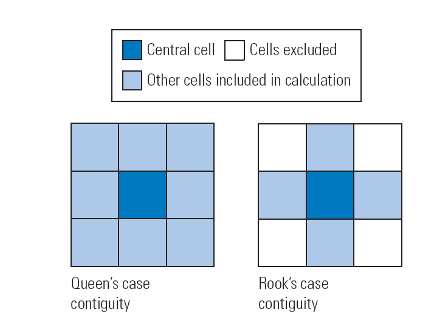

# Machine Learning

In this tutorial you will learn how to use R to    
- fit and predict from logistic generalized linear models     
- fit and predict from different machine learning algorithms with the `mlr3` package [@mlr3]    
- conduct spatial and non-spatial cross validation to evaluate the genralizability of your model.     
Specifically, we will predict the probability of landslides in a small part of the Ecuadorian Andes. 
As always we start out by loading all the necessary packages. 

```{r, message = F}
library(data.table)
library(dplyr)
library(ggplot2)
library(magrittr)
library(mapview)
library(mlr3spatiotempcv)
library(mlr3tuning)
library(mlr3verse)
library(sf)
library(spdep)
library(statmod)
library(terra)
library(tmap)
```


 

The data you need for this exercise consists of a digital elevation model (DEM) for the area (download [here](https://cloud.uni-landau.de/index.php/s/r7bSNojiaCeemNN)) and a data set of landslides locations (download [here](https://cloud.uni-landau.de/index.php/s/BcFFMZnSiQXNGNS)). 

```{r, echo=F, eval=F}
# How I created the student files.
#data("lsl", "study_mask", package = "spDataLarge")
#dem = rast(system.file("raster/ta.tif", package = "spDataLarge"))
# lsl %<>% select(x,y,lslpts)
# dem <- dem$elev
#writeRaster(dem, "data/ml_raster.tiff")
#write.csv(lsl, "data/landslides.csv", row.names = F)
```

```{r}
dem <- rast("data/ml_raster.tiff")
lsl <- read.csv("data/landslides.csv")
```

Let have a short look at the data. 
```{r}
head(lsl)
```

Here we have `r nrow(lsl)` observations from the Andes in Ecuador. 
The data include the initiation points of 175 landslides (`lslpts = TRUE`). 
In addition, 175 reference points which are randomly distributed in the sampling area are included. 
We will try to predict landslides, or determine the probability of a landslide occurring for the whole study area.
For these predictions we will use the slope, the plan curvature (`cplan`), the profile curvature (`cprof`), the elevation (`elev`), and the log$_{10}$ of the catchment area (`log10_carea`). 

These predictors are already part of the data you loaded. 
Nonetheless, we will go through the steps with which you can derive them from you elevation raster and add them to your `sf` data set. 
The specific variables that are already provided in the data are a little trickier to derive than what we will do. 
You would need to use a so called *bridge* from R to other GIS software (in this case SAGA R) to do so, and this goes beyond the scope of this course. 
If you are interested in this topic and want to give it a try I recommend Chapter 10 of @Lovelace2019. 

## Terrain analysis with terra

Conducting a terrain analysis with terra is reasonably easy. 
There is a single function (`terrain()`) with which you can compute several variables. 
The function has four arguments you will want to consider and some more for writing the results to file. 
`x` is the DEM in `SpatRaster` format, the format used by `terra`. 
`v` is the variable or variables you want to compute. 
You can choose slope, aspect, TPI, TRI, roughness, and flow direction. 
TRI (Terrain Ruggedness Index) is the mean of the absolute differences between the value of a cell and the value of its 8 surrounding cells. TPI (Topographic Position Index) is the difference between the value of a cell and the mean value of its 8 surrounding cells. Roughness is the difference between the maximum and the minimum value of a cell and its 8 surrounding cells.
You can provide multiple values to `v` by combining them in a vector. 
`neighbors` is the number of neighboring cells you want to consider to compute your slope and aspect. 
You can choose between 4 and 8 also known as rook and queen case after the chess pieces (see Figure \@ref(fig:queencase) taken from @lloydsda). 

```{r queencase, echo = F, fig.align='center', fig.cap="Queens and Rook case"}

```

```{r}
ta1 <- terrain(dem$elev, v = "slope")
ta2 <- terrain(dem$elev, v = c("slope", "aspect", "TPI"))
```

We can see that the results are again `SpatRaster` objects. 

```{r}
ta2
```

To fit models, we now need to add the new variables to the landslides data. 
To add the raster values to the sample points we have to convert the points, which at this stage are not yet spatially explicit, into `sf` format and then to `terra's` vector format `SpatVector` with `vect()`. 
We create `lsl_terrain` a copy of `lsl` which we use for this demonstration only. 
Afterward, we will fit the models with the original and unaltered `lsl`.

```{r results='hide', message = FALSE}
lsl_terrain <- lsl
lsl_terrain %<>% 
        st_as_sf(coords = c("x", "y"), crs="EPSG:32717") %>%
        vect()
```

We extract the values of the raster cells at the location of the landslide observations with the `extract()` function. 

```{r}
lsl2 <- extract(y = lsl_terrain, x = ta2)
```

Now we can bring the landslide data back to the `sf` format and combine it with the extracted terrain analysis data. 
In all of this the variable `lslpts` is reclassified as character at some point. 
With the last line of the code below, we turn it back into a bolean. 

```{r}
lsl_terrain %<>% 
        st_as_sf() %>% 
        bind_cols(lsl2) %>%
        mutate(lslpts = as.logical(lslpts))
lsl_terrain
```

We can now remove the data as we will continue our work with the origina ones. 
```{r, echo = FALSE}
rm(lsl_terrain, lsl2, ta1, ta2)
```

## Ploting the data 

Next we will look at DEM and landslides in parallel. 
First, we will mask the raster to just the study area.
That means we remove all cells of the raster that are not within the study area. 
Partly, because it looks nicer and partly because it removes the `NaN` in the raster that would cause problems later on. 

First, we turn the `lsl` data into `sf` format. 
```{r}
lsl %<>%  st_as_sf(coords = c("x", "y"), crs="EPSG:32717")
```

Then we derive its convex hull. 
We need to call `st_union()` on the points before, 
because otherwise `st_convex_hull()` would try to create a separate convex hull for each point.
```{r}
mask <- 
        lsl |> 
        st_union() |> 
        st_convex_hull()
```

When we call the mask function we need to use `vect()` to transform the mask into the `SpatVector` class. 

```{r}
dem2 <- mask(dem, vect(mask))
```

Now we can create a nice plot. 

```{r}
# create hill shade
hs <- 
        shade(slope = dem2$slope * pi / 180, 
              terrain(dem2$elev, v = "aspect", unit = "radians"))
# tmaptools does not support terra yet. 
bbx = tmaptools::bb(raster::raster(hs), xlim = c(-0.0001, 1),
                    ylim = c(-0.0001, 1), relative = TRUE)
map = tm_shape(hs, bbox = bbx) +
  tm_grid(col = "black", n.x = 1, n.y = 1, labels.inside.frame = FALSE,
          labels.rot = c(0, 90), lines = FALSE) +
  tm_raster(palette = gray(0:100 / 100), n = 100, legend.show = FALSE) +
  tm_shape(dem2$elev) +
  tm_raster(alpha = 0.5, palette = terrain.colors(10), legend.show = FALSE) +
  tm_shape(lsl) +
  tm_bubbles("lslpts", size = 0.2, palette = "-RdYlBu",
             title.col = "Landslide: ") +
  tm_layout(inner.margins = 0, legend.outside = TRUE) +
  tm_legend(bg.color = "white")
map
```

## Logistic regression

With the `glm()` function we can fit a logistic regression model that tries to predict the probability of a landslide with planar curvature, profile curvature, elevation, the decadal logarithm of the cathment area.
The call looks similar to the linear regression models you already know except for the `family = binomial()` argument, which specifies the distribution we assume for the residuals. 

```{r}
glm1 = glm(lslpts ~ slope + cplan + cprof + elev + log10_carea,
          family = binomial(),
          data = lsl)
```

Just like linear regressions, GLMs have a number of assumptions about the data that need to be met in order for the model to be meaningful. 
These assumptions are:
1. correct distribution function, 2. correct link function, 3. linearity, 4. lack of outliers, and 5. independence of observations. 
Your first step after fitting a model should always be to see if it fits the data well and if assumptions are met. 

Some of them can be checked in tandem: link function, linearity and distribution would, if wrongly specified, all lead to patterns in the residuals that we can investigate with residual plots. 
For linear models we use the *response residuals*, i.e. the difference between the observed point and the predicted point $y_i - \hat{\mu}$. 
For GLMs this is not possible, because the variance of the residuals changes with the mean. 
That means we assume that a pattern in the residuals and visually testing whether our data deviate from the expected pattern is a lot harder than looking for any pattern at all. 
Thus we use other types of residuals which should indeed show not pattern but are a little bit more difficult to compute.
The details of this was discussed in the lecutre and plenty of material is provided in the presentation notes. 
Here we will use Quantile residuals which we can compute with the `statmod`package [@dunnRandomizedQuantileResiduals2020]. 

```{r}
quantile_residuals <- statmod::qresiduals(glm1)
plot(quantile_residuals ~ glm1$fitted.values)
abline(h = mean(quantile_residuals))
```

investigating the QQ Plot (points should be on diagonal line), or
```{r}
qqnorm(quantile_residuals); qqline(quantile_residuals, col = 2)
```

residuals versus row number (again optimally no pattern).
```{r}
scatter.smooth(quantile_residuals)
```

Outliers or influential observations can be identified with Cook's distance. 
This metric gives the degree to which the model is altered by removing any one observation.
Larger values imply larger changes, i.e. a larger influence on the model. 
There are some rule of thumbs what values are considered problematic: $4/(n-p-1)$ [@Fox2002] or  1 [@maindonad2018]. 
Here, we simply can see that all values are below these thresholds. 
Nonetheless, we have a look at the largest value. 
How do regression parameters change if we drop this observation. 
```{r}
lsl.cd <- cooks.distance(glm1)
plot(lsl.cd)
infl <- which.max(lsl.cd)
glm2 <- update(glm1, subset = (-infl))
coef(glm1)
coef(glm2)
```
Parameters barely change. 

Our data are spatial and spatial data often contain spatial autocorrelation. 
If our data would be spatially auto correlated the assumption of independent observations would be violated. 
We can check the Moran's I of the residuals. 

```{r, warning = FALSE}
knn   <- knearneigh(lsl, k = 1)
nb    <- knn2nb(knn)
listw <- nb2listw(nb)
quantile_residuals <- qres.binom(glm1)
moran.test(x = quantile_residuals, listw = listw)
```

Indeed, there seems to be a weak but statistically significant autocorrelation in our residuals. 
At this point we will not address possible fixes for this problem as they extend beyond the scope of this lecture. 

With `summary()` we get a quick overview of the results. 

```{r}
summary(glm1)
```

Using the model we can predict the probability of a landslide for each cell of the raster *terrain_analysis*. 

```{r}
pred_glm <- terra::predict(object = dem,
                    model = glm1,
                    type = "response")
```

```{r}
map = tm_shape(hs, bbox = bbx) +
  tm_grid(col = "black", n.x = 1, n.y = 1, labels.inside.frame = FALSE,
          labels.rot = c(0, 90), lines = FALSE) +
  tm_raster(palette = gray(0:100 / 100), n = 100, legend.show = FALSE) +
  tm_shape(mask(pred_glm, vect(mask))) +
  tm_raster(alpha = 0.5, palette = "Reds", n = 6, legend.show = TRUE, title = "Probability of a Landslide: ") +
  tm_layout(inner.margins = 0, legend.outside = TRUE) +
  tm_legend(bg.color = "white")
map
```

A common metric to evaluate the predictive capacity of a model is the area under the receiver operating characteristic curve (AUROC or ROC). 
This is a value between 0.5 and 1.0, with 0.5 indicating a model that is no better than random and 1.0 indicating perfect prediction of the two classes. 
Thus, the higher the AUROC, the better the model's predictive power.
The following code chunk computes the AUROC value of the model with `roc()`, which takes the response and the predicted values as inputs. 
`auc()` returns the area under the curve.

```{r, message=FALSE, warning = FALSE}
pROC::auc(pROC::roc(lsl$lslpts, fitted(glm1)))
```

## mlr3

Now we will turn to the machine learning technique random forest. 
There are different frameworks for machine learning in R. 
We will focus on `mlr3` [@mlr3] which is a versatile and popular framework. 
`mlr3` follows a logic which is shown in Figure \@ref(fig:mlr3).
If your looking for an in depth introduction to the package, you can find a book length introduction to `mlr3` [here](https://mlr3book.mlr-org.com/). 

```{r mlr3, fig.cap = "flow diagram of mlr3", echo=F}
knitr::include_graphics("images/mlr3.svg")
```

### Creating a *task*

First we need to create a *task*. 
A *task* contains the data as well as some information on how we want to model the data, like the column name of the dependent variable. 
There are different types of tasks which differ in the kinds of dependent variables they support. 
For example, classification tasks are for cases where our dependent variable consists of binary or nominal data. 
A regression task is designed for continuous numeric quantities. 
The `mlr3spatiotempcv`[@mlrsp] package introduced a special spatial task type we will look at later. 

Here we will create a classification task for our landslides data. 
This is the optimal task type because the dependent variable is binary (landslide or no landslide). 
First we need to turn the `lslpts` column into a factor column.

For this first example we will drop the geometry column and add the coordinates as individual columns. 

```{r}
lsl2 <- st_drop_geometry(lsl)
lsl2 %<>% mutate(x = st_coordinates(lsl)[,1],
                 y = st_coordinates(lsl)[,2],
                 lslpts = factor(lslpts))
```

The spatial classification task is defined by `TaskClassifST$new()`.
The function takes the argument `backend`, the data set, `target`, the name of the dependent variable, and `id`, the name of a column the can be used to identify each observation. Additionally we provide the names of the coordinate columns (`coordinate_names`), tell the model not to use the coordinates as features (`coords_as_features = FALSE`) and provide the coordinate reference system (`crs`). 

```{r}
task = mlr3spatiotempcv::TaskClassifST$new(
        id = "ecuador_lsl",
        backend = mlr3::as_data_backend(lsl2),
        target = "lslpts",
        positive = "TRUE",
        coordinate_names = c("x", "y"),
        coords_as_features = FALSE,
        crs = "EPSG:32717"
)
```

The new object has the class `TaskClassifST` and we can get a short summary of the tasks if we print it to the console. 

```{r}
class(task)
print(task)
```

The task registers all variables that are not the target as predictors or, as they are commonly called in the machine learning literature, features. 
We want to use all six features here but in case we would just want to a subset this would be done with the following code

```{r eval = F}
task$select(c("slope", "cplan"))
```

We can use the `autoplot()` function to get a visual summary of the data. 

```{r message = FALSE}
autoplot(task, type = "pairs")
```

### The *learner*

The *learner* includes the machine learning algorithm we want to use as well as some information on *hyperparameters*. 
Hyperparameters are parameters that you have to determine before running the model. 
They are not estimated in the fitting procedure. 
Think of them as different settings for the methods. 
We will encounter some hyperparameters and discuss how you should choose them later. 

The learner works in a two-stage procedure: First, a randomly selected subset of the data (the training set, see Fig. \@ref(fig:mlr3)) is used to train the specified algorithm and the trained model is stored in the learner. 
Second, the trained model is used to predict the target in the test set (i.e. all observations that are not in the training set). 
The predictions can be compared to the actual values to determine how well the model fares on data it has not seen before. 
This is also known as *cross-validation*. 
If a model performs well in cross-validation we can have a higher believe that it might generalize to unobserved data from the same context (e.g. landslide probability in the area).
However, cross validation can not inform us on transferability, i.e., whether the model is adequate to estimate landslide probabilities in other regions of the world. 
Cross validation usually splits in more than just two groups. 
The number of groups in a CV is called *folds*.
With five folds we have five equally sized groups. 
The model is fit on four of the groups and predicts the fifth group. 
This is repeated for each group. 
Then the distribution of observations into groups is repeated. 
In the example below, we split the data into five groups 30 times. 
Please note that 30 is a rather low number of repetitions, I choose it to keep computational load light for this demonstration. 
In real world applications you should consider using more repetitions. 

```{r}
# non spatial resampling approach
ns_resampling <- rsmp("repeated_cv", folds = 5, repeats = 30)
```

CV assumes that the observations are independent which, as we have seen, is not the case for our data. 
A way to met this assumption is to use spatial or blocked CV. 
Instead of randomly selection point for the folds, all the points in a fold will be close to each other (see Figure \@ref(fig:blockcv) as an example). 

```{r blockcv, fig.align='center', fig.cap="Spatial vs non-spatial cross validation", echo=FALSE}
knitr::include_graphics("images/blockcv.png")
```

Thanks to `mlr3spatiotempcv` [@mlrsp] we can select such blocked cross validation approaches as resampling scheme. 

```{r}
# spatial resampling approach
sp_resampling = rsmp("repeated_spcv_coords", folds = 5, repeats = 30)
```


`mlr3` contains many algorithms to choose for you learner. 
A complete overview can be found [here](https://mlr-org.com/learners.html).
We want to choose three different learners here: 

1. A logistic GLM    
2. A Random Forest    
3. A support vector machine   

The random forest algorithm is based on the implementation in the `ranger` package [@wrightranger] and the support vector machine on the implementation in the `e1071` package [@Meyer2022]. 
In the codeblock below, we also define *fallback* learners that are used if the original learner (random forest or support vector machine) return an error. 
The featureless classifier does not use any features and simply always predicts the more common result. 

```{r}
lrnr_glm <- lrn("classif.log_reg", predict_type = "prob")
lrnr_rf  <- lrn("classif.ranger",  predict_type = "prob")
lrnr_svm <- lrn("classif.svm",     predict_type = "prob")
lrnr_rf$fallback  <- lrn("classif.featureless", predict_type = "prob")
lrnr_svm$fallback <- lrn("classif.featureless", predict_type = "prob")
```

Now we can run the resampling. 
We will run spatial and non spatial resampling for all three learners and see how their results differ. 

```{r results='hide'}
## non spatial CV
rr_nscv_glm <- mlr3::resample(task = task, learner = lrnr_glm, resampling = ns_resampling)
rr_nscv_rf  <- mlr3::resample(task = task, learner = lrnr_rf, resampling = ns_resampling)
rr_nscv_svm <- mlr3::resample(task = task, learner = lrnr_svm, resampling = ns_resampling)
## with spatial CV
rr_spcv_glm <- mlr3::resample(task = task, learner = lrnr_glm, resampling = sp_resampling)
rr_spcv_rf  <- mlr3::resample(task = task, learner = lrnr_rf, resampling = sp_resampling)
rr_spcv_svm <- mlr3::resample(task = task, learner = lrnr_svm, resampling = sp_resampling)
```

We can extract the AUROC and the Brier score from the `score` element of the resampling object. 
For a full list of available performance measures see [here](https://mlr3.mlr-org.com/reference/mlr_measures.html). 

```{r}
auroc_nsp_glm <- rr_nscv_glm$score(measure = mlr3::msr("classif.auc"))
auroc_nsp_rf  <- rr_nscv_rf$score(measure =  mlr3::msr("classif.auc"))
auroc_nsp_svm <- rr_nscv_svm$score(measure = mlr3::msr("classif.auc"))
auroc_sp_glm  <- rr_spcv_glm$score(measure = mlr3::msr("classif.auc"))
auroc_sp_rf   <- rr_spcv_rf$score(measure =  mlr3::msr("classif.auc"))
auroc_sp_svm  <- rr_spcv_svm$score(measure = mlr3::msr("classif.auc"))
brier_nsp_glm <- rr_nscv_glm$score(measure = mlr3::msr("classif.bbrier"))
brier_nsp_rf  <- rr_nscv_rf$score(measure =  mlr3::msr("classif.bbrier"))
brier_nsp_svm <- rr_nscv_svm$score(measure = mlr3::msr("classif.bbrier"))
brier_sp_glm  <- rr_spcv_glm$score(measure = mlr3::msr("classif.bbrier"))
brier_sp_rf   <- rr_spcv_rf$score(measure =  mlr3::msr("classif.bbrier"))
brier_sp_svm  <- rr_spcv_svm$score(measure = mlr3::msr("classif.bbrier"))
```

These tables contain more columns than we need. 
We drop the unnecessary columns to get clearer table.
We also prepare the table for joining them later. 

```{r}
auroc_nsp_glm %<>% dplyr::select(resampling_id, value = classif.auc)    %>% dplyr::mutate (measure = "auroc", model = "glm") 
auroc_nsp_rf  %<>% dplyr::select(resampling_id, value = classif.auc)    %>% dplyr::mutate (measure = "auroc", model = "rf") 
auroc_nsp_svm %<>% dplyr::select(resampling_id, value = classif.auc)    %>% dplyr::mutate (measure = "auroc", model = "svm")
auroc_sp_glm  %<>% dplyr::select(resampling_id, value = classif.auc)    %>% dplyr::mutate (measure = "auroc", model = "glm") 
auroc_sp_rf   %<>% dplyr::select(resampling_id, value = classif.auc)    %>% dplyr::mutate (measure = "auroc", model = "rf") 
auroc_sp_svm  %<>% dplyr::select(resampling_id, value = classif.auc)    %>% dplyr::mutate (measure = "auroc", model = "svm")
brier_nsp_glm %<>% dplyr::select(resampling_id, value = classif.bbrier) %>% dplyr::mutate (measure = "brier", model = "glm") 
brier_nsp_rf  %<>% dplyr::select(resampling_id, value = classif.bbrier) %>% dplyr::mutate (measure = "brier", model = "rf") 
brier_nsp_svm %<>% dplyr::select(resampling_id, value = classif.bbrier) %>% dplyr::mutate (measure = "brier", model = "svm")
brier_sp_glm  %<>% dplyr::select(resampling_id, value = classif.bbrier) %>% dplyr::mutate (measure = "brier", model = "glm") 
brier_sp_rf   %<>% dplyr::select(resampling_id, value = classif.bbrier) %>% dplyr::mutate (measure = "brier", model = "rf") 
brier_sp_svm  %<>% dplyr::select(resampling_id, value = classif.bbrier) %>% dplyr::mutate (measure = "brier", model = "svm")
```

Now we combine the two auroc data sets and the two brier score data sets. 

```{r}
results_cross_validation <-
        bind_rows(
                auroc_nsp_glm,
                auroc_nsp_rf,
                auroc_nsp_svm,
                auroc_sp_glm,
                auroc_sp_rf,
                auroc_sp_svm,
                brier_nsp_glm,
                brier_nsp_rf,
                brier_nsp_svm,
                brier_sp_glm,
                brier_sp_rf,
                brier_sp_svm
        )
```

We display the results using violin plots. 
They are similar to boxplots, the line in the middle indicates the median. 
However instead of an uninformative box we get the distribution of values as a shape.
Remember the higher the AUC the better and the lower the Brier score to better the model. 

```{r}
ggplot(results_cross_validation, aes(y = value, x = resampling_id)) + 
        geom_violin(draw_quantiles = .5) + 
        geom_jitter(alpha = 0.1, height = 0, width = 0.03) + 
        facet_wrap(model~ measure, scales = "free")
```

### Hyperparameter Tuning

<!-- As mentioned earlier many machine learning methods have hyperparameters. 
Parameters that are not fit by the model but chosen by the modeler. 
The optimal values for hyperparameters are commonly chosen by cross validation. 
Using the same folds as for performance evaluation can bias the results [@cawley2010]. Therefore we need to use multiple layers of cross validation (nested cross validation). 
Each fold from our original cross validation is again split into five folds. 
For each of these new fits we fit models with different hyperparameter values. 
These values are randomly sampled from an interval that the modeler provides. 
See Figure \@ref(fig:hyperparameter) for an visualization. The figure is taken from @schratzHyperparameterTuningPerformance2019. --> 

We will use a spatial nested cross validation scheme to tune the hyperparameters of the random forest. 

```{r hyperparameter, echo=FALSE}
knitr::include_graphics("images/hyperparameter_tuning.png")
```

As in the cross validation example above, we will use a relatively small numbers of folds and repetitions just to keep the computational demand reasonable. 
Please note, that for real analyses you should use more folds and repetitions. 
Try to find norms in your respective filed of study from published papers and see if performance estimates stabilize at a certain number of folds and repetition. 

For the hyperparameter tuning we first establish the *search space*, that is the space in which we look for possible parameter values.
This is done with `ps()` function from the `paradox` package [@Lang2022]. 
Here, we tune the parameter `max.depth`, that is the maximal depth, the number of splits, in a single tree. 
Low depth leads to underfitting, large depth to overfitting. 
We tell the `ps()` function that the value should be an integer (`p_int()`, enter `paradox::p_` into the console to see alternatives) between 1 and 10. 
```{r}
search_space = ps(max.depth = p_int(lower = 1, upper = 10))
```

We also specify the resampling scheme, the performance measure, and when the cross validation should end. 
```{r}
resampling = rsmp("spcv_coords")
measure = msr("classif.auc")
terminator = trm("evals", n_evals = 30)
```

With all of those, we specify a tuning algorithm for one criterion with `TuningInstanceSingleCrit$new()`.

```{r}
instance = TuningInstanceSingleCrit$new(
  task = task,
  learner = lrnr_rf,
  resampling = resampling,
  measure = measure,
  search_space = search_space,
  terminator = terminator
)
```

We specify the number of hyperparemeter vaules to evaluate in the `tnr()` function with the `resolution` argument. 

```{r results='hide'}
tuner = tnr("grid_search", resolution = 10)
tuner$optimize(instance)
parameter_tuning_results <- as.data.table(instance$archive)
```

Lets have a look at the results. 

```{r}
ggplot(parameter_tuning_results, aes(y = classif.auc, x = max.depth)) + 
        geom_line() + 
        geom_point() + 
        geom_point(data =filter(parameter_tuning_results, classif.auc  == min(classif.auc)), col = "red", size = 4) + 
        geom_label(data =filter(parameter_tuning_results, classif.auc  == min(classif.auc)), aes(label = max.depth), nudge_x = .5)
```
Our hyperparameter tuning determined that four is the optimal maximal depth for the trees. 
We can also tune multiple parameters at the same time. 
Here we additionally tune the minimum nodes size, i.e., the minimal number of observations that a single node should have. 

```{r results='hide'}
search_space = ps(max.depth = p_int(lower = 1, upper = 100), 
                  min.node.size = p_int(lower = 1, upper = 100))
instance = TuningInstanceSingleCrit$new(
  task = task,
  learner = lrnr_rf,
  resampling = resampling,
  measure = measure,
  search_space = search_space,
  terminator = terminator
)
tuner = tnr("grid_search", resolution = 30)
tuner$optimize(instance)
parameter_tuning_results <- as.data.table(instance$archive)
```

This is a little bit more difficult to visualize. 
In the following plot each axis is one hyperparameter.
Larger circles and brighter color indicate a higher AUC. 
The combination with the highest AUC is marked with a red dot.
```{r}
ggplot(parameter_tuning_results, aes(x = max.depth, y = min.node.size)) +
        geom_point(aes(fill = classif.auc, size = classif.auc), shape =
                           21) +
        geom_point(
                data = filter(parameter_tuning_results, classif.auc == max(classif.auc)),
                col = "red",
                size = 3
        ) +
        theme(legend.position = "none")
```

We can extract the optimal solution with 
```{r}
instance$result_learner_param_vals
```
and set the parameters accordingly. 
```{r}
lrnr_rf$param_set$values$max.depth <- 1
lrnr_rf$param_set$values$min.node.size <- 32
```

Now we turn to **nested cross validation**. 
We start out by defining the inner resampling. 
Most of the functions here we have seen before. 
The only new one is the `AutoTuner$new()` function.
The AutoTuner is a learner which wraps another learner (in our case `lrnr_rf`). 
Wrapping here means that it covers it and calls it when it is called. 
A wrapping function is a function that calls another function. 
So the AutoTuner calls our learner and tunes its hyperparameters with the specified resampling procedure, search space, terminator, tuner, and measure. 
The best hyperparameters are set as parameters for a final model which is fit to the full data. 

```{r}
resampling = rsmp("spcv_coords", folds = 4)
measure    = msr("classif.auc")
terminator = trm("evals", n_evals = 5)
tuner      = tnr("grid_search", resolution = 10)
at = AutoTuner$new(lrnr_rf, resampling, measure, terminator, tuner, search_space)
```

Now we can pass this inner to a resampling scheme for the outer resampling. 

```{r results='hide'}
outer_resampling = rsmp("spcv_coords", folds = 3)
rr = mlr3::resample(task, at, outer_resampling, store_models = TRUE)
```

The aggregated performance over all nested instances can be determined with: 
```{r}
mean(rr$score(measure = msr("classif.auc"))$classif.auc)
```

### Predictions  

We can also use the AutoTuner to fit the final model we want to use for prediction. 

```{r results='hide'}
at$train(task)
```

If you do not want to use the AutoTuner but instead train the model without tuning the hyperparameters with hyperparamters values you determined before you can use:

```{r}
lrnr_rf$train(task)
```

```{r}
at$model
lrnr_rf$model
```

We can use the predict landslide probability for the whole region. 

```{r}
ta2 <- data.table(slope = values(dem$slope)[,1], 
                  cplan = values(dem$cplan)[,1], 
                  cprof = values(dem$cprof)[,1],
                  log10_carea  = values(dem$log10_carea)[,1],
                  elev  = values(dem$elev)[,1])
ta2[is.na(slope), c("slope", "cplan", "cprof", "log10_carea", "elev") := -10]
# predict new values 
y <- at$predict_newdata(ta2)
x <- lrnr_rf$predict_newdata(ta2)

# replace predictions for -10 placeholders 
y <- as.data.frame(y$data$prob)
y[which(ta2$slope == -10), "TRUE"] <- NA
x <- as.data.frame(x$data$prob)
x[which(ta2$slope == -10), "TRUE"] <- NA
```

```{r}
dem$prediction_rf <- x$'TRUE'
dem3 <- terra::mask(dem, vect(mask))
```


Create map with predictions. 

```{r}
map = tm_shape(hs, bbox = bbx) +
  tm_grid(col = "black", n.x = 1, n.y = 1, labels.inside.frame = FALSE,
          labels.rot = c(0, 90), lines = FALSE) +
  tm_raster(palette = gray(0:100 / 100), n = 100, legend.show = FALSE) +
  tm_shape(dem3$prediction_rf) +
  tm_raster(alpha = 0.5, palette = "Reds", n = 6, legend.show = TRUE, title = "Probability of a Landslide: ") + 
  tm_layout(inner.margins = 0, legend.outside = TRUE) +
  tm_legend(bg.color = "white")
map
```


