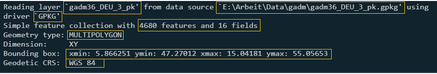
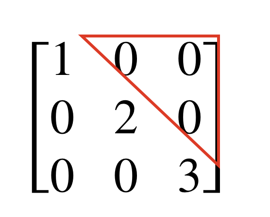

--- 
title: "Spatial Data Science in R"
author: "Jonathan Jupke"
date: "`r Sys.Date()`"
site: bookdown::bookdown_site
documentclass: book
bibliography: book.bib
biblio-style: "apalike"
description: |
        Lessons and tasks from GIS courses by Jonathan Jupke
link-citations: yes
---

# Introduction to the sf package

The most common way to handle spatial data in R is with the `sf` package [@pebesmaSimpleFeaturesStandardized2018].
In this first chapter, you will learn the basics of `sf` - everything you need to load, visualize, alter, and analyze spatial data in R. 
If you are looking more comprehensive introduction to `sf` and some additional packages, a great and free resource is the book *Geocomputation in R* [@Lovelace2019] available [here](https://geocompr.robinlovelace.net/).

## Loading sptial data into R

First we need to load the `sf` package. 
When we do so, we get the following message: 
        
```{r}
library(sf)
```

So `sf` establishes a connection between the running R instance and three other programs: GEOS, GDAL and PROJ.
[GEOS](https://libgeos.org/) and [GDAL](https://gdal.org/) are collections of functions to read, modify, and write geodata; [PROJ](https://proj.org/) transforms geodata from one coordinate reference system to another.  

Before we can load a file you need to set your working directory. 
```{r setwd, eval = F}
setwd("~/Uni/teaching/GIS/")
```

You have to adjust the working directory to your folder structure. 
If you are not sure how to write the path to your desired folder you can use the `file.choose()` function. 
After executing the function a window promt will open where you can select the desired folder in a point-and-click fashion. 
In the function you have to choose a file by double clicking it. 
R will now print the path to the selected file in the console.
The argument to `setwd()` needs to be the path to a folder. 
Therefore, to use the path `file.choose()` provided you need to remove the file name from the path.

With the command `st_read()` we read the geopackage file `gadm36_DEU_3_pk.gpkg` (download [here](https://cloud.uni-landau.de/index.php/s/99rjM6XDPkLxzxY)). 
The function starts, like all functions in `sf`, with `st_`, short for *spatiotemporal*.

```{r}
germany <- st_read("data/gadm36_DEU_3_pk.gpkg")
```

After the file is loaded we automatically get a set of information. 



These are from left to right and top to bottom following the yellow boxes: The layer name of the loaded file. This is not the object name in R, but the name stored in the geopackage (gpkg) file; where the file is located on disk; the file format (here GPKG); the number of rows (*features*, 4680) and columns (*fields*, 16); the feature type (GeometryType); the bounding box, i.e. minimum and maximum x and y co-ordinate data or longitude and latitude, and finally the coordinate reference system. 

If we now open the object in R we see the following: 

```{r}
germany
```

The header is similar to what we have already seen when reading the file. Below are the first ten rows of all columns.
The object has the classes:

```{r}
class(germany)
```

For the most part, we can handle sf objects like normal data frames.
We can use the `[` subsetting operations. 

```{r}
germany[,1]
germany[1,]
```

However, when we subset the columns of an sf object, we always keep the `geom` or `geometry` column. 
Usually, this is convenient because this column contains the spatial coordinates of the objects.
The `geom` column is a so-called *sticky* column. 
However, if you want to remove this column explicitly, you can use `st_drop_geometry()`. 
The `geom` column is different in another way - it is a [list column](https://adv-r.hadley.nz/vectors-chap.html#list-columns). 
Unlike other columns that are vectors, it is a list. 
The `geom` column has the class `sfc`.

```{r}
class(germany$geom)
```

`sfc` is short for *simple feature column*, i.e. a column for simple features. 
The individual elements in the column have the class `sfg`, *simple feature geometry*. 
`sfg` are the individual geometric shapes (points, lines, polygons, ...). 
Below, we will create `sfg` objects ourselves and compose an `sf` object from them. 

An object of class `sf` can be visualized with `plot()`. 
Fr this plot, I subset the data set to the first ten rows and three columns.

```{r}
plot(germany[1:10,7:9])
```

As you can see, by default each variable is plotted individually. 
Plots with single variables are created when we subset the dataset to one variable. 

```{r}
plot(germany[,"GID_3"])
```

## Creating spatial data yourself.


In `sf`, we can create spatial objects ourselves. 
This is rarely necessary since we usually work with data that was created in other projects, but later procedures are easier to understand once you have gone through the process from the beginning. The functions to create geometric shapes follow a simple rule: `st_` + name of the *geometryType*. So to create a point we use: 

```{r}
point1 <- st_point(x = c(1,1))
```
`point1` is a point with coordinates `1 1` and has the classes , `XY`, `POINT`, and `sfg`. 

```{r}
class(point1)
```

```{r}
plot(point1)
```

Lines consist of several coordinates which are connected with each other. 
The single coordinates are vectors (`c()`) just like `st_point()`. 
We could use lists, matrices, or data.frames to `st_linestring()` with several point coordinates.
The easiest way is to use matrices with two columns (for X and Y coordiantes) and as many rows as coordinate pairs.
In the example we create a line with the coordinates `1 1, 1 2, 2 2, 2 3`. 

```{r}
line_coordinates <- matrix(data = c(1,1,1,2,2,2,2,3), ncol = 2, byrow = T)
line1 <- st_linestring(line_coordinates)
plot(line1)
```

To create the object `line_coordinates`, we have transformed a vector with all coordinates into a matrix with two columns (`ncol`) and specified that the matrix is filled row by row (`byrow = T`), i.e., first row 1 column 1, then row 1 column 2 and so on. 
By default, matrices in R are filled column by column, not row by row. 
Since this notation is not very intuitive, I prefer the following notation: 

```{r}
line_coordinates <- 
        rbind(
                c(1,1), 
                c(1,2), 
                c(2,2),
                c(2,3)
        )
line1 <- st_linestring(line_coordinates)
plot(line1)
```

As you can see, the result is the same, but the single coordinates are not in one long vector. 
The function `rbind()` (short for *row bind*) takes single vectors and combines them as rows of a matrix. 
The equivalent function for columns is called `cbind()`. 

With `line_coordinates` we can also create a *multipoint*. 
```{r}
multipoint1 <- st_multipoint(line_coordinates)
plot(multipoint1)
```

Polygons are created with lists. 
When we have a single one polygon it looks like a *LineString* with the difference that the first coordinate and the last are the same.

```{r}
polygon_coordinates <- 
        rbind(
                c(1,1), 
                c(1,2), 
                c(2,2),
                c(2,1),
                c(1,1)
        )

polygon1 <- st_polygon(list(polygon_coordinates))

plot(polygon1)
```

*MultiLineStrings* and *Multipolygons* are aslo created with lists. 

```{r}
multilinestring_coordinates <- 
list(rbind(c(1,1), c(1,2), c(1,3), c(1,4)),
rbind(c(2,0), c(3,0), c(4,0), c(4,1)))

multilinestring1 <- st_multilinestring(multilinestring_coordinates)
plot(multilinestring1)        
```

```{r}
multipolygon_coordinates <- 
list(
list(rbind(c(0,0), c(0,1), c(1,1), c(1,0), c(0,0))), 
list(rbind(c(2,1), c(2,2), c(1,2), c(1,1), c(2,1)))
)
multipolygon1 <- st_multipolygon(multipolygon_coordinates)
plot(multipolygon1)
```

*Geometry collections* are single geometric objects that combine different GeometryTypes. 

```{r}
geometrycollection1 <-
        st_geometrycollection(x = list(
                st_multipolygon(multipolygon_coordinates),
                st_multilinestring(multilinestring_coordinates)
        ))
plot(geometrycollection1)
```

## Basic operations 

So far, our objects are geometric shapes, but not truly *spatial*. 
They are not yet assigned to concrete locations on earth, because they do not have a coordinate reference system (CRS).
With the command `st_crs()` we assign a CRS to an object. 
Alternatively, we can do this with `st_sfc()` when we turn an `sfg` into an `sfc`. 
We can use different formats to describe the CRS, but in practice the EPSG code is the easiest.
We assign `geometrycollection1` the CRS WGS 84. 

```{r}
geometrycollection_sfc <- st_sfc(geometrycollection1, crs = "EPSG:4326")
geometrycollection_sf  <- st_as_sf(geometrycollection_sfc)
```

There are many superior alternatives to the `plot()` function to create maps in R. 
Here, we will use the `tmap` package [@Tennekes2018].
Each `tmap` has at least two elements:    
        1. `tm_shape()` The spatial object you want to map.      
        2. the geometric shape you want to use: `tm_dots()` for points, `tm_lines()` for lines and `tm_polygons()` for polygons. 
        
These elements are combined with a `+`. 
There are no limits to how many objects or geometric shapes you can include in a single map. 
If you want to use different objects in one map you can call `tm_shape()` again with the next object after the `+`.  

```{r, echo = F, results='hide'}
library(tmap)
tmap_mode("plot")
```


```{r}
library(tmap)
tm_shape(geometrycollection_sf) + 
        tm_dots(size = 1) + 
        tm_lines() + 
        tm_polygons()
```

With `tmap` you can create interactive and static maps.
Interactive maps are great to explore your data, to check if you have specified the correct CRS, or for interactive documents in html format like this book. 
To create interactive maps you have to change the tm_mode from "plot" to "view". 

```{r}
tmap_mode("view")
```

After that the same function as before will create interactive maps. 

```{r}
tm_shape(geometrycollection_sf) + 
        tm_dots(size = 1) + 
        tm_lines() + 
        tm_polygons()
```

## Useful functions

The names of the functions in `sf` are mostly self-explanatory.
you can often just type `sf::`, scroll through the list of functions that appears, and with some background knowledge and imagination you'll often find what you're looking for. This works especially well if you combine this tactic with the help function (?function_name or highlight it and press F1).  Nevertheless, to conclude, let's look at some functions here as an example. 

### `st_area`

With `st_area()` we can determine the area of polygons
```{r}
germany_area <- st_area(germany)
class(germany_area)
```

`germany_area` has the class `units` which introduced the eponymous [package](https://r-quantities.github.io/units/articles/measurement_units_in_R.html) [@Pebesma2016]. 
With `units::drop_units()` we can convert the object into simple numbers ... 
```{r}
germany_area <- units::drop_units(germany_area)
```

... and color the administrative districts according to their area on a map. 

```{r}
germany <- dplyr::mutate(germany, area = germany_area)  
library(mapview)
mapview(germany, zcol = "area")
```
    
    
To create this map we used the `mapview` package [@appelhansMapviewInteractiveViewing2021]. 
`mapview` is often the faster and easier solution to create interactive maps. 
`tmap` offers more options and is the better solution to create maps for reports. 

### `st_distance`

With `st_distance()` we can determine the distance between two objects. 
As an example we could ask if the 10 largest districts are closer to each other than the ten smallest. 

```{r}
big10 <- germany |> 
        dplyr::arrange(area) |> 
        dplyr::slice_tail(n = 10)
big10 <- st_distance(big10)
```

The `st_distance()` can be used with one or two data sets. In both cases the result is a matrix with units. In our case, with only one data set, the distance from each polygon to each polygon is calculated. In cell 3, row 2 is the distance from centroid of the third polygon to the second. Since the distance from the third to the second is equal to the distance from the second to the third, the matrix is symmetric. The diagonal contains the distances of objects to themselves, i.e. 0.   

```{r}
big10 <- big10 |> units::drop_units() 
big10 <- big10[upper.tri(big10)]
small10 <- 
        germany |> 
        dplyr::arrange(area) |> 
        dplyr::slice_head(n = 10) |> 
        sf::st_distance() |> 
        units::drop_units() |> 
        {\(x) x[upper.tri(x)]}()
```

With `upper.tri()` I select the upper triangle of the matrix (see figure below) so I don't have every value twice. This also removes the diagonal. 



For `small10` we do the same, but this time with pipe operators. The only differences here are that `slice_tail()` has been replaced by `slice_head()` and the annonymous function at the end of the pipe. Anonymous functions are functions without a name. They are not stored as objects but executed directly. In R since version 4.1 we can create anonymous functions as follows: 

```{r}
# The two functions do the same thing. 
plus5 <- function(x) return(x+5)
plus5(4)
4 |> {\(x) x + 5}()
```

Now we still need to package the results in a data set and display them. For the latter, we use the `ggplot2` package [@Wickham2016] here. See [here](https://stats.oarc.ucla.edu/stat/data/intro_ggplot2_int/ggplot2_intro_interactive_flat.html) for an introduction. 

```{r}
library(ggplot2)

data <- data.frame(size = rep(c("big", "small"), each = 45),
                   distance = c(big10, small10))

ggplot(data, aes(y = distance, x = size)) + geom_boxplot()
```

So we see that the median distance between the ten largest counties is slightly smaller than that between the ten smallest. 

If we have two data sets and we only want to compare the first element of data set 1 with the first of data set 2, the second with the second, and so on, we set the argument `by_element` to `TRUE` in the function `st_distance()`. 


### `st_nearest_feature`

With `st_nearest_feature()` we find the elements in a dataset that are closest to the selected element. 

```{r}
# - Select the largest district
big1 <- germany |> 
        dplyr::arrange(area) |> 
        dplyr::slice_tail(n = 1)

# - Which element from germany is closest to the largest district? 
nnid <- st_nearest_feature(big1, germany)
# - The result is the row number of this closest object. 
nnid
germany[nnid, ]
mapview(rbind(big1,germany[nnid, ]), zcol = "GID_3")
```

### spatial subsetting

There are many ways to subset tables in R, using `[`, `select()` and `filter()`. 
They use the position of the desired objects in the table (for `[`), their column names (for `select()`), or values of the various variables (for `filter()`). 
With spatial data, we can spatial relationships to subset data sets.
The syntax follows the following scheme: Let `X` be the data set we want to select from and let `Y` be the data set we want to select with. 
For example: we have a set of bird observations all over Germany (`X`) and a data set with counties (`Y`) and we want to subset to the birds within one specific county. 
Now we subset `X` by `Y` by `X[Y]`. 
As an example, we use a set of bird observations ([here](https://cloud.uni-landau.de/index.php/s/bDFor6MpCX2qtNq) for download). 
In the code below, you can also see how to turn a data frame into an sf object. 
We use the `st_as_sf()` and provide it with the data frame, the names of the columns that have the coordinates (`coords`, first x then y), and the CRS.   


```{r}
# - load data
birds <- readRDS("data/birds.rds")
# - drop observations without spatial coordinates 
birds <- birds[which(!is.na(birds$decimalLongitude)), ]
# - turn bird data into sf object.
birds <- st_as_sf(birds, coords = c("decimalLongitude", "decimalLatitude"), crs = "EPSG:4326")
# - subset data for plot 
birds_subset <- birds[1:100, ]
mapview(birds_subset)
```
    
    
Now we want to select only the bird observations that are located in our county. 
The column `NAME_2` holds the county name. 
We select the county *Goslar*. 
Then we subset `birds` with `goslar`.

```{r}
goslar <- dplyr::filter(germany, NAME_2 == "Goslar")
goslar_birds <- birds[goslar, ]
mapview(goslar_birds)
```
    
    
The subsetting checks for a *topological relationship* between the elements of `birds` and `goslar`. 
If, as in the command above, we do not explicitly choose a topological relationship, the default relationship, intersection (per `st_intersects()`), is applied. 
Alternatives are touching the objects (`st_touch()`), crossing the objects (`st_cross()`), and covering (`st_covers()`). See the following figure for more examples. 


We consider here another example to demonstrate a different topological relationship. 
In this example, we use the `germany` data set and the largest county from the data set (`big1`). 
We want to select all counties that are adjacent to the largest county. 
So we subset `germany` the data set containing all counties using `big1`, the data set containing only the largest county. 
Instead of the `st_intersects()` relation, which is set by default, we choose `st_touches()`. 

```{r}
big1_neighbour <- germany[big1, op = st_touches]
mapview(big1_neighbour, zcol = "GID_3", legend = FALSE)
```
    
    
### Spatial joins 

In a spatial join, we add the variables of a second data set to those of a first one. The spatial relationship between the elements of the objects is used to determine which elements are combined. 
An example would be to add the county to the bird data as a variable. 

```{r}
# - Random subset of 500 titmice
birds_subset <- birds[sample(1:nrow(birds), 500), ]

# - create a dataset based on germany but with only one variable: name_2
germany_name2 <- dplyr::select(germany, NAME_2)

# - spatial join 
birds_name2 <- st_join(birds_subset, germany_name2)
mapview(birds_name2, zcol = "NAME_2", legend = FALSE)
```

### Spatial Aggregation 

The last thing we want to look at is how we aggregate data. 
The question here might be: What is the mean abundance of birds in the different counties. 
So we want to:     
1. group the bird data according to which district they fall into.     
2. calculate for each group the mean value of the abundance (individualCount).     
3. assign these mean values to the counties in a data set.    

We can do all this with a single function: `aggregate()`. 
However, we need to prepare the data a bit for this. 
`aggregate()` needs the following arguments: `x` which data should I aggregate? In our case it is the birds.
`by` in which data are the groups in which I should aggregate? For us it is `germany`. `FUN` with which function should I aggregate the data? For us `mean()`, the mean value. 
If you want to give arguments to the function you use to aggregate you can do that afterward. 

```{r}
# - Create a data set where the tits have only the variable individualCount. 
birds_count <- dplyr::select(birds, individualCount)
# - Reduce to rows that have information for the variable individualCount. 
birds_count <- dplyr::filter(birds_count, !is.na(individualCount))
# - aggregate the data birds_count using germany with the function mean. 
birds_agg <- aggregate(x = birds_count, by = germany, FUN = mean)
# - If we didn't remove the NAs we could use the following function: 
birds_agg <- aggregate(x = birds_count, by = germany, FUN = mean, na.rm = TRUE)
# - The argument na.rm = TRUE is an argument of the function mean(). It removes (remove, rm) all NAs before calculating the mean. If you open the help page of aggregate() you will see "..." at the arguments. These so called ellipsis are placeholders for all arguments you can give to the function in FUN.  
mapview(birds_agg, zcol = "individualCount")
```

## Exercises 

In [this](https://cloud.uni-landau.de/index.php/s/iMHkR9oC2H2QzZ6) folder you will find three files:  

1. bike rental stations in London     
2. the rail network of London      
3. the boroughs of London     

All data are projected with the projection WGS84 (EPSG: 4326). 

With this file, answer the following questions: 

1. how many bicycle stations are there in the dataset?
2. how many stations have more than 10 bicycles?
3. how big are the different regions of London? Add the area to the dataset as a variable.
4. assign to each bike station the 'osm_id' of the nearest train track
5. calculate the distance between each bike station and the nearest train track
6. create a plot showing the number of bikes per station against the distance to the next rail line.
7. create a map on which the bike stations are colored according to the distance to the nearest train line. 
Calculate the average distance from bike station to the nearest rail line for each borough in London for which bike data is available. 
