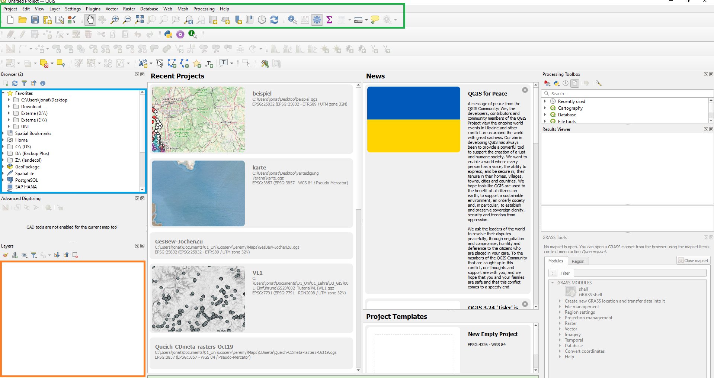
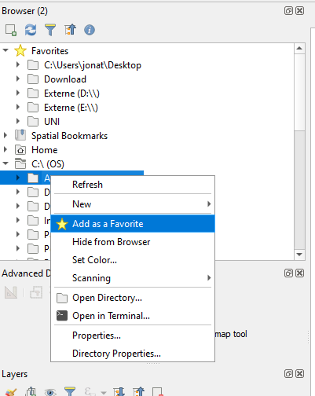
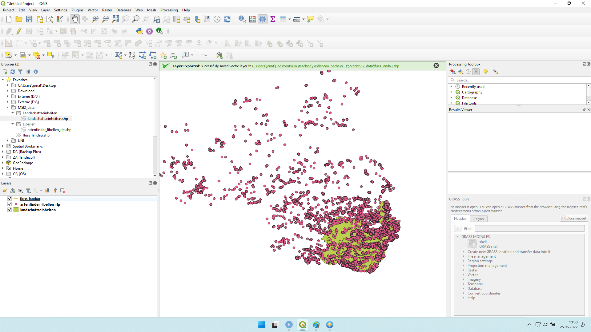
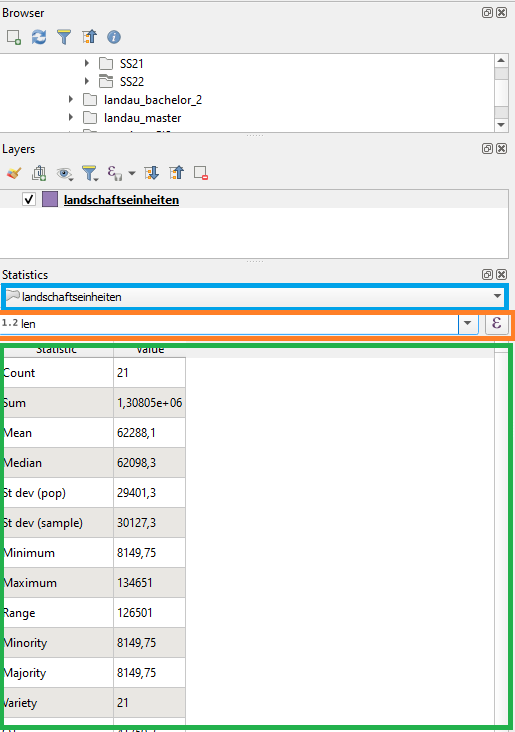
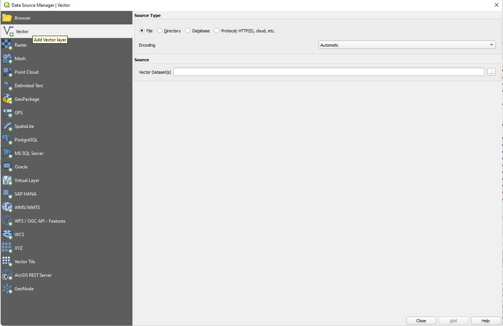
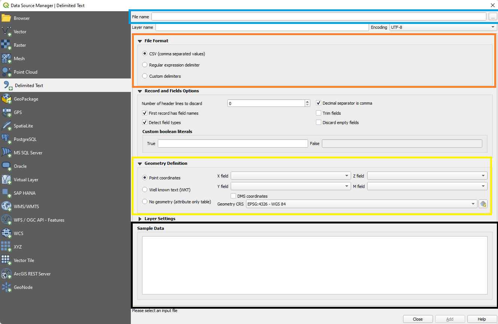
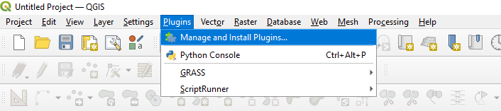
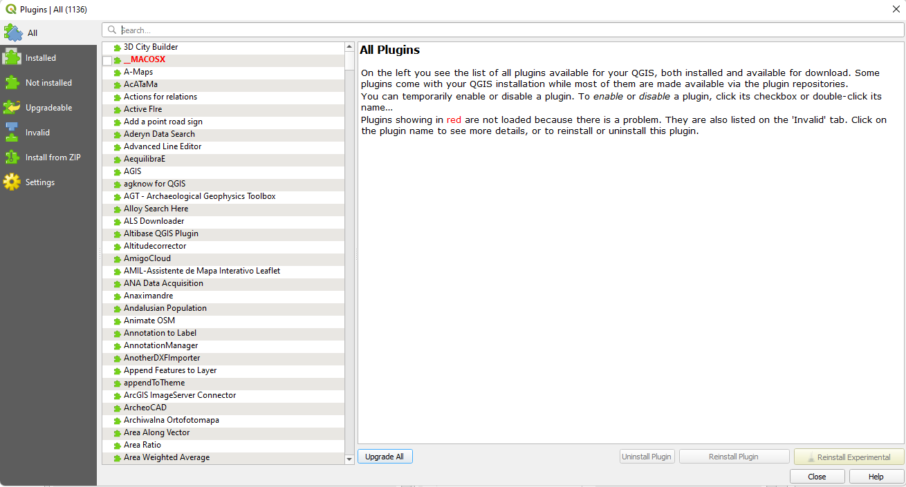

# Erste Schritte 

## Was sehe ich hier? 

Mein QGIS ist auf Englisch eingestellt. Falls dich der Sprachunterschied stört, kannst du die Sprache deines QGIS ändern unter **Settings** $\rightarrow$ **Options** (Abb. \@ref(fig:intro1)). 

```{r intro1, fig.cap = "Allgmeine Optionen öffnen um die Sprache zu ändern"}
knitr::include_graphics("fig/intro1.png")
```

Dort links den obersten Eintrag **General** wählen und die Sprache ändern. Allerdings nur im oberen Feld (user interface translation). Das Feld darunter sollte auf *Germany* eingestellt bleiben. 

Nachdem ihr QGIS das erste Mal geöffnet habt erscheint das folgende Fenster (Abb. \@ref(fig:intro4)). 

```{r intro4, fig.cap = "QGIS"}

```

Vermutlich siht das Fenster bei euch ein wenig anders aus, ihr werdet z.B. ein paar Schaltflächen und Fenster weniger haben, aber die enscheidenden Bestandteile sind die gleichen. 
Im **Browser Panel** (blau in Abb. \@ref(fig:intro4)) seht ihr die Ordner eures PCs. Hier könnt ihr zu Dateien navigieren die ihr öffnen wollt und diese mit einem Doppelklick zu laden. Falls es einen Ordner gibt auf den ihr besonders oft zugreift könnt ihr ihn als Favoriten markieren (Abb. \@ref(fig:intro5)). Favorieten werden ganz oben im **Browser Panel** angezeigt, so könnt ihr einfach und schnell zu ihnen navigieren ohne euch durch eure komplette Ordnerstruktur durchklicken zu müssen. Ein neu als Favorit markierter Ordner bekommt seinen Pfad als Namen. Bei mir ist das "C:\Users\jonat\Documents\Uni\teaching\GIS\landau_bachelor_1\SS22\MSI2_data". Wir können den Namen ändern indem wir den Favoriten auswählen und dann F2 drücken oder mit Rechtsklick $\rightarrow$ **Rename Favorite...". 

```{r intro5, fig.cap = "Ordner als Favorit markieren"}

```

::: {.blackbox .work data-latex="{work}"}
**Aufgabe**

1. Ladet die Dateien libellen.zip, fluss_landau.zip und Landschaftseinheiten.zip aus dem Ordner Vorlesung 1 auf OLAT herunter.    
2. Erstellt einen Ordner den ihr für alle Dateien dieser Vorlesung benutzen könnt.    
3. Macht diesen Ordner zu einem Favoriten.   
4. Entzippt die heruntergeladenen Dateien und speichert sie in dem neuen Ordner.   
5. Öffnet die drei Layer in QGIS indem ihr jeweils auf die .shp Dateien doppelklickt. 

:::

Falls ihr Hilfe beim entzippen der Datein braucht seht [hier](https://support.microsoft.com/de-de/windows/zippen-und-entzippen-von-dateien-8d28fa72-f2f9-712f-67df-f80cf89fd4e5) (Windows) oder [hier](https://support.apple.com/de-de/guide/mac-help/mchlp2528/mac). 

Unter dem **Browser Panel** ist das **Layer Panel** (orange Abb. \@ref(fig:intro4)). Hier werden alle Datein angezeigt die ihr aktuell in QGIS geladen habt. Wenn ihr das Programm startet ist der **Layer Panel** dementsprechend noch leer. Nachdem ihr die drei Layer geladen habt sollten diese dort aufgeführt werden (Abb. \@ref(fig:intro6)). 

```{r intro6, fig.cap = "QGIS mit geladenen Layern"}

```


In der Mitte des Bildschirms (dem **Map View**) werden euch die Daten nun angezeigt. Die Farben werden jedesmal beim Laden zufällig ausgewähl also seht ihr bei euch vermutlich andere Farben. Jeder Layer hat im **Layer Panel** drei Spalten. Erstens ein Box mit Hacken. Wenn ihr diesen Hacken mit einem Linksklick entfernt wird der Layer nicht mehr angezeigt. Zweitens eine farbige gemetrische Form. Diese zeigt die **feature class** (also Punkt, Linie oder Polygon) des Layers sowie seine [Symoblogie][Symbologie] (Farbe und Form der Darstellung) an. 
Als drittes seht ihr den Namen des Layers. Dieser kann genau wie bei den Ordnern im **Browser Panel** per Rechtsklick oder F2 geändert werden. Die Reihenfolge der Layer im **Layer Panel** entspricht der Reihenfolge der Layer im **Map View**. Wenn der Polygonlayer Landschaftseinheiten im Layer Panel über dem Punktlayer artenfinder_libellen_rlp liegt so liegt er auch im Map View darüber und wir können die Punkte unter dem Polygon nicht sehen.    

Das letzte wichtige Element der graphischen Oberfläche von QGIS ist die Menüleiste (grün Abb. \@ref(fig:intro4)).
Im Folgenden werde ich die wichtigen Elemente der Menüleisste kurz vorstellen. Einige der Elemente sind für diese Vorlesung nicht relevant und werden hier nicht besprochen, andere kommen in späteren Abschnitten vor. 
Mit  öffnet ihr ein neues QGIS Projekt, das aktuelle wird dabei geschlossen. 
Mit  öffnet ihr ein existierendes QGIS Projekt. Mehr zu Projekten findet ihr [hier][Projekte]. 
Mit  öffnet ihr den **Print Composer**. Mehr zum Print Composer [hier][Karten speichern].
Mit  wählt ihr das Pan (schwenken) Werkzeug aus. Damit könnt ihr die Ansicht im **Map View** ändern, indem ihr die Maus über den **Map View** bringt, die linke Maustaste gedrückt haltet und die Maus bewegt. Mit dem Mausrad könnt ihr rein und raus zoomen. 
Zoomen könnt ihr auch mit  und . Dafür das Werkzeug auswählen und dann auf den **Map View** klicken um rein () oder raus () zuzommen. 
Mit  können wir genau auf den aktuellen Layer zoomen. Mit dieser Funktion stellen wir die Zoomstufe so ein, das wir alle Daten des im **Layer Panel** gewählten Layers sehen können. Mit  und . 
Falls euch **Map View** nicht ausreicht könne ihr mit  eine zweiten (dritten, vierten, ...) **Map View** erstellen. Dieser erscheint als verschiebares Fenster.
Mit  können wir einzelne Elemente im **Map View** auswählen und erhalten deren Eintrag aus der Attributtabelle. 
Mit dem **Field Calculator** ()können wir der Attributtabelle neue Spalten hinzufügen. In betrachten wir [hier][Der Field Calculator] näher. 
Mit  öffnen wir die **Processing Toolbox**. 
MIt  können wir einige statistische Zusammenfassungen unseres Layers berechnen. Das Fenster öffnet sich unterhalb des **Layer Panels** (Abb. \@ref(fig:intro7)). Im obersten Menü (blau in \@ref(fig:intro7)) wählen wir den Layer, darunter (orange in \@ref(fig:intro7)) die Variable, also die Spalte der Attributtabelle und darunter (grün in \@ref(fig:intro7)) werden die Ergebnisse angezeigt. 
Mit  können wir die Attributtabelle eines Layers öffnen. 
Mit  können wir Distanzen, Flächen, Himmelsrichtungen und Winekl auf der Karte messen. 

        
```{r intro7, fig.cap = "Zusammenfassende Statistiken"}

```

## Wie lade ich Daten?

Wie Daten einfach über das **Browser Panel** geladen werden können haben wir bereits gesehen. Alternativ könnt ihr Dateien auch per Drag-and-Drop aus Browser eures Betriebssystems in QGIS ziehen (Map View oder Layer Panel). Die dritte Möglichkeit stellt der **Data Source Manager** dar. Ihr findet ihn unter **Layer** $\rightarrow$ **Data Source Manager** (Abb. \@ref(fig:intro8)) oder mit Strg + L. 

```{r intro8, fig.cap = "Pfad zum Data source manager"}
knitr::include_graphics("fig/intro8.png")
```

Auf der rechten Seite des **Data Source Manager** seht ihr verschiedene Reiter die für verschiedene Dateitypen stehen (Abb. \@ref(fig:intro9)). In dieser Vorlesung interresieren uns Vector, Raster und Delimited Text. 

```{r intro9, fig.cap = "Data source manager"}

```

In Abbildung \@ref(fig:intro9) sehen wir das Fenster für Vector. Hier muss nur unter **Source** über den  Knopf die Datei ausgewählt werden. Für Raster sieht das Fenster praktisch genauso aus. Delimited Text steht für Tabellen im .csv (comma separated values) Format. Dort sieht die Eingabemaske etwas anders aus (Abb. \@ref(fig:intro10)). 

```{r intro10, fig.cap = "Delimited text im Data source manager"}

```

Bei *File Name* wählt ihr über den  Knopf die gewünschte .csv Datei (blau in \@ref(fig:intro10)). Im Normalfall solltet ihr bei *File Format* (orange in \@ref(fig:intro10)) nichts verändern müssen. Der Haken sollte hier bei *CSV (comma separated values)* sein. Falls ihr unter *sample data* (schwarz in \@ref(fig:intro10)) eine Tabelle seht wie in Abbildung \@ref(fig:intro11)

```{r intro11, fig.cap = "Tablle im Delimited text Menü des Data source managers"}
knitr::include_graphics("fig/intro11.png")
```

Falls dies nicht der Fall ist wählt unter *File Format* die Option **custom delimiters**. QGIS wählt dann automatisch eine geeignete Option. Unter **Geometry Definition** müsst ihr im Idealfall nichts ändern. Wenn die Spalten der csv Datei in dennen die Koordinaten sind informative Namen haben (z.B. Longitude und Latitude oder Easting und Northing oder X und Y) findet QGIS diese automatisch. Wenn dies nicht der Fall ist müsst ihr sie *X field* und *y filed* selber auswählen. Zum Abschluss noch unten auf **add** gehen und die Datei ist hinzugefügt. 
## Projekte

Wenn ihr die Zusammenstellung der Dateien die ihr zu einem Zeitpunkt in QIGS geladen habt speichern wollt, könnt ihr Projekte dafür benutzen. Eine QGIS Projekt ist die Gesammtheit der gerade geladenen Layer. Ihr könnt es unter **Project** $\rightarrow$ **Save** speichern. Wenn ihr nun eine Projektdatei mit QGIS öffnet, öffnet ihr alle Layer die in dem Projekt gespeichert sind. Die gespeicherte Datei enthält nicht die Dateien für die einzelnen Layer. Sie enthält lediglich Verweise auf die Ordner wo diese Dateien zu finden sind. Wenn ihr also ein Projekt speichert, danach die Dateien für die Layer des Projektes umbennent oder verschiebt, oder wenn ihr Ordner im Pfad der Dateien umbennent, kann das Projekt sie nicht mehr finden und wir eine Fehlermeldung zurückgeben. 

## Plug-ins

Plugins sind kleine Erweiterungen, die QGIS zusätzliche Funktionalitäten verleihen. In dieser Vorlesung werden wir nur wenige benutzen, aber es ist dennoch gut zu wissen wo wir Plugins installieren und laden können. Das Pluginmenü öffnet ihr mit einem Klick auf den **Plugins** $\rightarrow$ **Manage and install Plugins...** (Abb \@ref(fig:intro2)).

```{r intro2, fig.cap = "Öffnen des Pluginmenüs"}

```

Das Pluginmenü (Abb. \@ref(fig:intro3)) enthält auf der linken Seite mehere Reiter. 

```{r intro3, fig.cap = "Das Pluginmenüs"}

```

Unter *All* werden alle Plugins aufgeführt, unter *Installed* nur diejenigen die ihr installiert habt, unter *Not Installed* findet ihr alle Plugins die ihr nicht installiert habt und unter *Upgradeable* werden alle installierten Plugins aufgeführt, für die es inzwischen ein Update gibt. Darunter könnt ihr noch nicht mehr funktionierende Plugins (*invalid*) sehen. Wir können Plugins einfach aus diesem Menü herraus installieren. Wenn ihr auf *Not installed* geht und aus der Liste, rechts neben den Reitern, ein Plugin auswählt könnt ihr unten rechts auf *install Plugin* klicken. Für diese Vorlesung werden wir das OpenLayers Plugin verwenden. Um das zu installieren müsst ihr zuerst im Reiter *Settings* einen Haken bei *Show also experimental plugins* setzen. Dann könnt ihr unter *All* oder *Not Installed* im Suchfenster OpenLayers Plugin eingeben und das Plugin installieren. Grundätzlich ist es auch möglich Plugins lokal aus zip Dateien zu installieren (*Install from ZIP*). Das ist am ehesten relevant wenn man selber Plugins programmiert und diese testen möchte. Daher werden wir diese Option in der Vorlesung nicht nutzen. 

