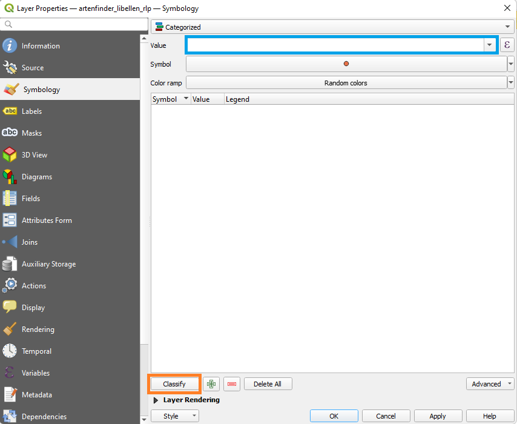
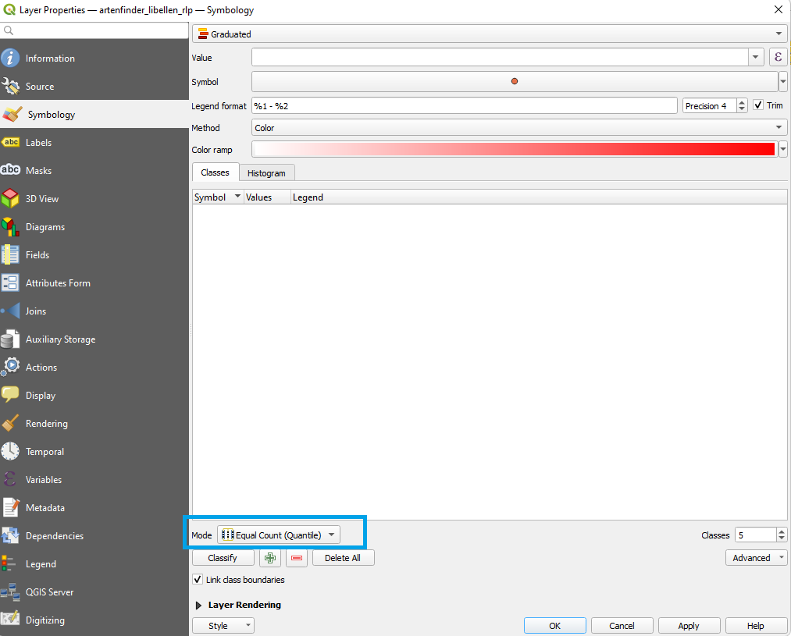
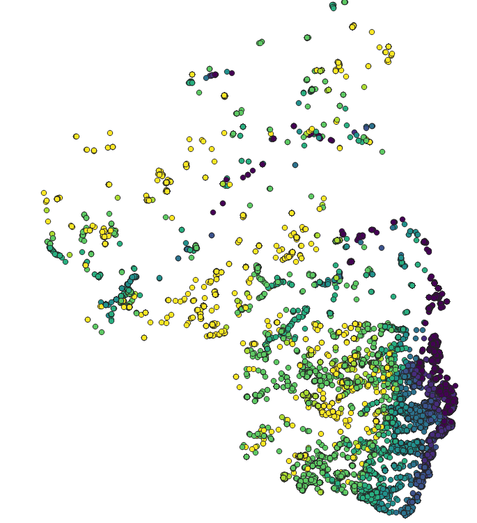
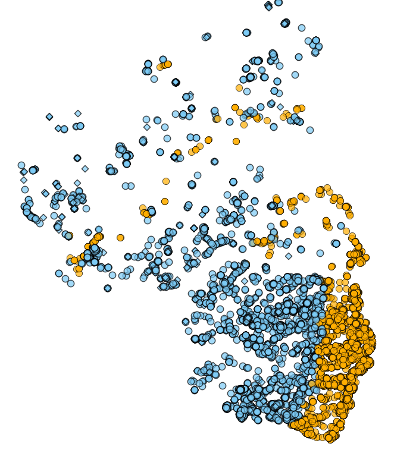
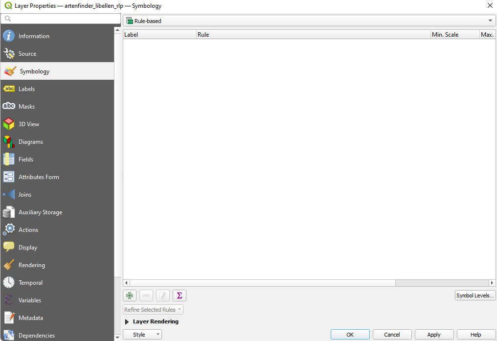
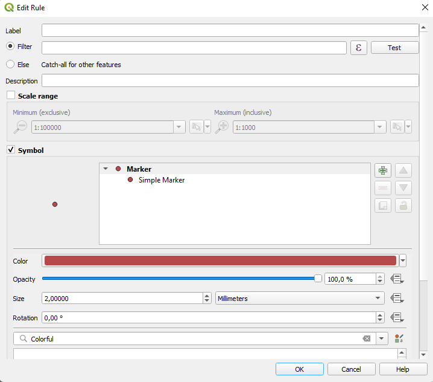

# Symbologie

Symbologie beschäftigt sich mit der Darstellung von Daten auf Karten. Die in diesem Abschnitt beschriebenen Methoden beziehen sich nur auf Vektordaten. Falls ihr die Darstellung von Rasterdaten ändern wollt, seht [hier][Darstellung]. 
## Punkte

Wir beginnen dieses Kapitel mit der Symbologie von Punkten. Um die Darstellung eines Layers zu verändern wählen wir den Layer mit einem Rechtsklick im **Layer Panel** aus und wählen dann **Properties...**. Nun öffnet sich das Symbology-Menü (Abb. \@ref(fig:sym1)). 

```{r sym1, fig.cap = "Symbology-Menü"}
knitr::include_graphics("fig/sym1.png")
```

Die Optionen in diesem Menü sind riesig. Wir werden uns hier auf die Grundlagen beschräken. Die meisten Funktionen, auch die die wir hier nicht besprechen, erklären sich von selbst oder werden klar wenn ihr ein wenig damit herumspielt. 

Ganz oben im Menü gibt es drei die Wahl zwischen verschiedenen Darstellungsarten (blau Abb. \@ref(fig:sym1)).
Hier gibt es im Drop-Down Menü die Optionen: single symbol, categorized, graduated und rule-based. Es gibt auch noch weitere Optionen aber die werden wir hier nicht behandeln. 

### Single Symbol

Die Ansicht unter der *Single Symbol* Option sehr ihr in Abbildung \@ref(fig:sym1). 
Mit den Optionen in der orangen Box könnt ihr die Farbe der Punkte verändern (color), die Punkte durchsichtig machen (Opacity), die Größe der Pukte sowie die Maßeinheit der Größe verändern (Size) und die Punkte rotieren (Rotation). 
In der Box darunter (grün in Abb. \@ref(fig:sym1)) könnt ihr die Form des Symbols von einem einfachen Punkt zu anderen Symbolen verändern. 

### Categorized

Bei *Categorized* sehen wir zuanfang das Menü aus Abbildung (\@ref(fig:sym2)). 

```{r sym2, fig.cap = "Symbology-Menü - categorized ohne Auswahl"}

```

Bei dieser Darstellungsart ist die Idee, verschiedenen Kategorien verschiedene Farben zuzuordnen. Diese Kategorien sind druch Variablen aus der Attributtabelle definiert. In dem Libellendatensatz könnten wir als Beispiel die Variable *titel_deut*, also die deutschen Artnamen auswählen. Im Menü wählen wir die Variable unter *Value* (blau in Abb. \@ref(fig:sym2)). Nun haben wir eine Variable ausgewählt und können den einzelnen Werten dieser Variable Farben zuordnen. Die Darstellungsart *categorized* eignet sich am Besten für diskrete Variablen. Diskrete Variablen haben verschiedene Klassen (z.B. Haarfrabe, Landkreis, biologische Art, Höhenklasse). Ihnen gegenüber stehen kontinuierliche Variablen wie Größe, Länge, Anzahl oder Höhe. Für kontinuierliche Variablen ist die nächste Darstellungsoption (*graduated*) besser geeignet. Da wir in der *categorized* verschiedene Kategorien auseinanderhalten wollen nutzen wir eine Farbskala mit zufällig zugeordneten Werten (*color ramp* = Random colors). Mit eine Klick auf *classify* (orange \@ref(fig:sym2)) ordnet QGIS jedem einzigartigen Wert der ausgewählten Variable eine Farbe zu. Das Ergebnis seht ihr in Abbildung \@ref(fig:sym3). 

```{r sym3, fig.cap = "Symbology-Menü - categorized mit Auswahl"}
knitr::include_graphics("fig/sym3.png")
```

Die Einstellung jetzt noch mit einem Klick auf *ok* bestätigen und die kategorisierte Darstellung ist fertig (Abb. \@ref(fig:sym4)). 

```{r sym4, fig.cap = "Categorized Darstellung der Libellen nach Artnamen"}
knitr::include_graphics("fig/sym4.png")
```

### Graduated

Die graduierte Darstellung eignet sich um Variablen mit Zahlenwerten auf einem kontinuierlichen Gradienten darzustellen. Anstat wie bei *categorized* jedem einzigartigem Wert eine Farbe zu zuordnen, benutzen wir einen von verschiedenen Algorithmen um die Daten in Gruppen einzuteilen und weisen jeder Gruppe eine Farbe zu. Die Anzahl der Gruppen können wir dabei frei wählen. Die anfänglich Ansicht der Darstellungsoption *graduated* seht ihr in Abbildug \@ref(fig:sym5).

```{r sym5, fig.cap = "Symbology-Menü - graduated ohne Auswahl"}

```

In diesem Menü funktioniert eigentlich alles genauso wie in dem von *categorized*. Der einzige unterschied ist der wir nun die Anzahl der Farbklassen auswählen (bei *classes*) und den Algorithmus mit dem die Grenzwerte der einzelenen Klassen festgelegt werden (*mode*, blau in Abb. \@ref(fig:sym5)). Die Algorithm zur auswahl sind Equal count (setze Grenzwerte so, dass in jeder Gruppe gleich viele Bobachtungen sind), Equal interval (setzte die Grenzen so, dass jeder Intervall gleichgroß ist), logarithmic (Grenzen sind entsprechen $10^x$), und weitere Algorithmen die kompliziertere Methoden anwenden. In der Praxis könnt ihr rumporbieren und den Algorithmus auswählen der euch am Besten gefällt. 

In Abbildung \@ref(fig:sym6) seht ihr die Libellen, eingefäbt nach Höhe. Die Darstellung hat neun Klassen die mit Equal Count definiert sind.

```{r sym6, fig.cap = "Graduated Darstellung der Libellen nach Höhe"}

```

### Rule based

Bei der regelbasierten Darstellung definieren wir Regeln nach dennen die Symbole ausgewählt werden. Als Beispiel hier eine Karte bei der Punkte die unter 150 m Höhe liegen orange sind und solche die darüber liegen blau. Gleichzeitig sind Punkte mit mehr als 2 Individuen Caros, während die restlichen Punkte Kreise sind (Abb. \@ref(fig:sym7)).

```{r sym7, fig.cap = "Rule-based Darstellung der Libellen"}

```

Wenn wir das Menü zu *rule-based* das erste Mal öffnen sieht es so aus (Abb. \@ref(fig:sym8)). 

```{r sym8, fig.cap = "Rule-based Darstellung ohne Auswahl"}

```

Um eine neue Regel hinzuzufügen klicken wir auf das grüne Plussymbol unten links. Es öffnet sich das folgende Fenster (Abb. \@ref(fig:sym9)). 

```{r sym9, fig.cap = "Erstellen einer neuen Regel"}

```

Bei *Label* können wir der Regel einen Namen geben. Bei *Filter* definieren wir unsere Regel. Diese Regeln folgen der gleichen Syntax wie alle Datenbankabfragen in QGIS. Dazu [hier][Datenbankabfragen ] mehr.
Darunter kann das Symbol für die gerade definierte Gruppe wie gewohnt angepasst werden. Um Beobachtungen mit einer Höhe kleiner 150m und weniger als 3 Individuen auszuwählen nutzen wir die folgende Regel:  "anzahl" < 3 AND "hoehe" < 150. Die anderen drei Gruppen lassen sich daraus ableiten. 


## Linien und Polygone 

Die gleichen Prinzipen lassen sich 1:1 auf Linien und Vektorenobjekte übersetzten. Diese haben logischerweise etwas andere Standardformen zur Auswahl aber die grundlegenden Prinzipien bleiben gleich. 