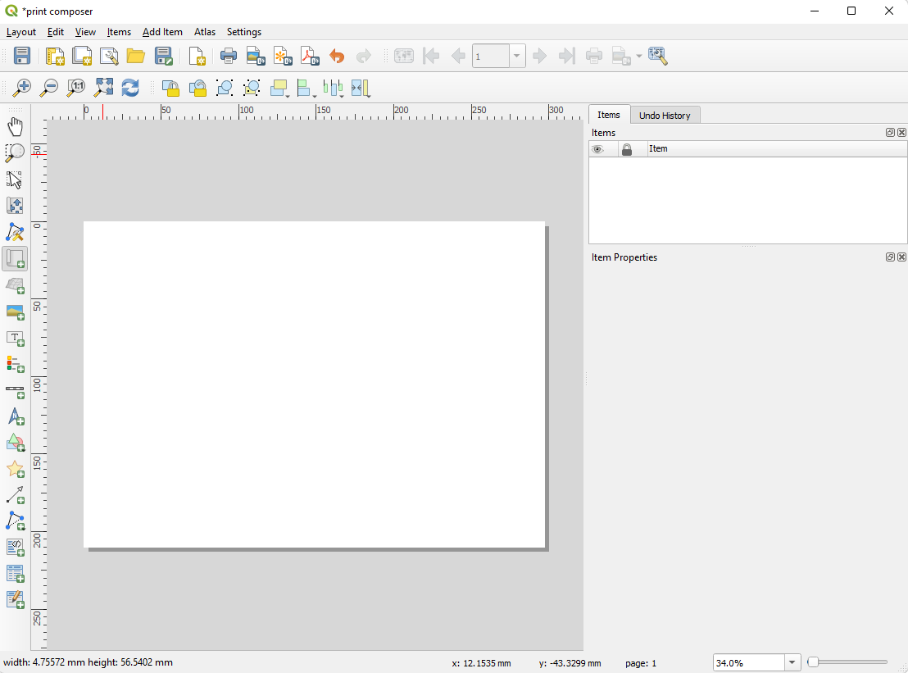
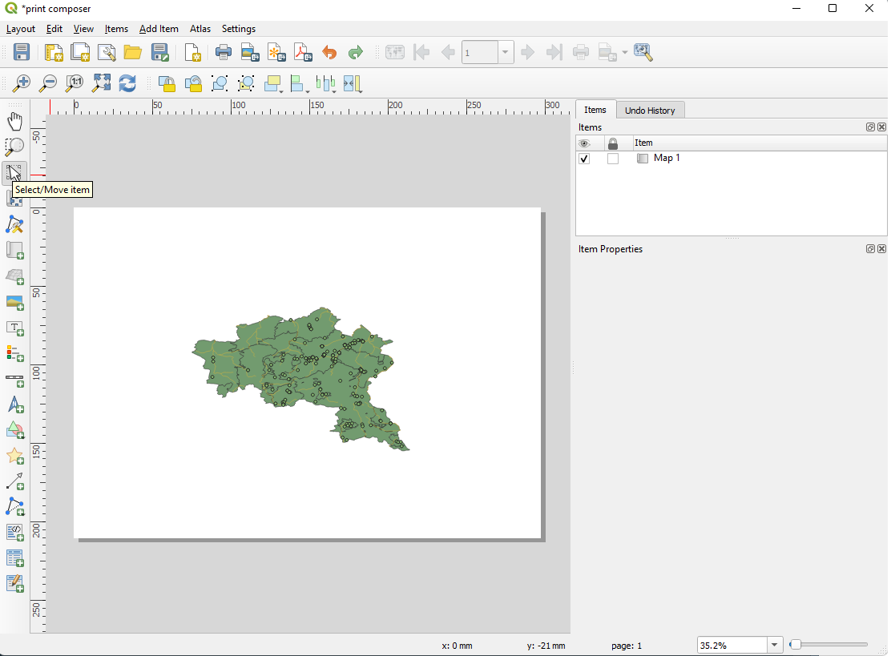
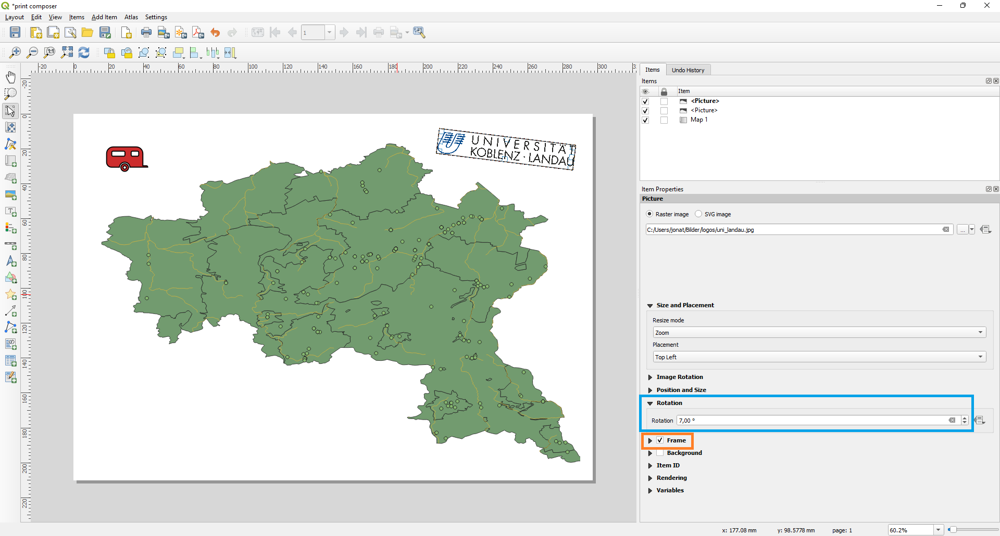
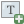
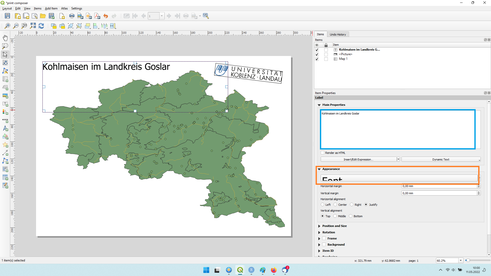
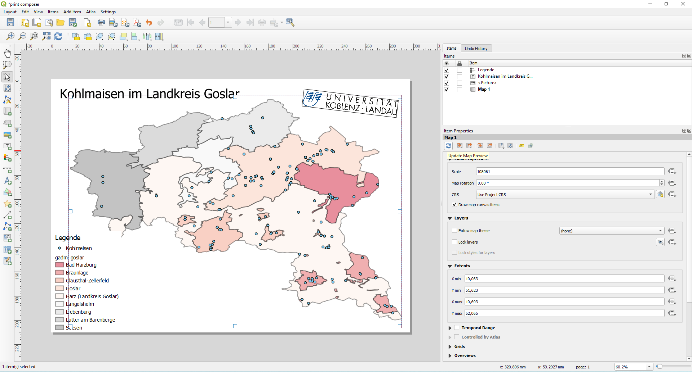
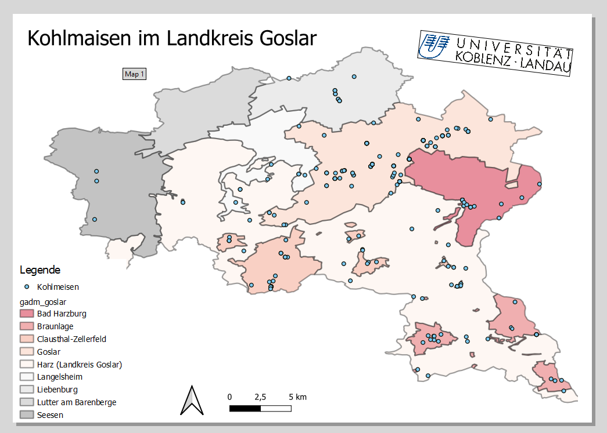
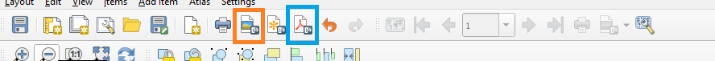

# Karten speichern

Bevor wir eine Karte speichern können, müssen wir Daten in QGIS geladen haben. Also laden wir unseren Landkreis, die Flüsse des Landkreises und die Beobachtungen der Kohlmeisen aus unserem Landkreis. Denkt daran, dass ihr die Meisen mit dem Data Source Manager (Strg + L) öffnen müsst (siehe [hier][Der Data Source Manager]), da sie als .csv Datei gespeichert sind. Danach in QGIS auf Projekt und dann auf **new print layout** klicken (Abb. \@ref(fig:pc1)). Alternativ öffnet ihr den print composer auch mit Strg + P. 

```{r pc1, fig.cap = "Öffnen des Print Composers"}
knitr::include_graphics("fig/printcomposer1.png")
```

Daraufhin werdet ihr aufgefordert einen Namen einzugeben. In der Praxis gebt ihr hier einen Namen ein der zu eurer Karte passt. Heute benutzen wir einfach *print composer test*. Jetzt sollte sich ein neues Fenster geöffnet haben. Genau wie das Hauptprogramm zeichnet sich der Print Composer durch eine unübersichtliche Anzahl an Knöpfen aus. Wir werden uns hier auf die wesentlichen Funktionen beschränken, eine ausführlichere Beschreibung findet ihr [hier](https://docs.qgis.org/2.8/en/docs/user_manual/print_composer/print_composer.html), leider müsst ihr beachten, das diese sich auf eine ältere Version von QIGS bezieht und die [aktuelle Hilfeseite](https://docs.qgis.org/3.22/en/docs/) keine dedizierte Seite für den Print Composer hat.

```{r pc2, fig.cap = "Der leere Print Composer"}

```

In der linken Leiste sind eine Reihe von Symbolen. Als ersts klicken wir auf . Dann ziehen wir mit gedrückter linker Maustaste ein Rechteck, dass das Papier in der Mitte füllt (Abb. \@ref(fig:pc3))

```{r pc3, fig.cap = "Hinzufügen der Karte mit Add Map"}
knitr::include_graphics("fig/printcomposer3.png")
```

Wenn ihr jetzt die linke Maustaste loslasst sollte euer Landkreis mit Flüssen und Vögeln zu sehen sein (Abb. \@ref(fig:pc4)). Die eingefügt Ansicht entspricht der akutellen Ansich in QGIS. Wenn ihr also in QGIS zoomt oder eine andere Region betrachtet wird hier etwas anderes eingefügt. Nachdem ihr die Karte im Print Composer eingefügt habt, haben Veränderungen in QGIS allerdings keinen Einfluss mehr auf sie. 

```{r pc4, fig.cap = "Die hinzugefügt Karte"}
knitr::include_graphics("fig/printcomposer4.png")
```

Mit dem **Select/ Move Item** (siehe Abb. \@ref(fig:pc5)) könnt ihr das das eingefügt Rechteck verschieben bzw. seine Größe verändern. 

```{r pc5, fig.cap = "Select/ Move Item"}

```

Mit dem Symbol darunter (**Move item content**) könnt ihr den angezeigten Auschnitt verändern, also zoomen oder die Ansicht verschieben. Damit könnt ihr z.B. den angezeigten Ausschnit so vergrößern, dass er die Karte ausfüllt. 

```{r pc6, fig.cap = "Karte vergrößert mit move item content"}
knitr::include_graphics("fig/printcomposer6.png")
```

Mit dem **Add Picture** Knopf können wir Bilder zu der Karte hinzufügen. Grundlegend gibt es hier zwei Optionen. 1. Symbole aus QGIS oder 2. Bilder von der Festplatte. Die Symbole von QGIS sind die gleichen, die ihr auch für Punktobjekte nutzen könnt. Um ein Bild hinzuzufügen müsst ihr als erstes wieder mit gedrückter linker Maustaste einen Rahmen ziehen. Rechts könnt ihr im Fenster SVG groups zwischen verschiedenen Gruppen und Symbolen wählen (blaue Box Abb. \@ref(fig:pc7)). Unten können verschiedene Eigenschaften der Symbole (Füllfarbe, Strichstärke und - farbe, etc.) angepasst werden (orange Box \@ref(fig:pc7)). Um von Symbolen zu eigenen Bildern zu wechseln müsst ihr von **SVG image** zu **Raster image** wechseln (gelbe Box in Abb. \@ref(fig:pc7))

```{r pc7, fig.cap = "Hinzufügen von Symbolen"}
knitr::include_graphics("fig/printcomposer7.png")
```

Dort gibt es dann wieder ein Feld in den ihr den Pfad zu dem gewünschten Bild eingeben könnt oder alternativ könnt ihr auf das  Symbol klicken und die Datein im Explorer auswählen. In Abbildung \@ref(fig:pc8) habe ich das Logo der Universität hinzugefügt, es leicht rotiert (blaue Box) und einen schwarzen Rahmen darum gezogen (orange Box).

```{r pc8, fig.cap = "Hinzufügen von Raster Bildern"}

```

Mit dem  Knopf können wir dem Bild Schrift hinzufügen. Wieder müssen wir als erstes einen Rahmen ziehen. Die Box enthält dann den Text Lorem ipsum, die ihr rechts in der Box **Main Properties** ändern könnt (blaue Box Abb. \@ref(fig:pc9)). Lorem ipsum ist ein Standardtext im Design und Layout der keinerlei Bedeutung hat und nur dazu da ist eine Fläche mit Text zu füllen. Schriftgröße und -art können unter **Appearance** $\rightarrow$ **Font** angepasst werden (orange Box Abb. \@ref(fig:pc9)). Dieses Tool kann zum Beispiel genutzt werden um der Karte eine Überschrift zu geben. 

```{r pc9, fig.cap = "Hinzufügen von Text"}

```

Mit  fügen wir der Karte eine Legende hinzu. Die Einträge der Legende entsprechen den Namen im QGIS Layerpanel und werden angepasst, falls ihr die Namen dort ändern solltet. Im aktuellen Zustand ist die Legende wenig hilfreich. 

Das können wir verbessern indem wir 1. die Layer umbennen ([siehe hier][Sonstiges]) und 2. in einen Layer Farben nutzen um eine Variable darzustellen([siehe hier][Symbologie]). 
Um die Änderungen in QGIS auch im Print Composer umzusetzten müssen wir im print composer auf die Karte klicken und dann rechts **Update Map Preview** auswählen (Abb. \@ref(fig:pc10)). 

```{r pc10, fig.cap = "Angepasste Legende"}

```

Mit den Knöpfen darunter können wir verschiedene weitere Formen zur Karte hinzufügen: Eine Kartenmaßstabsleiste, einen Nordpfeil, geometrische Formen, Punkte, Pfeile, etc. . Maßstab und Nordpfeil sind oft nützlich und sollten auf fast jeder Karte hinzugefügt werden (Abb. \@ref(fig:pc11)).

```{r pc11, fig.cap = "Mit Maßstab und Nordstern"}

```

Zum Schluss können wir die Karte nun in der oberen Leiste als pdf Datei (blaue Box Abb. \@ref(fig:pc12)) oder jpg Datei (orange Box) speichern.

```{r pc12, fig.cap = "Speichern der Karte"}

```