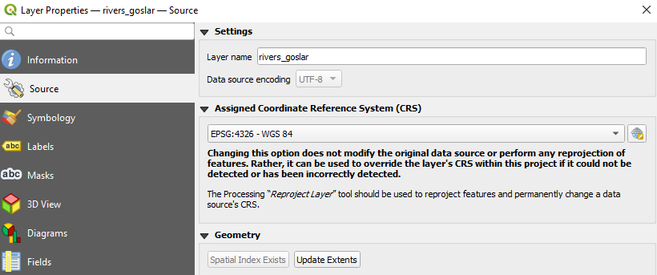
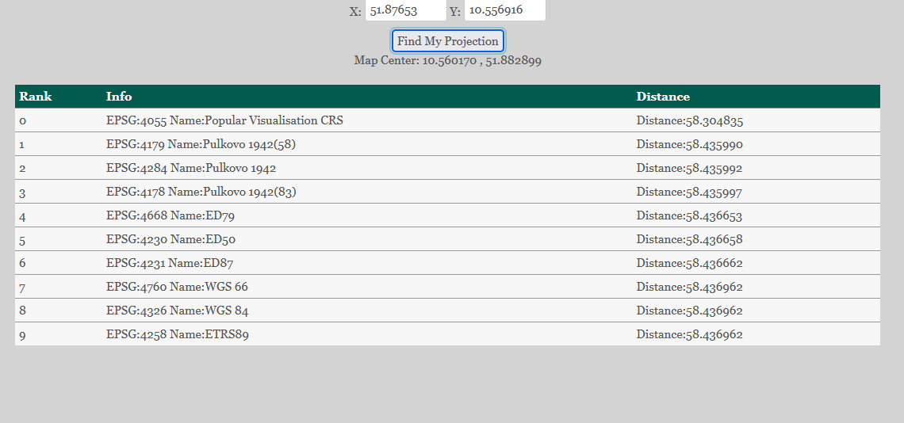

# Koordinatenbezugssysteme 

## Wie finde ich heraus wie meine Daten projeziert sind? 

Klickt mit der rechten Maustaste auf den Layer von dem ihr die aktuelle Projektion wissen wollt und wählt dann **Properties**, die unterste Option. Klick hier ganz oben auf Information . Im dritten Feld von oben (Coordinate Reference System (CRS)) findet ihr die Informationen. 

## Wie ändere ich das Koordinatenbezugssystem meiner Daten?

Hier gibt es zwei Möglichkeiten. Eure Daten haben CRS X aber wurden, fälschlicherweise, in CRS Y geladen. In diesem Szenario wollt ihr die Daten nicht reprojezieren sondern nur eine Einstellung ändern. Das könnt ihr mit im **Properties** (siehe [hier][Wie finde ich heraus wie meine Daten projeziert sind?]) im Reiter **Source** . Das Fenster seht ihr in Abbilding \@ref(fig:proj1)

```{r proj1, fig.cap = "Source Fenters "}

```

Im obersten Fenster wählt ihr den Layer den ihr anpassen wollt. Darunter könnt auf die aktuelle Auswahl klicken um eine Liste mit kürzlich verwendeten oder geläufigen Alternativen angezeigt zu bekommen. Falls das gesuchte CRS nicht dabei ist könnt ihr mit einem Klick auf den  Knopf ein Fenster öffnen in dem ihr mithilfe des EPSG Codes jedes CRS finden könnt, das QGIS kennt.    

Falls ihr die Daten reprojezieren wollt, sie also in CRS X geladen sind und auch in diesem Format vorliegen, aber ihr sie in CRS Y haben wollt, geht das über das **reproject layer** Tool (Abb. \@ref(fig:proj2)). 

```{r proj2, fig.cap = "Reproject Layer"}
knitr::include_graphics("fig/proj2.png")
```

Im erscheinenden Fenster einfach den Layer auswählen den ihr reprojezieren wollt (*Input Layer*) und unter *Target CRS* das Ziel CRS auswählen. Dann auf **Run** klicken. 

## Wie finde ich das Koordinatenbezugssystem herraus? 

Folgendes Szenario: Ihr habt einen Datensatz erhalten mit räumlichen Koordinaten und Namen der Orte. Ihr wisst aber nicht in welchem Koordinatenbezgssystem (KBS) und in welcher Projektion die Daten vorliegen. Dabei kann euch die Website http://projfinder.com/ weiterhelfen. 

Die Seite ist zweigeteilt (Abb. \@ref(fig:pf1)). 

```{r pf1, fig.cap = "projfinder.com"}
knitr::include_graphics("fig/projfinder1.png")
```

Auf der linken Seite seht ihr zwei Eingabefelder und auf der rechten eine Karte mit Fadenkreuz. Angenommen ihr wisst nicht welche Projektion die Kohlmeisendaten haben, könntet ihr in der Spalte *locality* weitere Informationen zur Probestelle finden. Einen Ausschnit meiner Tabelle seht ihr in Abbildung \@ref(fig:pf2).

```{r pf2, fig.cap = "Kohlmeisendaten"}
knitr::include_graphics("fig/projfinder2.png")
```

In Reihe elf sehe ich das eine Beobachtung aus Bad Harzburg stammt und die Koordinaten 51.87653 und	10.556916 hat. Nun kann ich auf projfinder.com auf der rechten Karte Bad Harzburg auswählen, links die beiden Koordinante eingeben und dann find *find my projection* klicken. Dann tauch unter dem *find my projection* Knopf eine Tabelle auf (Abb. \@ref(fig:pf3)). 

```{r pf3, fig.cap = "Auswahl der besten Projektionen"}

```

In der Tabelle sind verschiedene Projektionen aufgeführt und die Distanz die der Punkt mit den angegeben Koordinatne in der jeweiligen Projektion zu dem von uns mit dem Fadenkreuz gewähten Punkt hat. In unserem Fall wissen wir das die Daten in dem nicht projezierten Koordinatenbezugssystem WGS 84 vorliegen. Das ist erst an Stelle neun, aber die Unterschiede zwischen den zehn aufgeführten KBS bzw. Projektionen bewegen sich im Zentimeterbereich. Falls eure Daten nur eine kleine Fläche bedecken, so wie unsere Maisendaten, ist es egal welche der hier angegebenen Projektionen ihr wählt. Alle passen für diese Region gut. Falls ihr einen größeren Datensatz habt (ganz Deutschland oder Europa) solltet ihr das Verfahren mit mehreren Punkten wiederholen und die Projekten mit der insgesammt kleinsten Abweichung wählen. Die gewählten Punkte sollten möglichst weit von einander entfernt liegen. In diesem Beispiel könnt ihr die Ortbeschreibungen vermutlich gut finden, da es eure eigenen Landkreise sind. Falls ihr mit Ortsnamen in den Daten nichts anfangen könnt, hilft Google Maps. 

::: {.blackbox .work data-latex="{work}"}
**Aufgabe**

1. Ladet die Datensätze *astast_test_01.csv* und *astast_test_02.csv* aus Olat herunter (Ordner Vorlesung 4)   
2. Nutzt projfinder.com um herauszufinden in welchen Projektionen diese beiden Datensätze vorliegen. 

:::