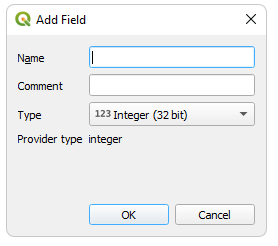
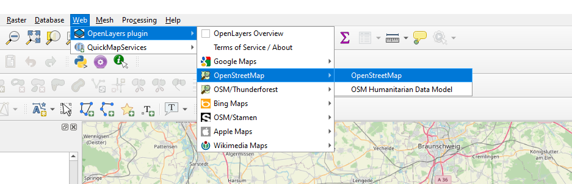
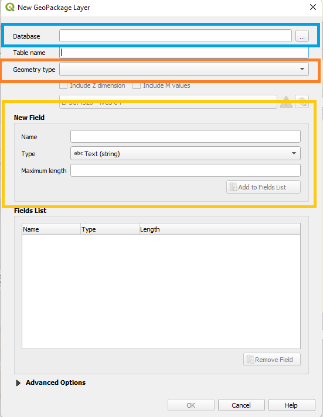
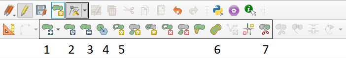

# Digitalisierung 

## Keycoding

In diesem Abschnitt werden wir einem existierenden Vektorlayer eine neue Spalte hinzufügen. Das könnte in der Praxis dem Fall sein, wenn ihr neue Daten zu bereits digitalisierten Objekten erhalten oder erhoben habt und dies nun nachtragen wollt. 

Bitte ladet für diese Beispiel den Polygon Vektorlayer mit eurem Landkreis. Falls dieser noch geladen ist, müsst ihr ihn nicht neu laden. Geht nun in die Attributtabelle, entweder über Rechtsklick im Layerpanel oder über F6, wenn der Layer im Layerpanel ausgewählt ist. Dort müssen wir als erstes den Bearbeitungsmodus öffnen. Das könnt ihr indem ihr oben links auf den Stift klickt oder mit Strg+E. Nun sind einige der vorher grauen Symbole in der oberen Leiste farbig geworden. Darunter auch das Symbol **New Field** (Abb. \@ref(fig:digi1)). 

```{r digi1, fig.cap = "Bearbeitungsmodus in der Attributtabelle"}
knitr::include_graphics("fig/digi1.png")
```

Wenn ihr darauf klickt erscheint das folgende Fenster (Abb. \@ref(fig:digi2)): 

```{r digi2, fig.cap = "Hinzufügen einer neuen Spalte"}

```

Im ersten Feld gebt ihr den Namen der neuen Spalte ein, am Besten ohne Leerzeichen und Umlaute. Das mittlere Feld kann leer gelassen werden. Im unteren Feld wählt ihr den Typ der Variable aus. Die Optionen sind ganze Zahlen (Integer) mit 32 oder 64 bit, Kommazahlen (decimal number (real)), Text (string), Datum und Boolean. 64 bit Integer braucht ihr nur für Zahlen > 2147483647. Boolean sind logische Werte also entweder TRUE oder FALSE. Für unser Beispiel wählen wir Integer 32 bit und kilcken dann ok. Nun sollte die neue Spalte in der Tabelle sein. Ihr könnt in die leeren Zellen der neuen Spalte klicken um dort Werte einzutragen. 

## Erstellen eines neuen Vektorlayers 

Wir können Daten aus Hintergrundkarten digitalisieren, indem wir diese quasi abpauschen. Dafür laden wir als erstes die openstreetmap Hintergrundkarte (Abb. \@ref(fig:digi3)). 

```{r digi3, fig.cap = "OpenStreetMap Hintergrundkarte"}

```

Falls ihr das OpenLayers Plugin nicht installiert habt, tut dies bitte jetzt ([Plug-ins installieren][# Plug-ins]). 

Nun könnt ihr in eurem Kreis einige Häuser ausschen die ihr digitalisieren wollt. Zoomt zu diesem Haus und klickt dann auf **Layer** $\rightarrow$ **Create Layer** $\rightarrow$ **New Shapefile Layer**. Dann sollte das folgende Fenster erscheinen (Abb. \@ref(fig:digi4)). 

```{r digi4, fig.cap = "OpenStreetMap Hintergrundkarte"}

```

Hier könnt ihr den neuen Layer als Datei speichern (blau), einen Geometrietyp wählen (Punkt, Linie oder Polygon; orange) und eine Attributtabelle anlege (gelb). 
Wir werden einen Polygonlayer erstellen und eine Variable mit dem Namen *Name* in der Attributtabelle anlegen. 

Wenn ihr auf Ok klickt erscheint der neue Layer im Layerpanel. Aber er hat noch keine Geometrien. Um die zu erstellen aktivieren wir den **Editing Mode** (Abb. \@ref(fig:digi5)). 

```{r digi5, fig.cap = "OpenStreetMap Hintergrundkarte"}
knitr::include_graphics("fig/digi5.png")
```

Zwei Knöpfe weiter rechts ist nun der Knopf **AddPolygon Feature** farbig geworden. 
Wenn ihr diesen Knopf auswählt erscheint ein Fadenkreuz. Mit jeden Kilck der linken Maustaste setzt ihr einen neuen Eckpunkt für euer Polygon. Die Verbindung zwischen dem ersten Punkt und dem zuletzt neu erstellten Punkt wird automatisch gezogen. Die Linien dürfen sich nicht überlappen. Solche Kreuzungen werden mit grünen Kreuzen markiert (Abb. \@ref(fig:digi6)). Wenn ihr fertig mit einem Polygon seit klickt auf die rechte Maustaste. 
Nun erscheint ein Fenster in dem ihr Werte für die vorher angelegten Variablen eingeben könnt. Die Variable fid (feature ID) gibt es immer und wir können den Eintrag *autogenerate* stehen lassen. Klick nun auf ok und ein neuer Polygon sollte erscheinen. Falls dies nicht der Fall ist guckt ob der OpenStreetMapLayer vielleicht darüber liegt. 

```{r digi6, fig.cap = "Erstellen von eigenen Polygonen"}
knitr::include_graphics("fig/digi6.png")
```

::: {.blackbox .work data-latex="{work}"}
**Aufgabe**

Digitaliersiert fünf Häuser in euren Kreis.

:::

 

Mit diesen neu erstellten Polygonen können wir eine Reihe von Operationen ausführen. Wir können mit dem **Vertex Tool** (Abbildung \@ref(fig:digi7) orange Box) die Eckpunkte verschieben oder neue Eckpunkte zwischen zwei bestehende Punkte setzten. Wir können sie verschieben (Abb. \@ref(fig:digi7) - 1), drehen (2), vergrößern und verkleinern (3), vereinfachen (4), ein Loch einfügen (5), puffern (auch negativ, 6) oder Grenzen ziehen und das eine Polygon damit in mehrere Formen und folglich auch mehrere Einträge in der Attributtabelle umwandeln.   

```{r digi7, fig.cap = "Verändern von Polygonen"}

```
