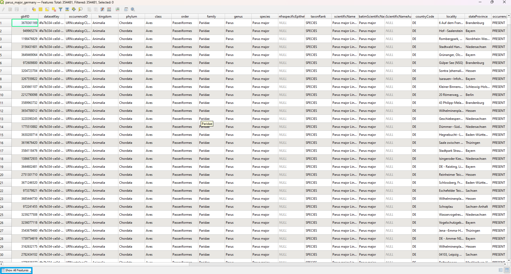
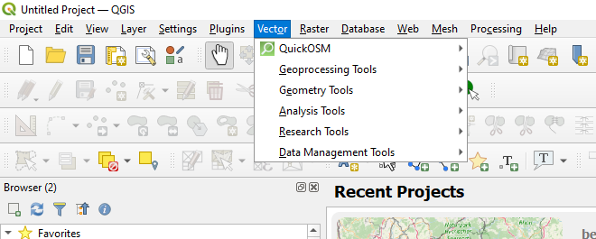
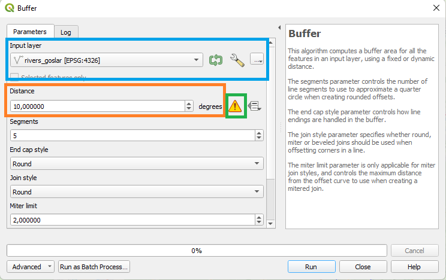
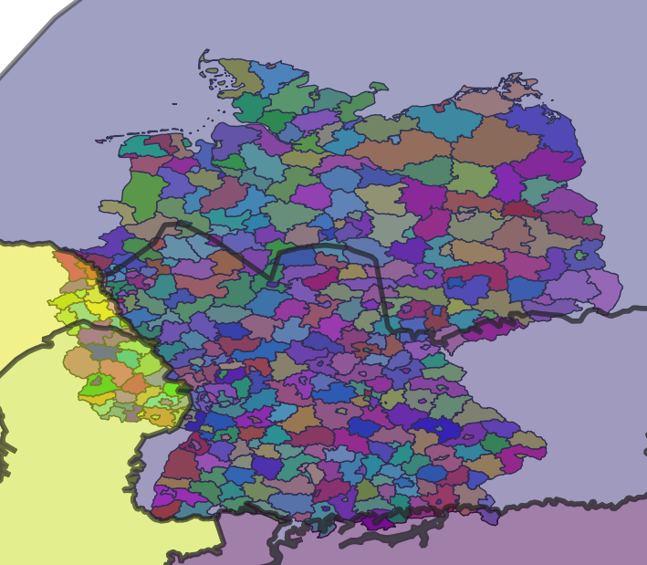
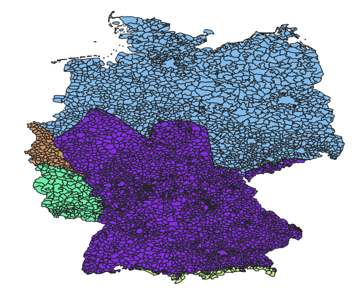
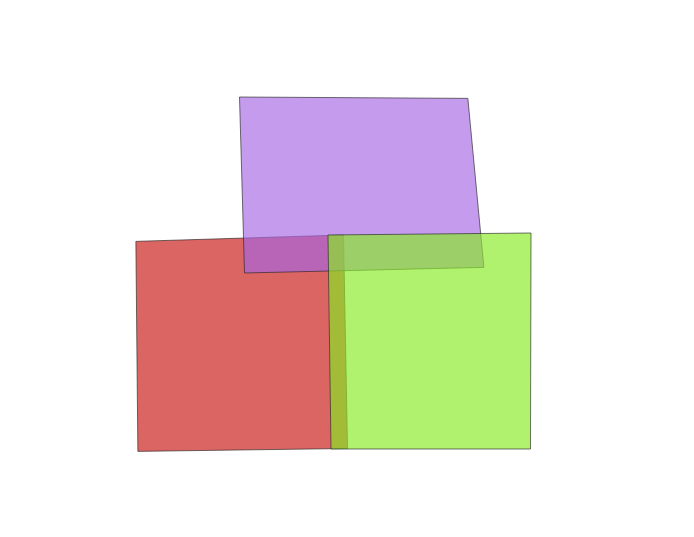
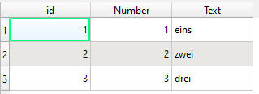
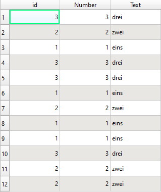
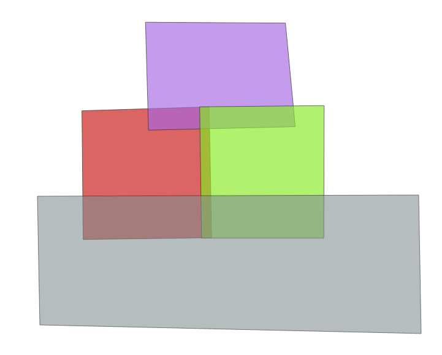

# Vektoroperationen
## Die Attributtabelle 

Die Attbributtabelle können wir im **Layer Panel** öffnen über Rechtsklick $\rightarrow$ **Open Attribute Table**, in der Menüleiste oben über den  Knopf oder über F6. Die geöffnete Tabelle der Kohlmeisendaten für den Landkreis Goslar seht ihr in Abbildung \@ref(fig:vo17).

```{r vo17, fig.cap = "Attributtabelle der Kohlmeisendaten für den Landkreis Goslar"}

```

In der Kopfzeile sehen wir gleich einige Informationen: Features total: 406, Filtered: 406, Selected: 0. Die Attributtabelle hat also 406 Reihen, sie enthählt 406 Beobachtungen von Kohlemeisen. Wir habe noch keinen Filter angewandt, also enspricht die Anzahl der gefilterten Reihen der der gesammten Anzahl. Ebenso haben wir keine Reihen ausgewählt, also ist selected aktuell 0. Indem wir auf die Zahl link der ersten Spalte klicken, wählen wir eine Reihe aus. Wenn ihr das macht seht ihr wie sich in der Kopfzeile die Zahl hinter Selected auf 1 erhöht. Mit gedrückter Umschalttaste (⇧) könnt ihr mehrere Reihen auswählen. 

Unten links (blau in \@ref(fig:vo17)) können wir die Tabelle filtern. Die Optionen sind: alle Reihen (standardmäßig gewählt), alle ausgewählten Reihen (Show selected features), alle Reihen deren Objekte im aktuellen *Map View* zu sehen sind (show features visible on map) oder alle Reihen die eine Bedingung erfüllen (Field filter und Advanced Filter (Expression)). Die letzte Option könnt ihr zum Beispiel nutzen indem ihr bei den Kohlmeisten bei *Field Filter* year auswählt und in die jetzt erscheinende Eingabeleiste 2014 eingebt. Nun werden nur Reihen angezeigt bei dennen die Spalte *year* 2014 ist.  

### Filtern

### Eine neue Spalte erstellen

### Der Field Calculator


## Vektoroperationen

Alle hier beschriebenen Vektoroperationen findet ihr unter dem Reiter **Vektor** (Abb. \@ref(fig:vo1)).

```{r vo1, fig.cap = "Hier findet ihr Vektoroperationen"}

```

Das erste Feld bei den Vektoroperationen ist **Geoprocessing**. Hier sind die geläufigen und in der Vorlesung besprochenen Vektoroperationen beheimatet. Es folgt eine kurze Übersicht über die Funktionen. Mehr Details gibt es [hier](https://docs.qgis.org/3.22/en/docs/user_manual/processing_algs/gdal/vectorgeoprocessing.html?highlight=geoprocessing). 

### Buffer

Mit dieser Funktion könnt ihr einen Puffer um Vektorobjekte legen. Im obersten Feld (blau Abb. \@ref(fig:vo2)) wählt ihr den Layer den ihr puffern wollt. Wie ihr seht gibt es hier auch den  Knopf. Ihr könnt also auch neue Daten laden und dirket puffern. Falls eure Daten in einem Koordiantensystem projeziert sind, dass mit Längen- und Breitengrad arbeitet (z.B. EPSG:4326) bekommt ihr eine Warunung (grün Abb. \@ref(fig:vo2)). In der Regel sind Pufferdistanzen leichter in Metern anzugeben als in Längen- bzw. Breitengraden. Je weiter wir vom Äquator entfernt sind, desto größer wird zusätzlich der Unterschied zwischen einem Grad Länge und einem Grad Breite. Am Besten transformiert ihr eure Daten also in ein KBS das in Metern misst, wie z.B. UTM 32N (EPSG: 25832). Wie das geht seht ihr [hier][Wie ändere ich das Koordinatenbezugssystem meiner Daten?]. 

```{r vo2, fig.cap = "Die Puffer-Funtion"}

```

Mit den reprojezierten Daten bekommen wir keine Warnung mehr. In Abbilding \@ref(fig:vo3) seht ihr einen zehn Meter Buffer rund um die Flüsse meines Landkreises. 

::: {.blackbox .work data-latex="{work}"}
**Aufgabe**

1. Zieht Puffern der Größen 10, 100 und 500 Metern um die Flüsse eures Kreises.   
2. Wie weit muss der Puffer sein, damit das erste von euch digitalisierte Haus im Puffer liegt?

:::

```{r vo3, fig.cap = "10 Puffer rund um die Landkreise"}
knitr::include_graphics("fig/vo3.png")
```

### Clip 

Mit **Clip** können wir eine Teilmenge eines Datensatzes erstellen. 
Die Daten aus dem *Input Layer* werden auf diejenigen Beobachtungen reduziert, die innerhalb des *Overlay Layers* liegen. 
Also zum Beispiel nur die Flüsse oder Maisenbeobachtugen innerhalb eures Landkreises. 

### Convex hull

Eine **Convex Hull** ist eine Hülle, die um jedes Elemente des **Input Layers** gezogen wird. Es ist nicht die Hülle die man um eine Gruppe von Punkten legen würde. Daher funktioniert dies Funktion eigentlich nur bei Linien oder Polygonen.
In Abbildung \@ref(fig:vo4) seht ihr die Flüsse in meinem Landkreis, eingefärbt nach ihrer *OBJECTID* (sieht [hier][Symbologie]). 

```{r vo4, fig.cap = "Flüsse im Landkreis nach OBJECTID eingefärbt"}
knitr::include_graphics("fig/vo4.png")
```

Jede dieser Linien besteht aus mehreren Punkten die in einer bestimmten Reihenfolge miteinander verbunden sind. Mit der Convex Hull Funktion ziehen wir nun eine Hülle um all Punkte einer Linie und das für jede Linie (Abb. \@ref(fig:vo5)). 

```{r vo5, fig.cap = "Convex Hull um Flüsse"}
knitr::include_graphics("fig/vo5.png")
```

Um eine Convex Hull um alle Elemente eines Layers zu ziehen siehe die [Minimum bounding geometry][Minimum bounding geometry] Funktion.

### Difference

**Difference** ist das Gegenteil von **Clip**. Bei dieser Funktion werden alle Elemente behalten, die außerhalb des *Overlay Layers* liegen. 

### Dissolve 

Mit **Dissolve** kann die Anzahl an Features in einem Layer reduziert werden, indem alle Felder mit gleichem *dissolve field* kombiniert werden. Als Beispiel können wir den ursprünglichen GADM Layer nehmen. Abbildung \@ref(fig:vo6) zeigt links den original Layer und rechts den Layer nachem **Dissolve** mit x als *dissolve feature* angewandt. wurde. All die Bezirke mit dem Gleichen Landkreis (NAME2) sind nun ein Feature. 

```{r vo6, fig.cap = "Dissolve von GADM Deutschland anhand der Varable NAME2"}
knitr::include_graphics("fig/vo6.png")
```

::: {.blackbox .work data-latex="{work}"}
**Aufgabe**

Löst die Grenzen der einezlnen Bereiche in eurem Landkreis auf. 

:::

### Intersection 

Bei der Verschneidung oder **Intersection** ist das Ziel, die Attribute eines Objektes mit denen eines anderen zu Kombinieren. Nehmen wir zum Beispiel den GADM Layer von Deutschland. Zustäzlich zu den Informationen die wir bereites zu jeden Feature haben, wollen wir nun wissen in welche Ökoregionen (nach Illies, Daten [hier](https://www.eea.europa.eu/data-and-maps/data/ecoregions-for-rivers-and-lakes)) die Landkreise Fallen. Abbildung \@ref(fig:vo7) zeigt beide Layer. Klar ist zu sehen, dass verschiedene Ökoregionen in Deutschland vorkommen. Ihr seht auch, dass ich immernoch den dissolved GADM Layer aus dem vorherigen Abschnitt benutze. 

```{r vo7, fig.cap = "Dissolve von GADM Deutschland anhand der Varable NAME2"}

```

In der nächsten Abbilung sehen wir das Ergebnis von einer Verschneidung mit den Ökoregionen als *Input Layer* und den GADM Layer als *Overlay Layer*. Die einzelnen Features sind nach der Ökoregion eingefäbt. Wie wir sehen, erhalten wir den Umriss des GADM Layers also des *Overlay Layers*. Die einzelen Features sind fast alle wieder die ursprünglichen Bezirke vor dem Dissolve. Dort wo einzelne Bezirke mehrere Ökoregionen enthalten, bzw. die Grenze zwischen zwei Regionen durch einen Bezirk verläuft, wurde der Bezirk an dieser Grenze in zwei Feature getrennt. Jedes Feature enthält nun sowol die Informationen aus dem GADM als auch aus dem Ökoregionen Layer. 

```{r vo8, fig.cap = "Ergebnis der Verschneidung von Ökoregionen und GADM"}

```

### Union 

Mit **Union** kombinieren wir Elemente. Das können Elemente eines Layers sein oder aus verschiedenen. Wenn wir die Elemente eines Layers kombinieren wollen geben wir diesen Layer als *Input Layer* an und lassen *Overlay Layer* leer. In Abbildung \@ref(fig:vo9) seht ihr ein Beispiel dafür. Hier sind drei Polygone, jedes überlappt mit jedem anderen und in der Mitte überlappen alle drei. 

```{r vo9, fig.cap = "Beispielpolygone bevor Union angewandt wurde"}

```

Die zugehörige Attributtabelle hat drei Spalten ID, Zahl und Text. Alle drei geben die Nummer des Polygons wieder (Abb. \@ref(fig:vo10)).

```{r vo10, fig.cap = "Attributtabelle der Beispielpolygone bevor Union angewandt wurde"}

```

Wenden wir **Union** auf diesen Layer an erhalten wir die Layer aus Abbildung \@ref(fig:vo11). 

```{r vo11, fig.cap = "Beispielpolygone nachdem Union angewandt wurde"}
knitr::include_graphics("fig/vo11.png")
```

Die zugehörige Attributtabelle ist in Abbildung \@ref(fig:vo12) ist zu sehen. 

```{r vo12, fig.cap = "Attributtabelle der Beispielpolygone nachdem Union angewandt wurde"}

```

Nun gibt es für jede überlappende Fläche eigene Polygone. Für eine Fläche auf der Polygon eins und zwei überlappen gibt es nun ein Polygon für Polygon eins und eins für zwei. In der Mitte, wo alle drei überlappen, gibt es nach **Union** drei Polygone – eines für jeden Original Layer. Am deutlichsten ist das zu sehen, wenn wir nur die Elemente mit einer ID anzeigen lassen (Abbildung \@ref(fig:vo13)). Hier sehen wir, dass die Form des ursprünglichen Rechtecks erhalten bleibt, wir nun allerdings vier anstelle von einem Polygon haben: einen für die Fläche die nicht überlappt (unten rechts), einen für die Fläche die mit dem linken Polygon überlappt (unten links), einen für die Fläche die mit dem oberen Polygon überlappt (oben rechts) und einen für die Fläche die mit beiden anderen Flächen überlappt (oben links). Die beiden anderen Polygon wurden genauso aufgeteilt. 

```{r vo13, fig.cap = "Eines der ursprünglichen Polygone nach Union"}
knitr::include_graphics("fig/vo13.png")
```

Wie bereits erwähnt können wir Union auch mit zwei verschiedenen Layer nutzen. Dafür habe ich einen zweiten Beispiellayer erstellt (Abb. \@ref(fig:vo14)).

```{r vo14, fig.cap = "Beide Beispiellayer"}

```

Diesen wähle ich nun als *Overlay Layer* im **Union** Fenster. Der Ergebnis beinhaltet alle vier ursprünglichen Polygone sowie die Flächen in dennen Polygone aus dem ersten und zweiten Layer überlappen als eigene Polygone (Abb. \@ref(fig:vo15)). 

```{r vo15, fig.cap = "Ergebniss von Union mit zwei Layern"}
knitr::include_graphics("fig/vo15.png")
```

Flächen in denen Polygone aus dem ersten Layer überlappen sind diesmal keine eigenen Flächen. Ein Blick in die Attributtabelle zeigt, dass alle Elemente des neuen Layers alle Attribute beider ursprünglichen Layer haben (Abb. \@ref(fig:vo16). 

```{r vo16, fig.cap = "Attributtabelle nach Union mit zwei Layern"}
knitr::include_graphics("fig/vo16.png")
```

## Misc

### Minimum bounding geometry

Mit **Minimum bounding geometry** können wir verschiedene Polygone um die Elemente eines Layers ziehen. Die Funktion findet ihr in der Processing Toolbox. Bei *Input Layer* wählt ihr den Layer um dessen Elemente ihr das Polygon ziehen wollt. Welches Polygon ihr berechnen wollt wählt ihr mit dem *Geometry type* Argument. **Envelope (Bounding box)** ist das kleinste Rechteck, das alle Elemente enthält, wobei die Seiten parallel zu Meridianen und Parallelen sind. Bei **Minimum Orientet Rectangle** erhalten wir ein das kleinste Rechteck das nicht parallel zu Meridianen und Parallelen sein muss, **Minimum Encolsing Circle** ist der kleinste Kreis, und **Convex Hull** ist die Convex Hull. 