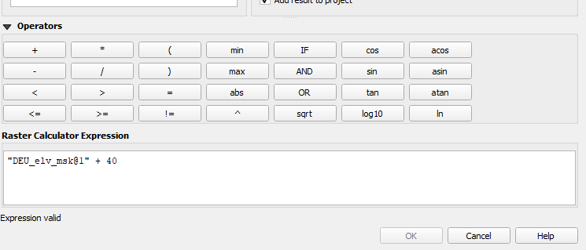
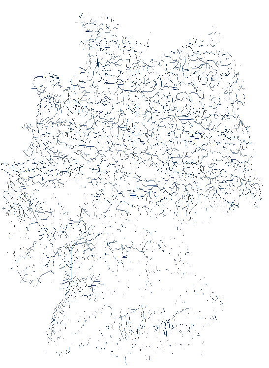

# Rasteroperationen 

## Einführung

Als erstes Beispiel nutzen wir hier ein DEM für Deutschland. Die Datei *DEM-32N-clip.tif* findet ihr in OLAT im Ordner Vorlesung 1. Wir laden die Datei über den **Data Source Manage** (Strg + L). Im Data Source Manager wählt ihr links den Reiter **Raster** und bei **Raster dataset(s) könnt ihr mit einem Klick auf  die gewünschte Datei auf dem Computer auswählen. 

Der Raster erscheint nun in schwarz-weiß (Abb. \@ref(fig:raster1)). 

```{r raster1, fig.cap = "DEM für Deutschland nach dem Laden"}

```

Helle Regionen sind höher und dunklere tiefer. Links im **Layer Panel** wird euch die Farbskala mit Minimal- und Maximalwert angezeigt. Wie bei einem Vektor Layer können wir mit Rechtsklick auf den Layer über **Properties** die meisten wichtigen Informatonen abrufen und einge Eigenschaften anpassen. 
Oben im Properties Fenster seht ihr den **Information** (; Abb. \@ref(fig:raster2)) Reiter . 

```{r raster2, fig.cap = "Information Reiter in Properties Fenster"}

```

Unter der Überschift *General* sehen wir Informationen zum Namen (Name), dem Dateipfad (Path), der Dateigröße (Size), dem Datum an dem die Datei das letzt mal verändert wurde (Last modified) sowie der Software die genutzt wurde um die Datei in QGIS zu laden (Provider).    
Danach kommen nähere Informationen zu den Eigenschaften des Rasters. Das Ausmaß (Extent) also die jeweils größten und kleinsten X- und Y-Koordinaten. Width und Height geben die Anzahl der Spalten und Reihen des Rasters an. Der Data type beschreibt die Art der Variable die inden einzelnen Zellen gespeichert ist. In diesem Fall Float32 also eine Kommazahl (floating point number) bei der für jede Zahl 32 bit (binary digits) freigehalten werden. Mit 64 bit könnte man mehr verschiedene Zahlen darstellen ($2^{64}$ anstelle von $2^{32}$) aber die Datei wäre größer. Der GDAL Driver gibt an welchen Treiber GDAL (der Provider) benutzt hat um die Datei zu laden. Unter Band1 sehen wir zusammenfassende Informationen zum ersten Band (und in diesem Fall einzigen Band). Was ist der maximale Wert, der minimale, der Mittelwert und die Standardabweichung. 

## Darstellung

Unter **Symbology** (, Abb. \@ref(fig:raster3)) können wir die Darstellung anpassen. 

```{r raster3, fig.cap = "Raster Symbologie"}

```

Die wichtigste Einstellung hier ist gleich die oberste: *Render type*. In dem drop-down Menü gibt es die Auswahlmöglichkeiten: *Multiband Color*, *Paletted/ Unique Values*, *Singleband grey*, *Singleband pseudocolor*, *Hillshade* und *Contours*. Standardmäßig ist hier Singleband grey eingestellt. Die *Render type* Einstellung bestimmt was für Optionen und Fenster im restlichen Menü zu sehen sind.     
Bei *Singleband grey* können wir unter *Color gradient* den Gradienten umdrehen (hohe Werte dunkel tiefe Werte hell). Darunter werden der Maximal- und Minimalwert angezeigt und bei *contrast enhancement* können wir mithilfe dieser Zahlenspanne die Darstellung anpassen. Mit der Einstellung *no enhancement* habe alle Zellen die gleiche Farbe. Mit *Strech to MinMax* wird der schwarz-weiß Gradient an die angegebene Minimal- und Maximalwerte angepasst. Diese Werte müssen nicht den tasächlichen Werten des Rasters entsprechen. Ihr könnt auch nur einen Teil davon für den Gradienten nutzen. Alle Werte die über dem Maximum liegen bzw. alle Werte die unter dem Minimum liegen bekommen die gleiche Farbe wie das Maximum bzw. Minimum. Mit *Stretch and Clip to MinMax* werden Zellen mit Werten außerhalb des angegebenen Zahlenraums entfernt. Bei unserem DEM können wir so die negativen Werte entfernen. *Clip to MinMax* entfernt Zellen mit Werten außerhalb des angegebenen Zahlenraumes ohne die restlichen Zellen einzufärben.  

Bei *Singleband pseudocolor* können wir eine anderen Farbgradienten wählen als schwarz-weiß. Den Farbgraident wählt ihr mit dem kleinen Pfeil rechts des Gradienten bei *color ramp*. Im Fenster darunter seht ihr die Farben, die den jeweiligen Zahlenbereichen zugeordnet sind. 
Unter dem Fenster könnt ihr bei Mode ändern wie die Farben den Zahlenbereichen zugeordnet werden. Mit *Equal Interval* wählen wir, dass die Gruppen zwischen Minimalwert und Maximalwert alle die gleiche Menge an Höhenmetern abdecken. Mit *Classes* können wir die Anzahl an Gruppen anpassen. 

Die Einstellung *Paletted/ Unique Values* ist für Raster geeignet die kategorische Variablen darstellen wie z.B. Landnutzungstyp. Hier bekommt jeder Werte eine eingene Farbe und die Farben liegen nicht auf einem gemeinsamen Farbgraidenten. Die Farben sollten möglichst unterschiedlich sein, damit die Kategorien klar voneinenander unterscheidbar sind. Als Beispiel zeige ich hier die CORINE Land Cover Daten. In Abbildung \@ref(fig:raster4) ist die schwarz-weiß Darstellung und das Symbologiefenster von *Paletted/ Unique Values*. 

```{r raster4, fig.cap = "CORINE Landcover Daten in schwarz-weiß"}

```

Wenn wir dort auf *classify* klicken wird jedem Wert des Rasters eine Farbe zugeordnet. Nachdem wir auf *Apply* klicken. Abbildung \@ref(fig:raster5) zeigt einen Ausschnitt der so erstellten Karte. 

```{r raster5, fig.cap = "CORINE Landcover Daten mit Paletted Values"}

```

Die Einstellung *Multiband Color* ist für Raster mit mehreren Bändern geeignet. Das sind vorallem Satellitenfotos. Ein Beispiel für so eine Datei ist *orthophoto.tif* im Ordner Vorlesung 5. Ihr könnt die Datei wie jeden anderen Raster auf in QGIS laden. In QGIS werden die drei Bänder der Datei im Layer Panel angezeigt. Jedes Band entählt die Intensität von einer Farbe Band 1 rot, Band 2 Grün und Band 3 Blau. Jedes Band reicht von 0 bis 255, hat also 256 Werte, was sich mit einem 8bit Integer ($2^8 = 256$) speichern lässt. Auf diese Art und Weise lassen sich Farben mit ihrem RGB (rot, grün, blau) Wert speichern. Die Extremata sind schwarz (0,0,0) und weiß (255,255,255). Für diesen Raster mit drei Bändern hat QGIS automatisch den *Render type* *Multiband Color* gewählt.

Die letzten beiden Typen *Hillshade* und *Contours* werden eher selten genutzt. Erstere täuschen einen 3D Effekt vor und letztere erstellen eine Karte mit Isolinien (beim DEM Isohypsen). Hillshades werden wir im Kapitel [Terrain Analysis] näher betrachten.  

## Rasteralgebra        

Rasteralgebra ist in QGIS im **Raster calculator** verfügbar (Abb. \@ref(fig:raster6)). 

```{r raster6, fig.cap = "Knopf um den Raster calculator zu öffnen"}

```

Öffnen wir den **Raster calculator**, öffnet sich folgendes Fenster (Abb. \@ref(fig:raster7)).

```{r raster7, fig.cap = "Der Raster calculator"}

```

Alle aktuell geladenen Raster werden im Fenster *Raster bands* (blau Abb. \@ref(fig:raster7)) aufgeführt. Befehle für Funktionen (unter Operators) werden im Fenster *Raster calculator expression* eingegeben (grün Abb. \@ref(fig:raster7)). Ausdehnung und Reihen- sowie Spaltenzahl können unter *Spatial Extent* (gelb Abb. \@ref(fig:raster7)) angepasst werden. Unter *Result Layer* (orange Abb. \@ref(fig:raster7)) könnt ihr einstellen ob der resultierende Layer gespeichert werden soll oder nach schließen der aktuellen QGIS Sitzung gelöscht werden soll (Option Create on-the-fly raster ...). Bevor ihr die Funktion mit einem Klick auf *OK* ausführen könnt müsst ihr entweder einen Namen für die zu speichernde Date auswählen oder die create-on-the-fly option markiert haben. 

### Lokale Funktionen

**Mathematische Funktionen**    
 Mathematische Funktionen können einfach wie bei einem Taschenrechner eingegeben werden. Wenn wir den DEM von Deutschland um 40 Meter erhöhen wollen können wir folgenden Befehl ausführen (Abb. \@ref(fig:raster8)). Mit anderen mathematischen Funktionen (-, *, /, exp) funktiert das genauso. 

```{r raster8, fig.cap = "Raster calculator: +" }

```

**Logische Funktionen**
Um logische Funktionen zu demonstrieren erstellen wir eine Version des DEM in dem nur Zellen mit über 400 Meter Höhe üNN enthalten sind. 

```{r raster9, fig.cap = "Befehl für Zellen mit Werten größer 400"}

```

Das Ergebniss ist ein Raster mit drei verschiedenen Zellwerten: 0 (<=400), 1(>400) und eine sehr große negative Zahl für fehlende Werte (außerhalb von Deutschland). Da wir nun eine kategorische Variable haben ist der Darstellungsstyl *Paletted* passend (Abb. \@ref(fig:raster10)). 

```{r raster10, fig.cap = "Raster mit zwei Höhenklassen"}

```

Wenn wir nun diesen Layer mit dem Originallayer multiplizieren würde wir einen Layer erhalten, in dem alle Zellen mit einer Höhe von über 400m ihren ursprünglichen Höhenwert haben und alle anderen 0.     


**Reclassification**    

Einfacher geht das allerdings mit dem *Reclassification by table* Tool, das ihr über die *Processing Toolbox* öffnen könnt (Abb. \@ref(fig:raster11)). 

```{r raster11, fig.cap = "Reclassification by table"}

```

Unter *Reclassification Table* könnt ihr mit einem Klick auf  eine Tabelle erstellen um eine kontinuierliche Variable (z.B. Höhe) in Klassen einzuteilen. Meine Beispieltabelle seht ihr in Abbildung \@ref(fig:raster12). 

```{r raster12, fig.cap = "Reclassification table"}

```

Ihr müsst auf *OK* klicken, damit die Tabelle auch gespeichert wird. Wenn ihr jetzt auf *Run* klickt wird der neue Raster berechnet. Da es im Fall des DEMs für Deutschland Werte < 0 als kleiner als die untere Grenze der untersten Klasse gibt haben wir mehr als die vier Klassen erhalten (Abb. \@ref(fig:raster13)).

```{r raster13, fig.cap = "Einzelwerte angezeigt bei Paletted"}
knitr::include_graphics("fig/raster13.png")
```

Alle Werte die nicht von uns bestimmten Klassen entsprechen können wir löschen indem wir sie auswählen und auf die rote Minus Taste rechts von *classify* drücken. Für eine bessere Darstellug klicken wir außerdem auf die Farbleiste und wählen im nun erscheinenden Fenster oben rechts *Discrete* anstelle von *Continuous*. Die so erzeugte Karte seht ihr in Abbildug \@ref(fig:raster14). 

```{r raster14, fig.cap = "Deutschland in vier Höhenklassen"}

```

**Overlay**
in Planung. 

### Fokale Funktionen

Um fokale Funktionen außerhalb der Terrainanalyse zu berechnen muss QGIS auf GRASS GIS zurückgreifen. Ihr solltet GRASS GIS in der *Processing Toolbox* sehen (Abb. \@ref(fig:raster15)). 

```{r raster15, fig.cap = "Deutschland in vier Höhenklassen"}

```

Falls ihr GRASS GIS dort nicht seht kontrolliert ob die beiden GRASS Plugins aktiviert sind. 

Sucht in der *Processing Toolbox* nach *r.neighbors*. In dieser Funktion könnt ihr unter *Input Raster Layer* den Input Layer wählen, unter *Neighborhood operation* was für eine Statistik berechnet werden soll und unter *Neighborhood Size* die Größe des moving window. 

### Zonale Funktionen

Zonale Statistken können in QGIS dem **Zonal statistic** Tool berechnen. Als Beispiel berechnen wir hier den Mittelwert des DEM für jeden Bezirk in meinem Landkreis. In Abbildung \@ref(fig:raster16) seht ihr das Fenster der **Zonal statistic** Funktion. 

```{r raster16, fig.cap = " Zonal statistic Tool"}

```

Bei *Input* wählen wir den Layer mit den Zonen, für die wir die Werte berechnen wollen. Bei *Raster Layer* den Raster von dem wir die Werte berechnen wollen. Die berechneten Werte werden der Attirbuttabelle des Inputlayers als Spalten hinzugefügt. Bei *Output column prefix* könnt ihr einen Präfix für die Spaltennamen wählen. Ich wähle hier den Präfix *hoehe_*. Unter *Statistics to calculate* könnt ihr die gewünschten Statistiken auswählen. Standardt ist count, sum und mean. Da wir hier nur am Mittelwert interressiert sind wähle ich nur mean. Abbildung \@ref(fig:raster17) zeigt die nach mittlerer Höhe eingefärbten Bezirke.

```{r raster17, fig.cap = "Bezirke im Kreis Goslar mit mittlerer Höhe"}

```

### Globale Funktionen


## Terrain Analysis

Die Funktionen der Terrain Analyse findet ihr unter **Raster** $\rightarrow$ **Analysis**. 

### Gewässernetzwerk

Hierfür nutzen wir Funktion aus SAGA GIS. Auch hier gilt, falls ihr SAGA GIS nicht in eurer Processing Toolbox seht, üperprüft ob das entsprechende Plugin aktiviert ist. Als erstes füllen wir die Lücken in unserem DEM mit der Funktion **Fill Sinks (Wang & Liu)**. In der Funktion müssen wir nur unser DEM angeben, die anderen Argumente können unverändert bleiben. Die Funktion erstellt drei Outputs: Flow Directions, Watershed Basins und Filled DEM. Den Filled DEM Layer nutzen wir nun als Input für die Funktion **Strahler Oder**. Wieder müssen wir aus dem Input Layer keine Argumente ändern oder eingeben. Das Ergebnis seht ihr auf Abbildug \@ref(fig:raster18). 

```{r raster18, fig.cap = "Gewässernetzerk für Deutschland - ohne Grenzwert"}
knitr::include_graphics("fig/raster18.png")
```

Um das Netzwerk übersichtlicher zu machen entfernen wir kleinere Gewässer (Stahler Ordnung < 2) mit dem **Raster calculator** und färben die übriggelbiebenen Gewässer als singleband pseudocolor blau ein (Abb. \@ref(fig:raster19)).

```{r raster19, fig.cap = "Gewässernetzerk für Deutschland"}

```

## NDVI berechnen 

Mithilfe des Raster Calculators und der benötigten Daten können wir den NDVI in QGIS berechnen. 
Die notwendingen Satellitendaten könnt ihr entweder aus OLAT runterladen oder selber aus dem [EarthExplorer](https://earthexplorer.usgs.gov/) laden. In der ersten Option ist nur das Bild für Landau verfügbar. Um das Bild für euren Kreis runterzuladen müsst ihr einen (kostenlosen) Account bei EarthExplorer anlegen. Für eine Anleitung zum Downloaden von Sattelitenbildern aus dem EarthExplorer seht das entsprechende Video aus zu Vorlesung 6. 

[Hier](https://landsat.gsfc.nasa.gov/satellites/landsat-8/landsat-8-bands/) bekommt ihr einen Überblick über die Bänder von Landsat 8. Das Near Infrared Band ist Band 5 und das Rot Band ist Band 4. Der NDVI $$\dfrac{NIR - RED}{NIR + RED}$$ ist daher $$\dfrac{Band5 - Band4}{Band5+Band4}$$. Diese Formel können wir in den **Raster Calculator** eingeben (Abb. \@ref(fig:raster20)) und erhalten dann einen NDVI Raster. 

```{r raster20, fig.cap = "Eingabe im Raster Calculator um den NDVI zu berechnen"}

```

Nachdem wir diesen mit einer Farbpalette die von braun über weiß zu grün reicht haben wir die folgende Karte (Abb. \@ref(fig:raster21)).

```{r raster21, fig.cap = "NDVI Landau"}

```