class: title-slide middle

# `r rmarkdown::metadata$title`

## `r rmarkdown::metadata$subtitle`

.author[
`r rmarkdown::metadata$author`
]

```{r setup, include=FALSE}
options(htmltools.dir.version = FALSE)
library(icons)
library(ggplot2)
#library(greta)
library(corrplot)
Sys.setenv(JAGS_HOME="C://Program Files/JAGS/JAGS-4.3.0/")
```


```{r xaringan-themer, include=FALSE, warning=FALSE}
library(xaringanthemer)
style_duo_accent(
  text_font_base = "Pompiere",
  text_font_family = "Pompiere",
  base_font_size = "25px",
  text_font_size = "24px",
  primary_color = "#1381B0",
  secondary_color = "#FF961C",
  inverse_header_color = "#FFFFFF",
  title_slide_text_color = "#FFFFFF",
  extra_fonts = list(
    google_font("Staatliches"),
    google_font("Megrim"),
    google_font("Pompiere")
  )
)

xaringanExtra::use_xaringan_extra(c("tile_view", "panelset", "editable", "animate", "tachyons", "share_again"))
xaringanExtra::use_extra_styles(
  hover_code_line = TRUE,         #<<
  mute_unhighlighted_code = TRUE  #<<
)
xaringanExtra::use_scribble()
```


---

layout: false
class: full-screen hide-count

<div class="grid-2-2">
<div class="extension-tile tileview"><div>Multi-what?</div></div>
--
<div class="extension-tile panelset-tile"><div>What's new?</div></div>
--
<div class="extension-tile webcam"><div>Multivariate GLMs</div></div>
--
<div class="extension-tile editable"><div>Latent Variable Models</div></div>
</div>


---

layout: false
class: full-screen hide-count

<div class="grid-2-2">
<div class="extension-tile tileview animated fadeInRight"><div>Multi-what?</div></div>
</div>

---

## *multivariate* ... what was that again?

.can-edit.f3.code[
- PCA
- ...
]

---

## *multivariate* = multiresponse

.center[
<p style="font-size:300%;"> multi<b>.green[response]</b> <u>not</u> multi<b>.red[variable]</b></p> 
]

--

.w-50.pr3.fl[
<table>
  <tr>
    <th></th>
    <th><font color="green">Species1</font> &#128000;</th>
    <th><font color="green">Species2</font> &#128007;</th>
    <th><font color="green">Species3</font> &#128008;</th>
  </tr>
  <tr>
    <td>Site1</td>
    <td>17</td>
    <td>10</td>
    <td>3</td>
  </tr>
  <tr>
    <td>Site2</td>
    <td>20</td>
    <td>8</td>
    <td>2</td>
  </tr>
    <tr>
    <td>Site3</td>
    <td>8</td>
    <td>16</td>
    <td>5</td>
  </tr>
</table>
]
.w-50.pr3.fl[
<table>
  <tr>
    <th></th>
    <th><font color="red">Predictor1</font> &#127774;</th>
    <th><font color="red">Predictor2</font> &#127974;</th>
    <th><font color="red">Predictor3</font> &#128293;</th>
  </tr>
  <tr>
    <td>Site1</td>
    <td>33</td>
    <td>0</td>
    <td>20</td>
  </tr>
  <tr>
    <td>Site2</td>
    <td>20</td>
    <td>20</td>
    <td>3</td>
  </tr>
    <tr>
    <td>Site3</td>
    <td>15</td>
    <td>50</td>
    <td>0</td>
  </tr>
</table>
]

---

## Why multivariate analyses? 

<p style="font-size:200%";>
🌎 ecological data are multivariate 
</p>

--

<p style="font-size:200%";>
🐋 multiple species from communities with emergent properties 
</p>

--

<p style="font-size:200%";>
🦚 co-occurrence patterns 
</p>

--

<p style="font-size:200%";>
💪 borrow strength 
</p>

---

##Applied Multivariate statistics 

.w-50.pr3.fl[

- <p style="font-size:200%;">Multiple Regression</p>
- <p style="font-size:200%;">Generalized Linear Models</p>
- <p style="font-size:200%;">Ordination and PCA  </p>
- <p style="font-size:200%;">Redundancy Analysis (RDA)</p>    
]

--

.w-50.pr3.fl[
- <p style="font-size:200%;">Similarity and distance - NMDS  </p> 
- <p style="font-size:200%;">MANOVA and PERMANOVA   </p> 
- <p style="font-size:200%;">Cluster analysis  </p> 
- <p style="font-size:200%;">Decision Tree</p> 
]

---

## Ordination

.footnote[Whitaker 1967]

<p style="font-size:200%";>
- term proposed by Goodall (1954)
</p>

<p style="font-size:200%";>
- plant sociology should be based on gradients not classes (taxonometrics)
</p>

.center[
        
]
  
---

## Principal Component Analysis
        
.w-50.pr3.fl[
```{r message=FALSE, eval = F}
library(vegan)
data(varechem)
res <- rda(varechem, 
           scale = TRUE)
plot(res)
```
]
--
```{r message=FALSE, echo = F}
library(vegan)
data(varechem)
res <- rda(varechem, 
           scale = TRUE)
plot(res)
```

---

## Principal Component Analysis
        
```{r}
res$CA$v[1:4,1:4]
```

---

## Principal Component Analysis

.center[
<p style="font-size:250%;"> 
🦐 or 🌊 :  unconstrained
</p>    
]    

--
.center[
<p style="font-size:250%;">
🦐 and 🌊 :  <s>un</s>constrained
</p>        
]
---

## Redundancy Analysis
.center[        
<p style="font-size:200%;">
1.  .blue[Multiple Regression]: Y&#770; = &#946;<b>X</b> </p>
]
--
.center[  
<p style="font-size:200%;">
2.  .blue[PCA]: PCA(Y&#770;) = PCA(&#946;<b>X</b>)</p>   
]
---

## Redundancy Analysis

.w-50.pr3.fl[
```{r message=FALSE, eval = F}
library(vegan)
data(varespec)
res <- rda(varespec ~ ., 
           data = varechem, 
           scale = TRUE)
plot(res)
```
]

--

```{r message=FALSE, echo = F}
library(vegan)
data(varespec)
res <- rda(varespec ~ ., 
           data = varechem, 
           scale = TRUE)
plot(res)
```

---

## Distance and Dissimularity
        
<!--<font size="32"> Distance metrics reduce dimensionality</font> --> 
.center[
        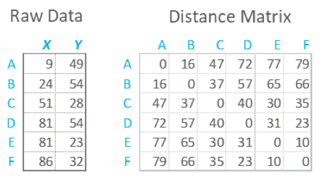
]

---

## NMDS
<font size="32"> Points in k dimensional space have similar distance ranks </font>
--
.w-50.pr3.fl[
```{r, results='hide'}
vare.nmds <- metaMDS(comm = varespec)
```
]

--

```{r echo = FALSE, fig.height=6, warning=FALSE}
pl <- vegan::ordiplot(vare.nmds, display="sites",cex=1.25,air=0.01)
identify(pl, "sites")
```

---
layout: false
class: full-screen hide-count

<div class="grid-2-2">
        <div class="extension-tile tileview"><div>Multi-what? &#10004;</div></div>
--
        <div class="extension-tile panelset-tile animated fadeInRight"><div>Whats new?</div></div>
        </div>
        
---

## Are there problems? 

<p style="font-size:150%;"> 🧲 Horseshoe effect </p> 
--
<p style="font-size:150%;"> ✔️ difficult to check assumptions </p>  
--
<p style="font-size:150%;"> 📈 mean variance relationship </p>  

--

- <p style="font-size:150%;"> Apply Regression concepts to multivariate data </p>  
- <p style="font-size:150%;"> Residual diagnostics, model selection,  flexible mean-variance relationship</p>

---


## Why didn't to that from the start?  

--

.center[

]

---

## What are model-based approaches? 
  
<p style="font-size:150%;"> &#128218 model-based approaches assume a .green[parametric generative model] </p>

--

<p style="font-size:150%;"> &#127993 .green[model-based] vs. .orange[distance-based] </p>

--

<p style="font-size:150%;"> &#9889 terms are not consistent </p>

--

<p style="font-size:150%;"> &#128172 alternative name: .orange[algorithm-based] (Warton <l>et al.</l> 2015) </p>

--

<p style="font-size:150%;"> &#128584 in many ways, .orange[distance-based methods] are also models </p>

---
## What are model-based approaches?

<blockquote>
Our constrained ordination model [...] 
.right[-- <cite>Brittain *et al.* (2020)</cite>]
</blockquote>

--
        
<blockquote>
Many biologist fit CCA models [...] 
.right[-- <cite>Yee (2004) </cite>]
</blockquote>

---
        
## mean-variance relationship
        
<p style="font-size:200%;"> Ordinary Linear Regression </p> 

--

<p style="font-size:150%;"> y<sub>i</sub> = &alpha; + &beta; x<sub>i</sub> + &epsilon;<sub>i</sub> </p>

--


<p style="font-size:150%;"> y<sub>i</sub> &sim; N(&alpha; + &beta; x<sub>i</sub>, &sigma;<sup>2</sup>)</p> 

--

<p style="font-size:150%;"> &epsilon;<sub>i</sub> &sim; N(&mu; = 0, &sigma;<sup>2</sup>)</p> 

--

<p style = "font-size:200%;">The variance does not change with the mean! </p>

---

## mean-variance relationship

<p style="font-size:200%;"> Poisson GLM </p>

--

<p style="font-size:150%;"> 
L<sub>i</sub> = &alpha; + &beta; x<sub>i</sub> + &epsilon;<sub>i</sub>
</p>

--

<p style="font-size:150%;">
y<sub>i</sub> &sim; Poisson(&lambda; = exp(L<sub>i</sub>))
</p>

--

<p style="font-size:200%;"> 
&lambda; = &mu; = &sigma; 
</p>
        
--
        
<p style="font-size:200%;">  
The variance and the mean are the same 
</p>

---

.center[
        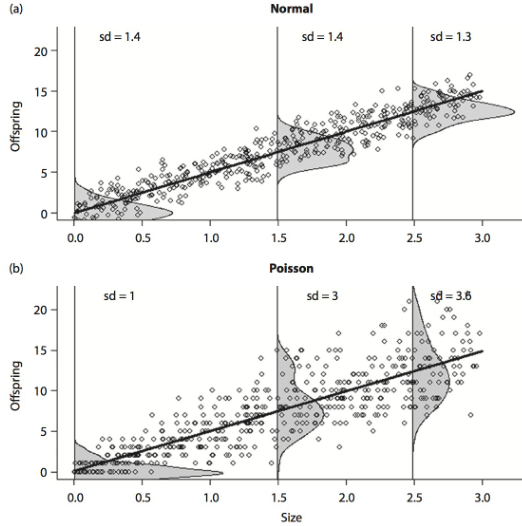
]

---

.center[
        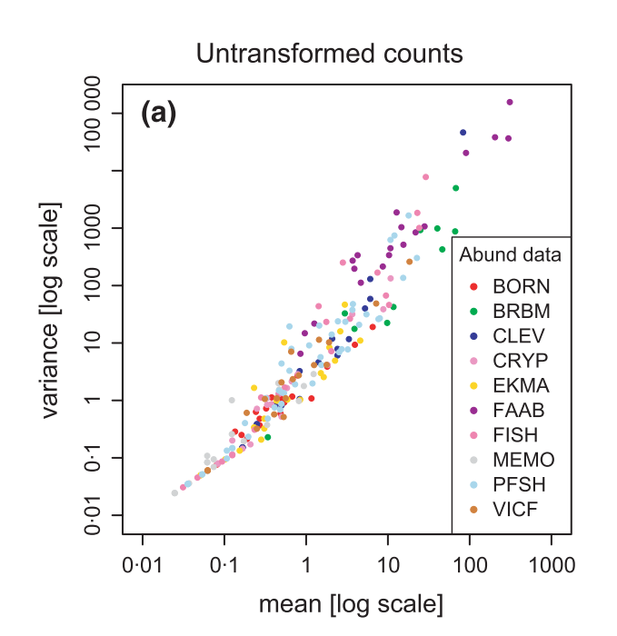
]

.footnote[Warton *et al.* (2012)]

---


```{r example-binomial-mean-var, echo = F, fig.align='center'}
var_list = list()
loop_probability = seq(from = 0, to = 1, length.out = 100)
for (i in seq_along(loop_probability)) {
        var_list[i] = var(rbinom(n = 1e4, size = 100, prob = loop_probability[i]))
}
plot_data = data.frame(variance = unlist(var_list), 
                       probability = loop_probability)
plot_data  |>  
        ggplot(aes(x = probability, y = variance)) + 
        geom_line(size = 2) + 
        ggtitle("Mean-Variance of Binomial Data") + 
        theme(panel.grid = element_blank())
```

---
        
## mean-variance relationship
        
<p style="font-size:200%;">
.orange[distance metrics] assume a mean-variance relationship <br>
</p>

--

<p style="font-size:200%;"> Euclidean Distance </p>

$$d_{ij} = \sqrt{\sum_{s=1}^S (y_{is} - y_{js})^2}$$
        
--

<p style="font-size:200%;">        
The difference is not weight by the absolute values 
</p>

--

<p style="font-size:200%;">       
Assumes a constant variance.
</p>

---

## mean-variance relationship  

<p style="font-size:200%;">       
Canberra distance 
</p>

--

$$d_{ij} = \sum_{s=1}^S \frac{|y_{is} - y_{js}|}{(y_{is} - y_{js})}$$

--

<p style="font-size:200%;">        
Straight line relationship
</p>

---

## Are models better? 

.center[
        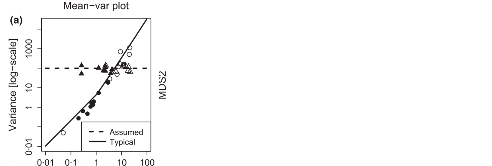
]

.footnote[Warton *et al.* (2012)]

---
 
## Are models better? 
        
.center[
        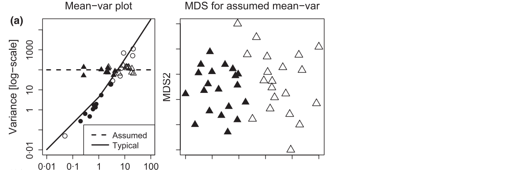
]
        

        
.footnote[Warton *et al.* (2012)]

---

## Are models better?
        
.center[
        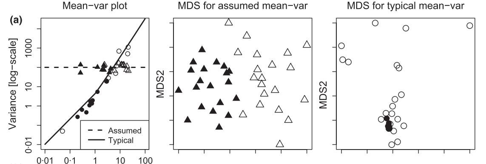
]

.footnote[Warton *et al.* (2012)]

---
 
## Are models better? 

.center[
        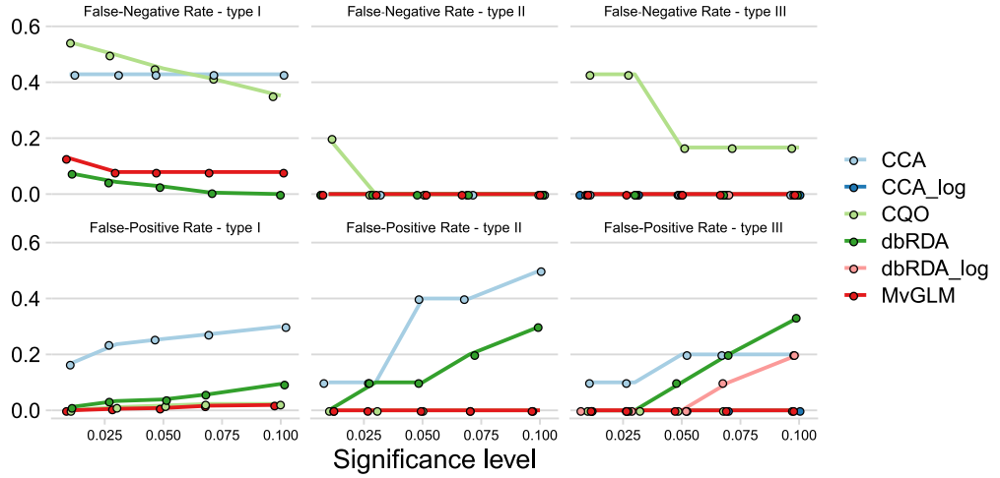
]
        
.footnote[Jupke & Schäfer (2020)]


---

## Conclusion: What's new 
        
- <p style="font-size:200%;">
classical approaches use distances as heuristic
</p>

--

- <p style="font-size:200%;">
 advances in statistics and computer power enable us to use multivariate models
</p>

--
   
- <p style="font-size:200%;">        
 some models perform better in comparisons but it depends on data, question, and specific methods
</p>

---

layout: false
class: full-screen hide-count

<div class="grid-2-2">

<div class="extension-tile tileview"><div>Multi-what? &#10004</div></div>
<div class="extension-tile panelset-tile"><div>What's new? &#10004</div></div>
--
<div class="extension-tile webcam animated fadeInRight"><div>Multivariate GLMs</div></div>

</div>

---

## mvabund 
.footnote[Wang *et al.* (2012)]

<p style="font-size:200%;">   
R package published in 2012  <br>

<b>M</b>ulti<b>v</b>ariate <b>Abund</b>ance data  
</p>

--
   
- <p style="font-size:150%;"> &#9776; many, possibly correlated responses </p> 

- <p style="font-size:150%;"> 📈 strong mean-variance relationship  </p>

---

## The joint model 

$$\huge \hat{y}_{is} = \beta_{0s} + \beta_s x_i + u_{ij}$$
$$\huge u_i \sim N(0, \Sigma)$$


---

<p style="font-size:200%;">
What is problematic with this approach?
</p> 

--


```{r echo = F, fig.height=6,fig.align='center'}
parameter_plot <- data.frame(responses = 2:100)
parameter_plot$parameters <-  (2:100 * (2:100 + 1))/2
ggplot(parameter_plot, aes(x = responses, y = parameters)) + 
  geom_line(size = 2)
```

---
        
## Simplify

<p style="font-size:150%;"> 
💭 Instead of estimating &Sigma; we can .blue[assume] it.
</p>
--
<p style="font-size:150%;">
⚙️ That's how .blue[mvabund] works 
</p>
--
<p style="font-size:150%;">
🤷 Ok, if primary interest is species-environment relationships  
</p>

--
<p style="font-size:150%;">
🔂  Fit a separate GLM to each species
</p>
--
<p style="font-size:150%;">  
🙋 How is that multivariate? 
</p>
--
<p style="font-size:150%;">
⏭️ ... only at the inference stage
</p>

---
        
## test statistics  
        
.w-50.pr3.fl[
<p style="font-size:150%;">      
.blue[Likelihood Ratio] 
</p>

$\huge LR = 2\ \bigg[log (L_{MLE}) - log(L_{H_0})\bigg]$
]
--
.w-50.pr3.fl[
<p style="font-size:150%;">       
.blue[Sum of Likelihood Ratios]  
</p>

$\huge \Sigma LR = \Sigma_s^SLR_s$
]

--
.w-100.pr3.fl[     
<p style="font-size:150%;"> 
- &Sigma;LR does not account for inter-species correlations   <br> 
- but the permutation-based <i>p</i> -value does  
</p>
]

---

## Correlation options
        
.footnote[Warton (2008a, 2011)]

<p style="font-size:180%;">
  .blue[<b>"I"</b>] <br>
  No correlation, default setting 
</p>

--
     
<p style="font-size:180%;">        
  .blue[<b> "R" </b>]  <br> 
  <i> true </i> joint model 
</p>

--

<p style="font-size:180%;">    
  .blue[<b>"shrink"</b>] <br>  
  middle option, shrinks &Sigma; to <b>I</b> with ridge regularization 
</p>

---

## MvAbund Example 
        
        
```{r mvabund-setup-see, echo=TRUE, eval=FALSE}
library(mvabund)
head(copepods[,1:3])
```

--
        
```{r mvabund-setup-do, echo=FALSE, warn=FALSE, message=FALSE}
library(mvabund)
data("Tasmania")
copepods <- Tasmania$copepods
treatment <- Tasmania$treatment
block <- Tasmania$block
head(copepods[,1:3])
```

--
        
```{r mvabund-data-show, echo = T, eval = F}
tasmvabund <- mvabund(copepods)
```

--
        
```{r mvabund-data-do, eval = T, echo=F}
tasmvabund <- mvabund(copepods)
```
---

## mean-variance plot

```{r, eval = F, echo=T}
meanvar.plot(tasmvabund)
```

.center[
        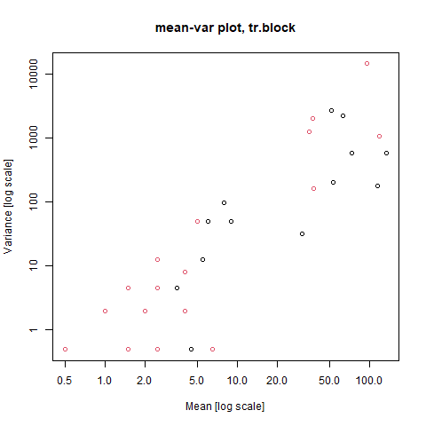
]

---
        
## Fitting a model

```{r mvabund-fit-model-see, echo = T, eval = F}
tas.nb <- manyglm(copepods ~ block*treatment,
                  data = x,
                  family = "negative.binomial")
```
```{r mvabund-fit-model-do, echo = F, eval = T}
tas.nb <- manyglm(copepods ~ block*treatment,
                  family = "negative.binomial")
```

---
        
## Checking model assumptions 

.center[        
```{r mvabund Checking model assumptions 1, fig.height=7, fig.width=7,echo=F}
plot.manyglm(tas.nb, which = 1)
```
]

.footnote[Dunn & Smyth (1996)]

---
        
## Checking model assumptions

.center[
```{r mvabund Checking model assumptions 2, fig.height=7, fig.width=7, echo=F}
plot.manyglm(tas.nb, which = 2)
```
]

.footnote[Dunn & Smyth (1996)]

---
        
## Checking model assumptions

.center[
```{r mvabund Checking model assumptions 3,  fig.height=7, fig.width=7, echo=F}
plot.manyglm(tas.nb, which = 3)
```
]

.footnote[Dunn & Smyth (1996)]

---
        
## Testing Hypotheses
        
```{r mvabund-load-anova, echo=F}
anova_out = readRDS("../../data/mvabund/anova/tasmania/anova_list.RDS")
anova_out = anova_out$cop_I_LR_pit.trap
```

```{r mvabund Testing Hypotheses, eval = FALSE, echo = T}
anova_out <- anova(tas.nb, p.uni = "adjusted")
```

.scroll-output[
        
```{r mvabund show anova, echo = F}
anova_out
```
        
]

---

```{r, fig.align='center'}
mvabund::coefplot(tas.nb, which.Xcoef = 3)
```

---
        
## Beta plot 
        
```{r mvabund-make-beta-plot, eval = T, echo = F}
#library(lattice)
# a <- max(abs(coef(tas.nb)))
# colort <- colorRampPalette(c("blue", "white", "red"))
# plot.tas <-
#         levelplot(
#                 t(as.matrix(coef(tas.nb))),
#                 ylab = "",
#                 xlab  = "",
#                 col.regions = colort(100),
#                 at = seq(-a, a, length = 100),
#                 scales = list(x = list(rot = 45))
#         )
```


.center[
        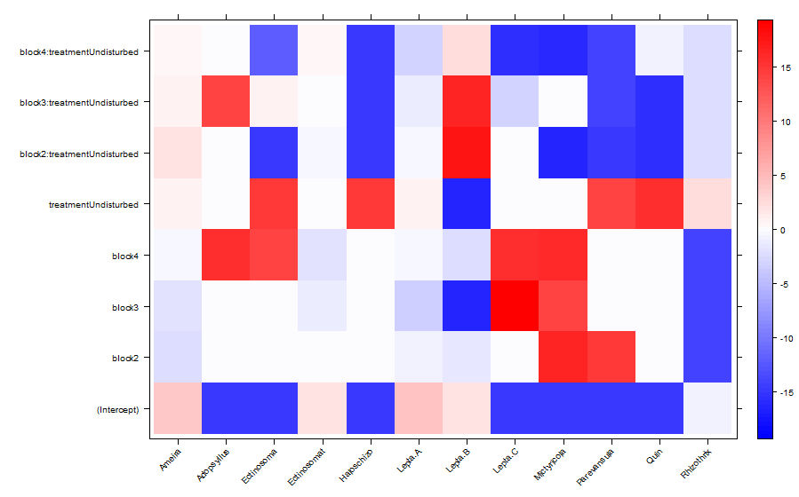
]


---

## Traits 
<p style="font-size:200%;">
Not discussed in today. <br> 
See <a href="https://rpubs.com/dwarton/68823">here</a> for introduction:
Or the mvabund post on the <a href="https://jonjup.netlify.app/post/2020-12-08-analyzing-the-anttraits-data-with-mvabund/analyzing-the-anttraits-data-with-mvabund/">blog</a>
</p>

---
        
## Conclusion: mvabund
 
<p style="font-size:200%;"> 
- Recurring problem is estimating &Sigma; - too many parameters
</p>

--

<p style="font-size:200%;">         
- in .blue[<b>mvabund</b>] only the inference is multivariate, models are fit separately
</p>

--

<p style="font-size:200%;"> 
- inference through row-permutation and aggregated test statistics. 
</p>

---

class: title-slide middle
        
# Time for Exercises 
        
---

layout: false
class: full-screen hide-count

<div class="grid-2-2">

<div class="extension-tile tileview"><div>Multi-what? &#10004</div></div>
<div class="extension-tile panelset-tile"><div>What's new? &#10004</div></div>
<div class="extension-tile webcam"><div>Multivariate GLMs &#10004</div></div>
--
<div class="extension-tile editable animated fadeInRight"><div>Latent Variable Models</div></div>

</div>

---

## What about gradients? 

<p style="font-size:200%;"> 
- .blue[<b>mvabund</b>] is no ordination 
  - no biplots 
  - no gradients
</p>

--

<p style="font-size:200%;"> 
- no <i> true </i> joint model 
- no proper co-occurrence matrix
</p>


--

<p style="font-size:200%;"> 
- we can use Latent variable models for ordination 
</p>
  
---

## Latent variable? 

<p style="font-size:200%;"> 
👀  variables can be observed or latent (unobserved)
</p>
--
<p style="font-size:200%;"> 
🔧 latent variables are inferred from observed variables
</p>
--
<p style="font-size:200%;"> 
☝️  The axes in an ordination are latent variables 
</p>
--
<p style="font-size:200%;"> 
💭 Hypothetical constructs 
  - intelligence
  - self-esteem
  - personality
</p>

---

.footnote[Walker and Jackson (2011)]

## Random Effects Ordination 

<p style="font-size:110%;"> 
- unconstrained ordination 
</p>
--
<p style="font-size:110%;"> 
- random effects model = mixed model
</p>
--
<p style="font-size:110%;"> 
- <b>E(y)</b> = &alpha;<sub>i</sub> + &beta; <b>x</b><sub>i</sub> + <b>u</b><sub>is</sub> &#8594; &alpha;<sub>i</sub> + &beta; <b>x</b><sub>i</sub> + &lambda;<sub>s</sub>&eta;<sub>i</sub>
</p>
--
<p style="font-size:110%;"> 
- we assume &eta; ~ N(0,<b>I</b>)
</p>
--
<p style="font-size:110%;"> 
- iteratively fit <b>H</b> and &Lambda;
</p>
--
<p style="font-size:110%;"> 
- only presence-absence and normal responses 
</p>
--
<p style="font-size:110%;"> 
- implemented in reo R package 
</p>

---

.footnote[Hui et al. (2015)]

## Model-based unconstrained ordination  

`r fontawesome("external-link-alt")` extend reo to all GLMs 

.center[
        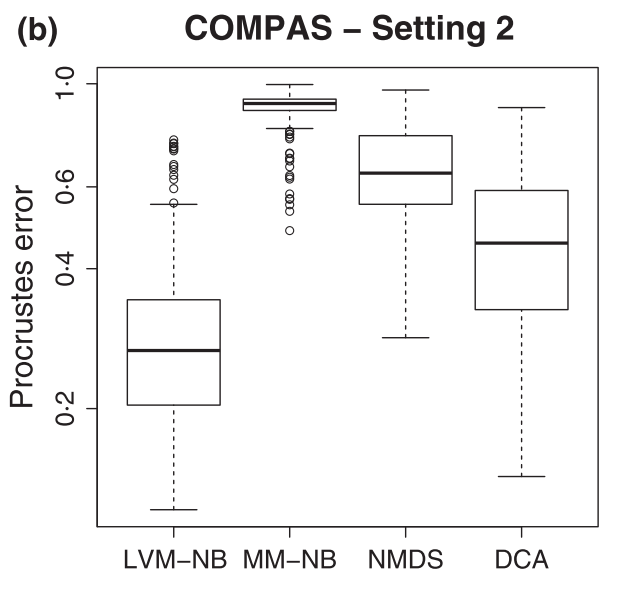
]


---

## BORAL

.footnote[Hui (2016b)]    

<p style="font-size:200%;"> 
- <b>.blue[B]</b>ayesian <b>.blue[O]</b>rdination and <b>.blue[R]</b>egression <b>.blue[A]</b>na<b>.blue[L]</b>ysis
</p> 

--

<p style="font-size:200%;">
- (un)constrained Ordination with <b>.blue[MCMC]</b> estimation 
</p>

--

\begin{align}
log(\mu_{is}) &= \alpha_i + \beta_{0s} + \mathbf{\eta_i^T}\mathbf{\lambda_s} & \text(Hui\ et\ al.\ 2015)\\
log(\mu_{is}) &= \alpha_i + \beta_{0s} + \mathbf{x_i}^T\boldsymbol{\beta_s} + \mathbf{\eta_i^T}\mathbf{\lambda_s} & \text(BORAL)\\
\end{align}


---

## Latent variables in ecology 

.footnote[Dormann *et al* (2018), Blanchet *et al.* (2020)]

- a spatial signal

- unmeasured environmental variables 

- a measure of co-occurrence ... 

--

- ... however: 

  - species occurrences depend on the environment  

--
        
  - indirect species associations   

--
        
  - interactions are often asymmetric 
  
---

## BORAL in Action
        
```{r read-boral-ucpo, echo=F}
fit_unconstrained_po <-readRDS("../../data/boral/boral_unconstrained_poisson.RDS")
pacman::p_load(boral, rjags, mvabund, UncertainOrd)
data(spider)
Y <- spider$abund
```
                
```{r boral-in-action,echo=T, eval=F}
# Unconstrained Ordination 
pacman::p_load(boral, rjags, mvabund, UncertainOrd)
data(spider)
Y <- spider$abund
fit_unconstrained_po <- boral(y = Y,
                              family = "poisson",
                              lv.control = list(num.lv = 2),
                              row.eff = "fixed",
                              save.model=TRUE)
summary(fit_unconstrained_po)
```

---

## BORAL in Action

.scroll-output[
```{r boral-in-action2, echo=F}
summary(fit_unconstrained_po)
```
]

---

## Check model assumptions
        
        
```{r check-boral-ucpo,  fig.height=7, fig.width=7, echo=F,fig.align='center'}
par(mfrow=c(2,2))
res <- capture.output(plot(fit_unconstrained_po))
```

---

## Check model assumptions - NB
```{r check boral 2, fig.height=7, fig.width=7, echo=F, fig.align='center'}
fit_unconstrained_nb <-readRDS("../../data/boral/boral_unconstrained_negbinom.RDS")
par(mfrow=c(2,2))
res = capture.output(plot(fit_unconstrained_nb))
```

---

## Ordination Diagram

```{r ordiplot boral 1, fig.height=7, fig.width=7, echo=F,fig.align='center'}
suppressMessages(lvsplot(fit_unconstrained_nb))
```

---

## Constrained Ordination 

```{r boral load constrained, echo=F}
fit_constrained_nb <- readRDS("../../data/boral/boral_constrained_negbinom.RDS")
X <- scale(spider$x)
``` 

```{r boral fit constrained, echo=T,eval = F}
X <- scale(spider$x)

fit_constrained_nb <-
        boral(
                y = Y,
                X = X,
                family = "negative.binomial",
                lv.control = list(num.lv = 2),
                save.model = TRUE
        )

summary(fit_constrained_nb)
```

---

## Constrained Ordination 

.scroll-output[
```{r boral-fit-constrained-3, echo=F}
summary(fit_constrained_nb)
```
]
  
---
## Ordination Diagram 

```{r ordiplot boral 2,  fig.height=7, fig.width=7, echo=F,fig.align='center'}
suppressMessages(lvsplot(fit_constrained_nb))
```

---
## Correlation plots 
```{r boral correlation plots,fig.width=7, fig.height=7, echo=F,fig.align='center'}
envcors <- get.enviro.cor(fit_constrained_nb)
par(mfrow=c(1,1))
corrplot(
        envcors$sig.cor,
        type = "lower",
        diag = FALSE,
        title =  "Correlations due to covariates",
        mar = c(3,0.5,2,1),
        tl.srt = 45)
```

---

## Correlation plots 

```{r boral correlation plots2, fig.width=7, fig.height=7, echo=F,fig.align='center'}
rescors <- get.residual.cor(fit_constrained_nb)
corrplot(
        rescors$sig.cor,
        type = "lower",
        diag = FALSE,
        title =  "Residual correlations",
        mar = c(3, 0.5, 2, 1),
        tl.srt = 45
)
```

---

## Uncertainty in latent variable models
- R package UncertainOrd (Hoegh & Roberts, 2020)
- based on 95% credible intervals

```{r load uncertainord file, echo=F}
uncertain_plot <- readRDS("../../data/boral/boral_uncertainplot.RDS")
par(mfrow=c(1,1))
```

```{r, echo=FALSE, fig.height=6, echo=F,fig.align='center'}
options(warn=-1)
uncertain_plot[[1]]$plot.obj
```

---
## Uncertainty in latent variable models
- R package UncertainOrd (Hoegh & Roberts, 2020)
- based on 95% credible intervals

```{r, echo=FALSE,  fig.height=6, echo=F,fig.align='center'}
options(warn=-1)
uncertain_plot[[2]]$plot.obj
```

---

## Uncertainty in latent variable models
- R package UncertainOrd (Hoegh & Roberts, 2020)
- based on 95% credible intervals

```{r, echo=FALSE,  fig.height=6, echo=F,fig.align='center'}
options(warn=-1)
uncertain_plot[[3]]$plot.obj
```

---

## Uncertainty in latent variable models
- R package UncertainOrd (Hoegh & Roberts, 2020)
- based on 95% credible intervals

```{r, echo=FALSE,  fig.height=6, echo=F,fig.align='center'}
options(warn=-1)
uncertain_plot[[4]]$plot.obj
```

---

## Can we include traits in this? 
   
<p style="font-size:150%;">        
- as parameters for the priors  
</p>

--

$\huge \beta_{0s} \sim N(t_j^T \kappa_0, \mathbf{\sigma}^2_0)$ <br>
$\huge \beta_{sp} \sim N(\mathbf{t_s^T \kappa_p, \sigma^2_p})$

--

<p style="font-size:150%;"> 
- The mean of the normal distribution from which species-specific intercept and regression coefficients are drawn depends on traits (t) and a trait coefficient $\kappa$. 
</p>

---

class: center,middle


$$\huge y_{is} = a_i + \beta_{0s} + x^T \beta + \eta^T \lambda + \epsilon$$ 
--
$$\huge a_i \sim N(0,20)$$ 
--
$$\huge \beta_{0s} \sim N(\mu_{s}, \sigma^2_0)$$ 
--
$$\huge \mu_{\beta_{0s}} = t_s^T \kappa_0$$ 
--
$$\huge \beta_{sp} \sim N(\boldsymbol{\mu}_{\beta_{sp}},\boldsymbol{\Sigma})$$ 
--
$$\huge \mu_{\beta_sp} = t_s^T \kappa_{sp}$$ 
--
$$\huge \lambda_s \sim N(0,20)$$ 

---

## GLLVM package 

<p style="font-size:200%;">
📦  R package gllvm (Niku <i>et al.</i>, 2019b)
</p>
--
<p style="font-size:200%;">
🔂 Maximum Likelihood instead of MCMC 
</p>
--
<p style="font-size:200%;">
🏃 faster than boral!
</p>
--
<p style="font-size:200%;">
👌  no posterior, no UncertainOrd ... but prediction regions 
</p>
--
<p style="font-size:200%;">
🤩 latent variables that include covariables and residuals (preprint)
</p>


---


```{r gllvm-in-action-1-show, eval = F, echo=T}
pacman::p_load(gllvm, corrplot,gclus)
data("antTraits")
y <- as.matrix(antTraits$abund)
X <- scale(as.matrix(antTraits$env))
TR <- antTraits$traits
fit_uo_po <- gllvm(y, family = poisson())
fit_uo_nb <- gllvm(y, family = "negative.binomial")
```

```{r gllvm-in-action-1-do, echo = F}
pacman::p_load(gllvm, corrplot,gclus)
data("antTraits")
y <- as.matrix(antTraits$abund)
X <- scale(as.matrix(antTraits$env))
TR <- antTraits$traits
fit_uo_po <- readRDS("../../data/gllvm/anttraits/fit_model_uo_po.RDS")
fit_uo_nb <- readRDS("../../data/gllvm/anttraits/fit_model_uo_nb.RDS")
```

--

```{r gllvm-summary, echo = F}
fit_uo_po
```

---

## Unconstrained ordination

.scroll-output[
```{r gllvm-in-action-2, fig.width=6, fig.hight=7, echo = F, fig.align='center'}
par(mfrow = c(1,2))
plot(fit_uo_nb, which = 1)
plot(fit_uo_po, which = 1)
plot(fit_uo_nb, which = 2)
plot(fit_uo_po, which = 2)
plot(fit_uo_nb, which = 3)
plot(fit_uo_po, which = 3)
```
]

---

## gllvm Biplot  
```{r gllvm-uc-biplot,fig.height=6, fig.width=6, echo = F, fig.align='center'}
ordiplot(fit_uo_nb,
         biplot = TRUE,
         ind.spp = 15,
         xlim = c(-3,3) ,
         ylim = c(-2, 1.6))
```

---

## gllvm Biplot  
```{r gllvm-uc-biplot2 ,fig.height=6, fig.width=6, echo = F, fig.align='center'}
ordiplot(fit_uo_nb,
         biplot = TRUE,
         ind.spp = 15,
         xlim = c(-3,3) ,
         ylim = c(-2, 1.6),
         predict.region = TRUE)
```

---

## Constrained Ordination 

```{r gllvm-in-action-3-show, eval = F, echo=T}
fit_co_nb2 <- gllvm(y, X, num.lv = 2,
                    formula = ~ Bare.ground + Shrub.cover +
                            Volume.lying.CWD,
                    family = "negative.binomial")
fit_co_nb3 <- gllvm(y, X, num.lv = 3,
                    formula = ~ Bare.ground + Shrub.cover +
                            Volume.lying.CWD,
                    family = "negative.binomial")
AIC(fit_co_nb2, fit_co_nb3)
```

```{r gllvm-in-action-3-do, echo = F}
fit_co_nb2 <- readRDS("../../data/gllvm/anttraits/fit_model_co_nb_2.RDS")
fit_co_nb3 <- readRDS("../../data/gllvm/anttraits/fit_model_co_nb_3.RDS")
AIC(fit_co_nb2, fit_co_nb3)
```

---

## Biplot of constrained ordination 
```{r gllvm-co-biplot, fig.height=6, fig.width=6, echo = F, fig.align='center'}
ordiplot(fit_co_nb2, biplot = T)
```

---

## Coefficient plot 

```{r gllvm-co-coefficient-plot, fig.width = 10, fig.height=7, echo = F, fig.align='center'}
coefplot(fit_co_nb2, cex.ylab = 0.7, mar = c(4,9,2,1),
         xlim.list = list(NULL, NULL, c(-4,4)))
```

---

## Residual Correlation plot 
```{r gllvm-residual-correlation-plot,fig.height=7, fig.width=7, echo = F, fig.align='center', eval = F}
par(mfrow = c(1,1))
cr <- getResidualCor(fit_co_nb2)
corrplot(cr[order.single(cr),
            order.single(cr)],
         diag = FALSE,
         type = "lower",
         method = "square",
         tl.cex = 0.8,
         tl.srt = 45,
         tl.col = "red")
```

.center[
        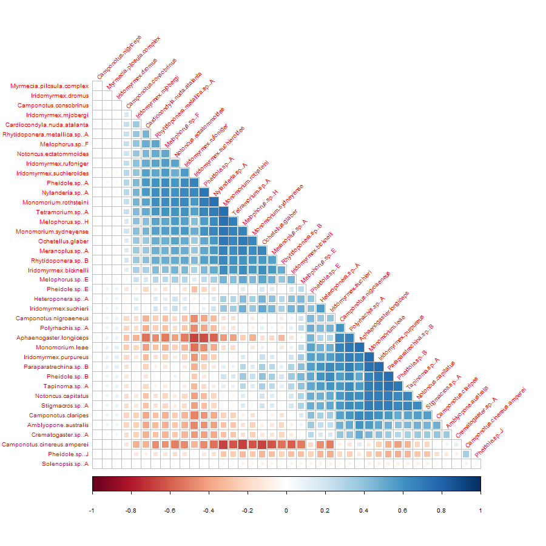
]

---

## Including traits 

```{r fitting-4th-corner-gllvm-show, eval = F, echo=T}
fit_4th <- gllvm(
        y = y,
        X = X,
        TR = TR,
        family = "negative.binomial",
        num.lv = 2,
        formula = y ~
                (Bare.ground + Shrub.cover + Volume.lying.CWD) +
                (Bare.ground + Shrub.cover + Volume.lying.CWD):(Pilosity + Polymorphism + Webers.length)
)
```

```{r fitting-4th-corner-gllvm-do, echo = F}

fit_4th <- readRDS("../../data/gllvm/anttraits/fit_model_trait_co_nb_r2.RDS")
  
```

---

## Fourth Corner Interaction Plot
```{r gllvm-fourth-corner-interaction-plot,fig.height=7, fig.width=7, echo = F, fig.align='center'}
fourth <- fit_4th$fourth.corner
colort <- colorRampPalette(c("blue", "white", "red"))
a <- max( abs(fourth) )
plot.4th <- lattice::levelplot((as.matrix(fourth)), xlab = "Environmental Variables",
                               ylab = "Species traits", col.regions = colort(100), cex.lab =1.3,
                               at = seq(-a, a, length = 100), scales = list(x = list(rot = 45)))
plot.4th
```

---

## Do Traits matter here? 
```{r gllvm-traits-matter, eval=F, echo=T}
fit_4th2 <- gllvm(y, X, TR, family = "negative.binomial", 
                  num.lv = 2, formula = y ~ (Bare.ground + 
                  Shrub.cover + Volume.lying.CWD))
anova(fit_4th, fit_4th2)
```

```{r gllvm-traits-matter2, echo = F}
fit_4th2 <- readRDS("../../data/gllvm/anttraits/fit_model_traits_not_co_nb_2.RDS")
```
--
```{r gllvm-traits-matter3, echo = F}
trait_anova = readRDS("../../data/gllvm/anttraits/anova_traits.RDS")
trait_anova
```

---

class: title-slide middle
        
# Time for Exercises 
        

