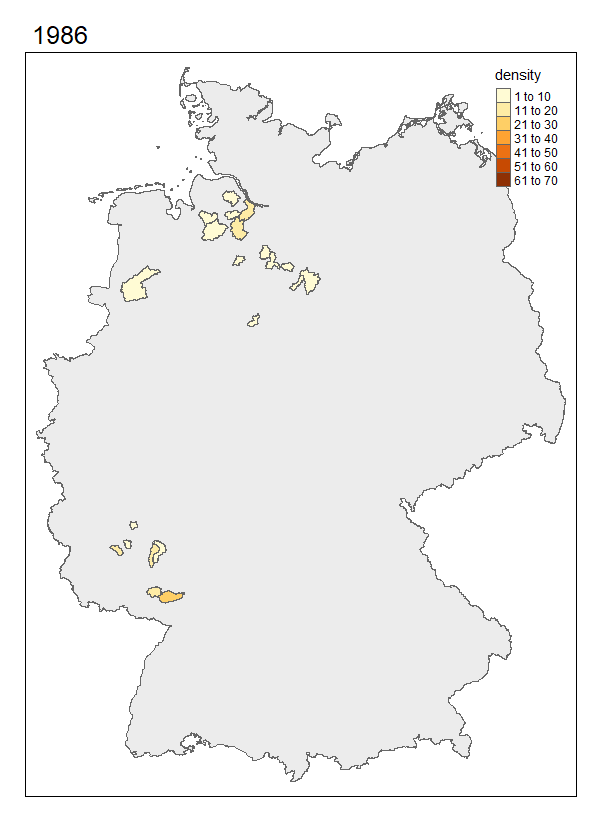
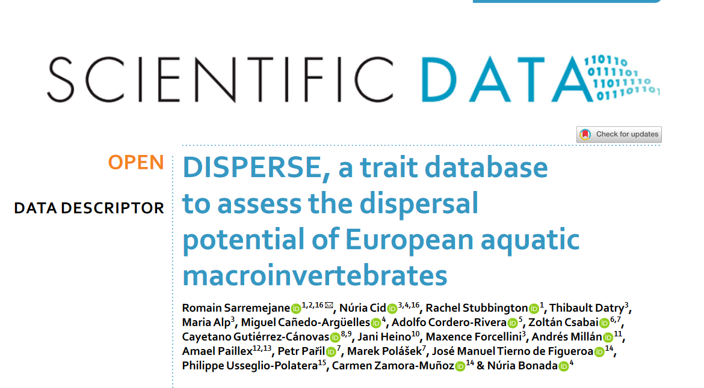

class: title-slide middle

# `r rmarkdown::metadata$title`

## `r rmarkdown::metadata$subtitle`

.author[
`r rmarkdown::metadata$author`
]

```{r setup, include=FALSE}
options(htmltools.dir.version = FALSE)
library(icons)
```

```{r xaringan-themer, include=FALSE, warning=FALSE}
library(xaringanthemer)
style_duo_accent(
  text_font_base = "Pompiere",
  text_font_family = "Pompiere",
  base_font_size = "25px",
  text_font_size = "28px",
  primary_color = "#1381B0",
  secondary_color = "#FF961C",
  inverse_header_color = "#FFFFFF",
  title_slide_text_color = "#FFFFFF",
  extra_fonts = list(
    google_font("Staatliches"),
    google_font("Megrim"),
    google_font("Pompiere")
  )
)

xaringanExtra::use_xaringan_extra(c("tile_view", "panelset", "editable", "animate", "tachyons", "share_again"))
xaringanExtra::use_extra_styles(
  hover_code_line = TRUE,         #<<
  mute_unhighlighted_code = TRUE  #<<
)
xaringanExtra::use_scribble()
```

---

.center[

]

---

# Effekte von Landwirtschaft auf  ...
```{r echo = FALSE}
xaringanExtra::use_panelset()
```
.panelset[
.panel[.panel-name[Biodiversität]
 - $\alpha$ 
 - $\beta$
 - $\gamma$
 - Funktionale Diversität
]
.panel[.panel-name[Köpergrößenspektren]
.center[

]
]
.panel[.panel-name[Stöchometrie]
.center[

]
]
]

---

# Betadiversität und Verbreitungssträke

.center[

]

---

# Was ihr davon habt:    

- <p style="font-size:200%;">Praktische Erfahrung mit R und Github </p>
- <p style="font-size:200%;">Vertiefung ökologische Statistik und Gemeinschaftsökologie</p>
- <p style="font-size:200%;">Erstellen von Präsentationen und Manuskripten in R</p>


---

---
